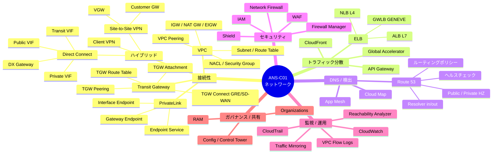
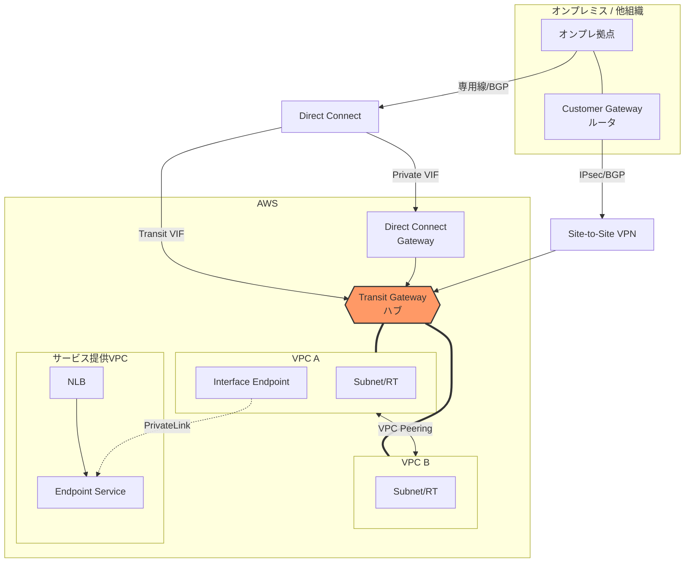
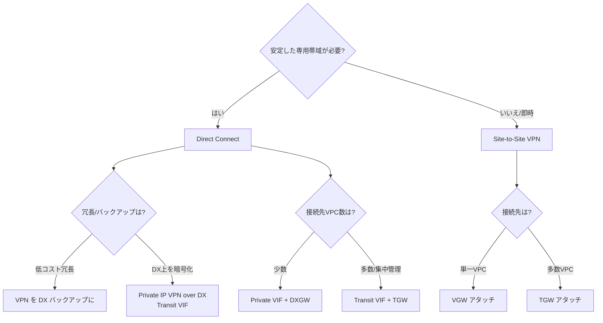
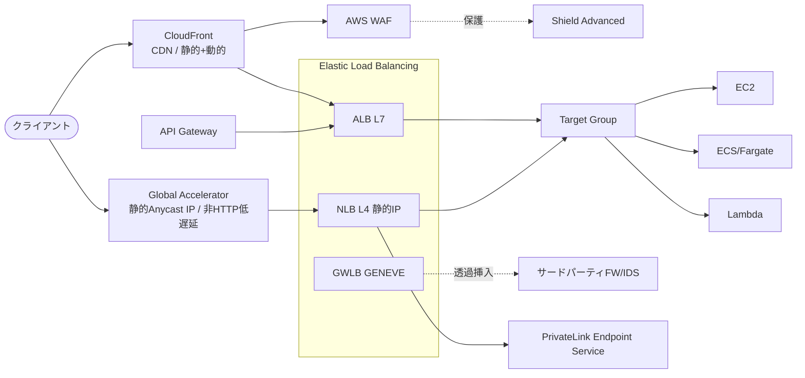
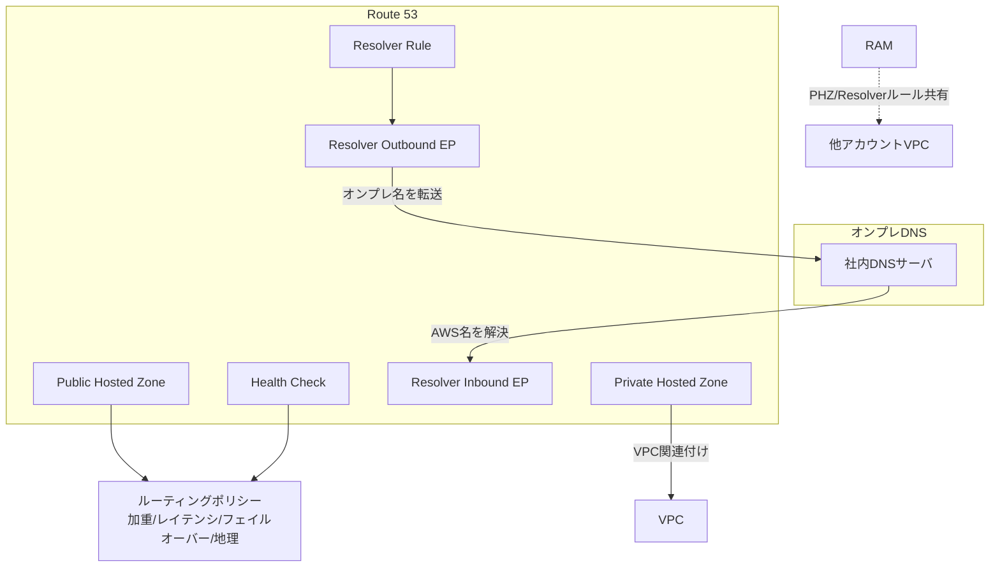
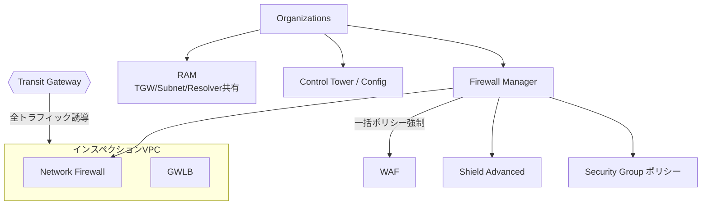
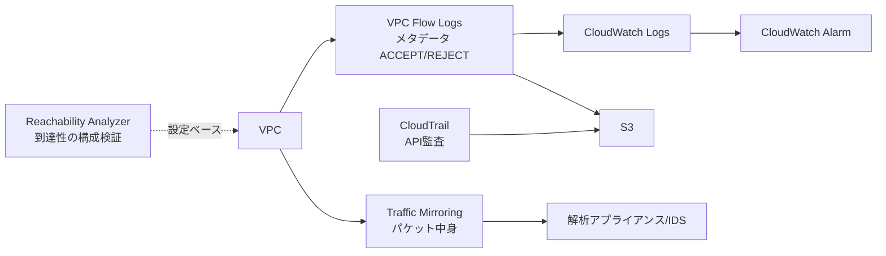
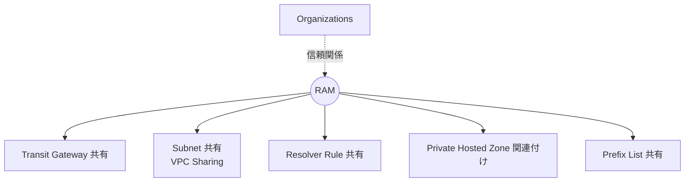

# ANS-C01 リソース相関マインドマップ

> AWS Certified Advanced Networking - Specialty の主要リソースを「どう繋がり・どう依存し合うか」で整理。
> 試験は単体暗記より **組み合わせ設計判断** が問われるため、本資料は相関関係に特化。
> 各サービス詳細は [services/README.md](README.md) のインデックスを参照。

---

## 1. 全体マインドマップ（俯瞰）



---

## 2. コア接続性の相関図（VPC を中心に）



**読み解きポイント**
- **TGW がハブ**: 多数 VPC ＋ ハイブリッドを集中管理。スポーク間は TGW ルートテーブルで制御。
- **VPC Peering** は少数 VPC・低コスト・推移的ルーティング不可（A↔B↔C で A↔C は不可）。
- **PrivateLink** は CIDR 重複していても単一サービスへ到達可能（NLB 裏付け）。
- **DX の VIF 使い分け**: Private VIF→単一/少数VPC、Transit VIF→TGW経由で多数VPC、Public VIF→AWSパブリックサービス。

---

## 3. ハイブリッド接続の選択フロー



---

## 4. エッジ → アプリ層のトラフィック相関



**読み解きポイント**
- **WAF は ALB / CloudFront / API Gateway に紐付け**。Shield Advanced はそれらに加えて Global Accelerator / EIP も保護。
- **NLB は PrivateLink の裏付け**（Endpoint Service）になる唯一の ELB。
- **GWLB は GENEVE(6081)** でセキュリティアプライアンスへ透過的に挿入。

---

## 5. DNS / 名前解決の相関



**読み解きポイント**
- **Inbound EP** = オンプレ → AWS の名前解決、**Outbound EP + Rule** = AWS → オンプレ。双方向で「ハイブリッドDNS」。
- **PHZ と Resolver ルールは RAM で共有** し、共有サービス VPC に集約するのが定石。

---

## 6. セキュリティ・ガバナンスの相関



**読み解きポイント**
- **集中型インスペクション**: TGW で全トラフィックをインスペクション VPC に誘導 → Network Firewall / GWLB で検査。
- **Firewall Manager は Organizations 配下に組織横断ポリシーを強制**（新規アカウントにも自動適用）。

---

## 7. 監視・トラブルシュートの相関



**読み解きポイント**
- **Flow Logs = メタデータ**（誰が誰へ・許可/拒否）、**Traffic Mirroring = パケット実体**。用途で使い分け。
- **Reachability Analyzer** は実トラフィックを流さず構成から到達性を検証（SG/NACL/RT のミス検出）。

---

## 8. 共有・マルチアカウント（RAM 中心）



---

## まとめ：暗記すべき相関の最重要ペア

| 起点 | 相関先 | 関係の本質 |
|---|---|---|
| Transit Gateway | VPC / VPN / DX(Transit VIF) | ハブ＆スポークの中心。スポーク間制御は TGW ルートテーブル |
| PrivateLink | NLB / Endpoint Service | CIDR重複でも単一サービスへ到達（NLB裏付け） |
| Direct Connect | DXGW(Private VIF) / TGW(Transit VIF) | 接続VPC数で VIF を選択 |
| WAF | ALB / CloudFront / API Gateway | L7保護の貼り付け先 |
| Shield Advanced | CloudFront / GA / NLB / EIP | DDoS保護対象 |
| Route 53 Resolver | オンプレDNS（in/out EP） | ハイブリッドDNSの双方向 |
| Firewall Manager | Organizations / WAF / NFW / SG | 組織横断ポリシー強制 |
| RAM | TGW / Subnet / Resolver / PHZ | マルチアカウント共有の起点 |
| GWLB | セキュリティアプライアンス(GENEVE) | 透過的インスペクション挿入 |
| VPC Flow Logs | CloudWatch / S3 | トラフィックメタデータの可視化 |
```
