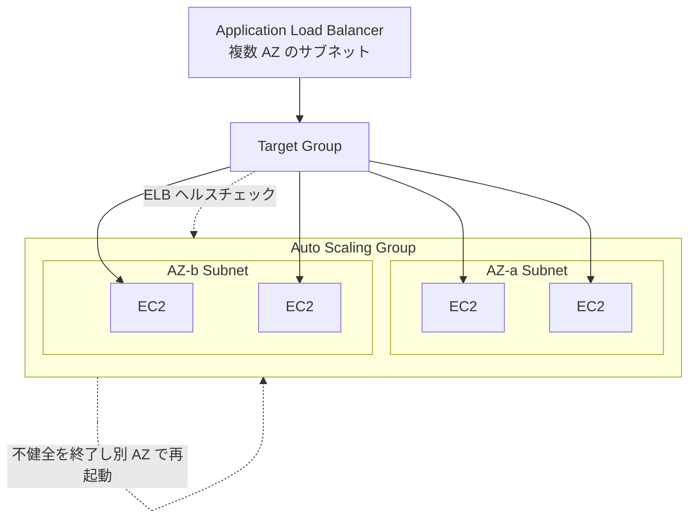

# Amazon EC2 Auto Scaling（ネットワーク観点）

> カテゴリ: コンピュート / 重要度: △（周辺）
> ANS-C01 では「マルチ AZ 分散」「ELB 連携とヘルスチェック」がネットワーク可用性の文脈で問われる。
> 最終更新: 2026-05-24 ／ 出典は本ドキュメント末尾

---

## 1. 概要

EC2 Auto Scaling は、需要に応じて EC2 インスタンス群（Auto Scaling Group, ASG）を自動で増減させるサービス。ネットワーク観点では、**複数 AZ/サブネットへの均等分散による高可用性**と、**ELB ヘルスチェック連携による不健全インスタンスの自動置換**が中心。

### 試験での位置づけ

- 「ロードバランサ配下の可用性をどう確保するか」という設計問題で ELB と組み合わせて登場。
- AZ 障害時の挙動、ヘルスチェックの種類（EC2 vs ELB）が問われる。

---

## 2. コアコンセプト

| 概念 | 役割 | 試験での要点 |
|---|---|---|
| **Auto Scaling Group (ASG)** | インスタンス群の論理単位 | 指定した**複数サブネット（=AZ）に均等分散** |
| **複数 AZ/サブネット** | 可用性の源泉 | ASG に複数 AZ のサブネットを指定すると EC2 Auto Scaling が**均等配分** |
| **ELB 連携** | ターゲットグループへ自動登録 | ASG にターゲットグループをアタッチ → 起動時に自動登録、終了時に自動解除 |
| **ヘルスチェック** | 健全性判定 | **EC2 ステータスチェック** と **ELB ヘルスチェック** の両方を利用可能 |
| **AZ リバランス** | 偏りの自動是正 | AZ 間が不均衡になると新規起動で再均等化（先に起動→後で終了） |

---

## 3. アーキテクチャ / 仕組み

- ASG の**サブネット指定 = AZ 指定**。複数 AZ のサブネットを与えると自動で均等分散され、単一 AZ 障害でも他 AZ で稼働継続。
- ELB と同じ AZ をカバーするよう ASG のサブネットを設定するのが原則。

---

## 4. 試験頻出ポイント

- **可用性設計の基本**: ASG を**複数 AZ のサブネット**にまたがせる。単一 AZ のみだとその AZ 障害でサービス全停止。
- **ヘルスチェックタイプ**: デフォルトは EC2 ステータスチェックのみ。**ELB ヘルスチェックを有効化**するとアプリ層の不健全（例: HTTP 500）も検知して置換できる。アプリ障害の自動回復を問う設問では「ELB ヘルスチェックを ASG に有効化」が正解になりやすい。
- ターゲットグループは**インスタンス ID 登録**で ASG と連携（IP 登録は手動寄り）。ASG がスケール時に自動で登録/解除。
- AZ リバランスは**先にインスタンスを起動してから古いものを終了**するため、一時的に希望容量を超えることがある。

---

## 5. 他サービスとの連携

- **[Elastic Load Balancing](../../networking-content-delivery/elastic-load-balancing/README.md)**: ターゲットグループへの自動登録とヘルスチェックの源。
- **[EC2](../ec2/README.md)**: 起動されるインスタンス本体（ENI/帯域はインスタンスタイプ依存）。
- **[VPC](../../networking-content-delivery/vpc/README.md)**: 分散先のサブネット/AZ、SG の基盤。
- **[Route 53](../../networking-content-delivery/route-53/README.md)**: マルチリージョン構成では DNS ルーティングと組み合わせて広域可用性を実現。

---

## 6. 制約・上限・コスト

| 項目 | 値 |
|---|---|
| ASG / リージョン | デフォルト 500（引き上げ可） |
| 起動テンプレート/設定 | ASG ごとに1つ |
| ヘルスチェックタイプ | EC2 / ELB / VPC Lattice / カスタム |

- **コスト**: EC2 Auto Scaling 機能自体は**無料**。課金は起動される EC2・ELB・データ転送に対して発生。マルチ AZ 配置による AZ 間データ転送料に留意。

---

## 7. 出典

- [What is Amazon EC2 Auto Scaling? – AWS Docs](https://docs.aws.amazon.com/autoscaling/ec2/userguide/what-is-amazon-ec2-auto-scaling.html)
- [Health checks for instances in an Auto Scaling group – AWS Docs](https://docs.aws.amazon.com/autoscaling/ec2/userguide/ec2-auto-scaling-health-checks.html)
- [Use Elastic Load Balancing to distribute traffic – AWS Docs](https://docs.aws.amazon.com/autoscaling/ec2/userguide/autoscaling-load-balancer.html)
- [Distribute instances across Availability Zones – AWS Docs](https://docs.aws.amazon.com/autoscaling/ec2/userguide/auto-scaling-benefits.html)
