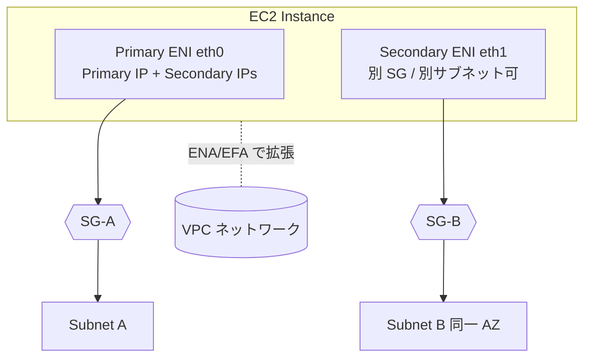

# Amazon EC2（ネットワーク観点）

> カテゴリ: コンピュート / 重要度: △（周辺）
> ANS-C01 ではインスタンスの「ネットワーク性能要件にどう応えるか」が問われる。本書はネットワーク観点に絞る。
> 最終更新: 2026-05-24 ／ 出典は本ドキュメント末尾

---

## 1. 概要

Amazon EC2 は仮想サーバを提供するサービス。ネットワーク観点では、**ENI（仮想 NIC）の付け替え**、**拡張ネットワーキング（ENA/EFA）による高スループット・低レイテンシ**、**Placement Group による配置最適化**、**インスタンスタイプ依存のネットワーク帯域**が試験の焦点。

### 試験での位置づけ

- 「HPC/分散学習で最低レイテンシが欲しい → EFA + Cluster Placement Group」のような**要件→構成**マッピングが頻出。
- マルチ ENI / セカンダリ IP による設計（アプライアンス、IP 集約、管理/データ分離）も問われる。

---

## 2. コアコンセプト

| 概念 | 役割 | 試験での要点 |
|---|---|---|
| **ENI** | 標準の仮想 NIC | プライベート/パブリック IP・SG・MAC を保持。**インスタンス間で付け替え可能**（フェイルオーバ用途） |
| **ENA** | 拡張ネットワーキングアダプタ | 対応インスタンスで最大 **100 Gbps** 級。enaSupport 属性で有効化 |
| **EFA** | Elastic Fabric Adapter | ENA＋**OS バイパス**。HPC/ML 集団通信（MPI/NCCL）向け。**Cluster Placement Group 必須** |
| **拡張ネットワーキング** | SR-IOV による高 PPS・低レイテンシ・低 CPU | ENA（現行）/ Intel ixgbevf（旧 VF）。対応 AMI＋ドライバが必要 |
| **Placement Group** | インスタンス物理配置の制御 | cluster / spread / partition の3種（§4） |
| **セカンダリ IP / 複数 ENI** | 1インスタンスに複数 IP/NIC | IP 数はインスタンスタイプ依存。**帯域は増えない** |

---

## 3. アーキテクチャ / 仕組み

- **ENI は同一 AZ 内のサブネットにのみ**アタッチ可能（AZ をまたげない）。
- 1インスタンスに複数 ENI を付けると**異なるサブネット/SG**に同時所属できる（管理面/データ面の分離、デュアルホーム）。
- **EFA の OS バイパス**はインスタンス内・同一 Cluster Placement Group 内で有効。EFA はインターネット越え通信には使えない（VPC 内・同一 PG）。

---

## 4. Placement Group（頻出）

| 種類 | 配置 | 用途 | 制約 |
|---|---|---|---|
| **Cluster** | **単一 AZ 内に密集** | HPC・低レイテンシ・高スループット（EFA 併用） | 同一 AZ。容量不足リスク。AZ 障害に弱い |
| **Spread** | 個別ハードウェアに分散 | 少数の重要インスタンスの可用性 | **AZ あたり最大7インスタンス** |
| **Partition** | パーティション単位で分離（ラック分離） | Hadoop/Kafka/Cassandra 等大規模分散 | グループあたり **AZ ごと最大7パーティション** |

- Cluster は**単一フローで最大 10 Gbps**、複数フローで最大 25 Gbps（ENA 対応インスタンス・同一 PG）。
- EFA を使う超低レイテンシ HPC は **Cluster** が原則。

---

## 5. 試験頻出ポイント

- **要件→アダプタ**: 一般高スループット→**ENA**、密結合 HPC/分散ML 集団通信→**EFA**、通常→ENI。
- **複数 ENI を足してもインスタンスの総帯域は増えない**（帯域はインスタンスタイプで決まる）。ENI 追加の主目的は IP/サブネット/SG 分離とフェイルオーバ。
- **ネットワーク帯域**はインスタンスサイズに比例。小サイズはベースライン帯域＋バースト（クレジット制）で、持続高負荷ではベースラインに律速。
- **5 Gbps 超**の単一フローは原則同一 Cluster Placement Group 内に限られる（リージョン内ピア間は 5 Gbps 上限が基本）。
- セカンダリ IP の最大数・ENI の最大数は**インスタンスタイプ依存**（VPC CNI の Pod 数計算にも影響、[EKS](../../containers/eks/README.md) 参照）。
- **ジャンボフレーム（MTU 9001）** は同一 VPC 内・一部経路のみ。IGW/VPN 経由は 1500。詳細は [VPC](../../networking-content-delivery/vpc/README.md) §9。

---

## 6. 他サービスとの連携

- **[VPC](../../networking-content-delivery/vpc/README.md)**: ENI/SG/サブネット/MTU の基盤。ENI は VPC のコア要素。
- **[Elastic Load Balancing](../../networking-content-delivery/elastic-load-balancing/README.md)**: ターゲットとして EC2 を登録（instance/ip ターゲットタイプ）。
- **[EC2 Auto Scaling](../ec2-auto-scaling/README.md)**: マルチ AZ への分散配置とヘルスチェック。
- **[EKS](../../containers/eks/README.md) / [ECS](../../containers/ecs/README.md)**: ノード/コンテナインスタンスとしての ENI 消費・Pod 数上限。

---

## 7. 制約・上限・コスト

| 項目 | 値 |
|---|---|
| ENI / インスタンス・IP / ENI | **インスタンスタイプ依存**（大型ほど多い） |
| Spread Placement Group | **AZ あたり最大7インスタンス** |
| Partition Placement Group | **AZ あたり最大7パーティション** |
| Cluster 単一フロー帯域 | 最大 10 Gbps（複数フロー 25 Gbps、ENA 必須） |
| ENA 最大スループット | 最大 100 Gbps 級（対応インスタンス） |

- **コスト**: ENA/EFA/拡張ネットワーキング自体は追加料金なし。データ転送料（AZ 間・リージョン間・インターネット）が主な課金。Placement Group も無料。

---

## 8. 出典

- [Elastic network interfaces – AWS Docs](https://docs.aws.amazon.com/AWSEC2/latest/UserGuide/using-eni.html)
- [Enhanced networking on Linux – AWS Docs](https://docs.aws.amazon.com/AWSEC2/latest/UserGuide/enhanced-networking.html)
- [Elastic Fabric Adapter – AWS Docs](https://docs.aws.amazon.com/AWSEC2/latest/UserGuide/efa.html)
- [Placement groups – AWS Docs](https://docs.aws.amazon.com/AWSEC2/latest/UserGuide/placement-groups.html)
- [Placement group rules and limitations – AWS Docs](https://docs.aws.amazon.com/AWSEC2/latest/UserGuide/limitations-placement-groups.html)
- [Amazon EC2 instance network bandwidth – AWS Docs](https://docs.aws.amazon.com/AWSEC2/latest/UserGuide/ec2-instance-network-bandwidth.html)
