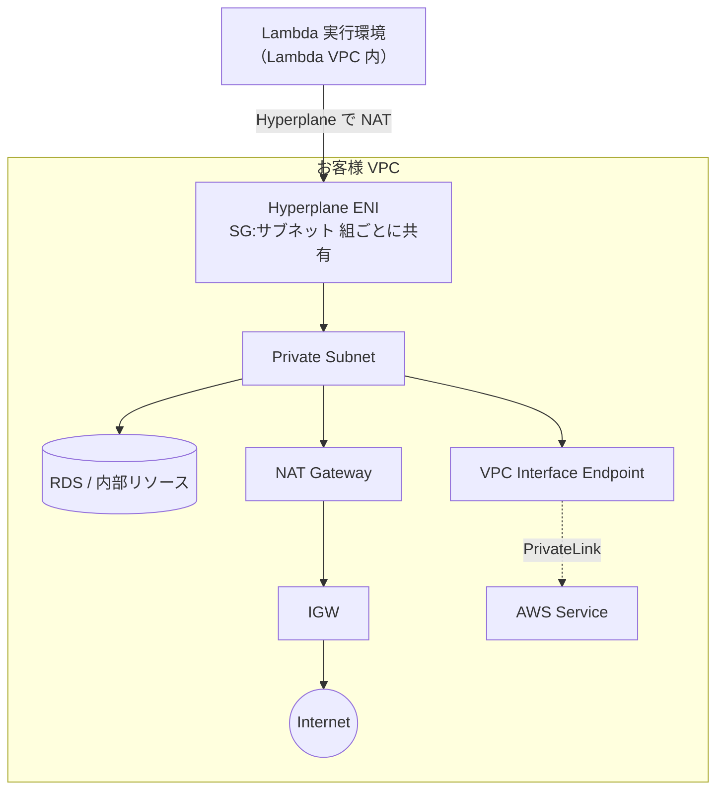

# AWS Lambda（ネットワーク観点）

> カテゴリ: コンピュート / 重要度: △（周辺）
> ANS-C01 では「VPC 内 Lambda の ENI 挙動」「アウトバウンドの NAT 経由」「IP 消費」が問われる。
> 最終更新: 2026-05-24 ／ 出典は本ドキュメント末尾

---

## 1. 概要

AWS Lambda はサーバレスのコード実行サービス。ネットワーク観点では、**VPC 接続時の Hyperplane ENI の挙動**、**サブネット/SG の指定**、**インターネット/AWS サービスへのアウトバウンド経路（NAT・エンドポイント）**、**同時実行と IP 消費**が中心。

### 試験での位置づけ

- 「VPC 内リソース（RDS 等）にアクセスする Lambda の構成」「VPC Lambda から外部 API を叩けない原因」の切り分けで頻出。
- 旧来の「同時実行ごとに ENI 大量作成 → IP 枯渇」問題と、現行の **Hyperplane ENI** による改善の理解が問われる。

---

## 2. コアコンセプト

| 概念 | 役割 | 試験での要点 |
|---|---|---|
| **VPC 接続** | Lambda を VPC 内リソースへ接続 | 関数にサブネット＋SG を指定。デフォルトは VPC 外（AWS 管理） |
| **Hyperplane ENI** | Lambda が管理する共有 ENI | **SG:サブネットの組み合わせ単位**で作成・共有。NLB/NAT GW と同じ Hyperplane 基盤 |
| **アウトバウンド経路** | VPC 内 Lambda の外部通信 | **VPC 接続すると既定でインターネット不可** → NAT GW 経由 or VPC エンドポイント |
| **同時実行 (Concurrency)** | 並列実行数 | ENI 作成と直結しなくなった（Hyperplane 化）。スケールは ENI 数に律速されない |
| **IP 消費** | サブネット IP の使用 | Hyperplane ENI が**サブネットの IP を消費**。多数の SG:サブネット組で増える |

---

## 3. アーキテクチャ / 仕組み

- 同一アカウント内で**同じ SG:サブネットの組**を使う関数は**同じ Hyperplane ENI を共有**する → ENI が爆発的に増えない。
- 各 Hyperplane ENI は最大 **約 65,000 接続/ポート**を扱い、超過時は Lambda が自動で ENI を追加スケール。
- VPC 接続した Lambda は**既定でインターネットへ出られない**。外部 API/インターネットへ出すには **NAT Gateway 経由**、AWS サービスへは **VPC エンドポイント（PrivateLink）** を使う。

---

## 4. 試験頻出ポイント

- **「VPC 内 Lambda がインターネットに出られない」**: パブリックサブネットに置いても Lambda 実行環境にパブリック IP は付かない。**プライベートサブネット + NAT Gateway**（または対象 AWS サービスの VPC エンドポイント）が正解。
- **IP 枯渇対策**: 関数が使う **SG:サブネットの組み合わせ数を減らす**、十分大きいサブネット CIDR を割り当てる。Hyperplane 化により同時実行とは独立。
- **コールドスタート改善**: 現行アーキテクチャでは ENI 作成が実行パスから外れ、VPC 接続のコールドスタート遅延が大幅に改善。
- **HyperPlane ENI 上限超過エラー**: "exceeded the maximum limit for HyperPlane elastic network interfaces" → SG:サブネット組の多さやサブネット IP 不足が原因。
- VPC 接続 Lambda の SG は**お客様が指定した SG** が適用され、宛先リソース側 SG でその SG を許可する。

---

## 5. 他サービスとの連携

- **[VPC](../../networking-content-delivery/vpc/README.md)**: サブネット/SG/IP 空間の基盤。NAT GW・エンドポイント設計の前提。
- **[Route 53](../../networking-content-delivery/route-53/README.md)**: VPC 内 Lambda は VPC リゾルバ（VPC+2）で名前解決。
- **PrivateLink / VPC エンドポイント**: NAT を経由せず AWS サービスへプライベート接続（コスト削減・セキュリティ）。
- **[Elastic Load Balancing](../../networking-content-delivery/elastic-load-balancing/README.md)**: ALB のターゲットとして Lambda 関数を登録可能。

---

## 6. 制約・上限・コスト

| 項目 | 値 |
|---|---|
| Hyperplane ENI あたり接続数 | 約 65,000（超過で自動スケール） |
| ENI 作成 | SG:サブネットの組ごとに共有（同時実行数とは非連動） |
| VPC 接続関数の IP 消費 | サブネットの IP を Hyperplane ENI が消費 |

- **コスト**: VPC 接続自体に追加料金はない。アウトバウンドに **NAT Gateway** を使うと時間＋データ処理料が発生 → S3/DynamoDB は Gateway エンドポイント、他 AWS サービスは Interface エンドポイント利用で NAT コストを回避可能。

---

## 7. 出典

- [Giving Lambda functions access to resources in an Amazon VPC – AWS Docs](https://docs.aws.amazon.com/lambda/latest/dg/configuration-vpc.html)
- [Announcing improved VPC networking for AWS Lambda functions – AWS Blog](https://aws.amazon.com/blogs/compute/announcing-improved-vpc-networking-for-aws-lambda-functions/)
- [Troubleshoot the Lambda HyperPlane ENI error – AWS re:Post](https://repost.aws/knowledge-center/lambda-hyperplane-vpc)
- [Enable internet access for VPC-connected Lambda functions – AWS Docs](https://docs.aws.amazon.com/lambda/latest/dg/configuration-vpc.html)
