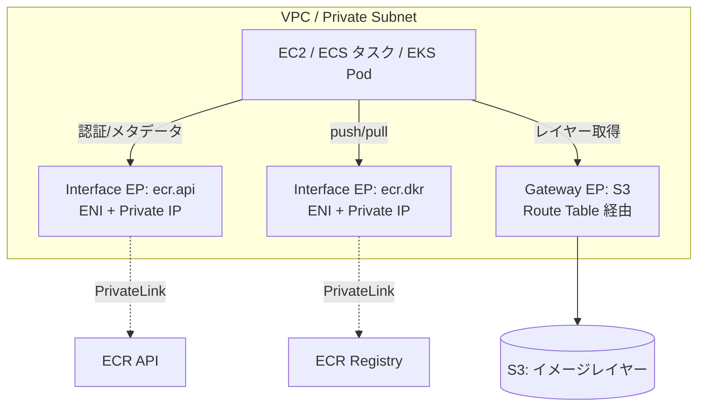

# Amazon ECR（Elastic Container Registry）ネットワーク

> カテゴリ: コンテナ / 重要度: △（周辺）
> ANS-C01 では「プライベートサブネットからの NAT を使わないプライベート pull」に必要な VPC エンドポイント構成が問われる。
> 最終更新: 2026-05-24 ／ 出典は本ドキュメント末尾

---

## 1. 概要

Amazon ECR はマネージドなコンテナレジストリ。ネットワーク観点では、**インターネットを介さずプライベートにイメージを pull するための VPC エンドポイント構成**が唯一にして最重要の論点。ECR API は **PrivateLink（Interface エンドポイント）**、イメージレイヤーの実体は **S3（Gateway エンドポイント）**で取得する。

### 試験での位置づけ

- 「プライベートサブネットの EC2/ECS/EKS が NAT を使わず ECR から pull できない → 何が足りない？」が定番。**ecr.api + ecr.dkr + S3 の3点**を答えさせる。

---

## 2. コアコンセプト

| 概念 | 役割 | 試験での要点 |
|---|---|---|
| **プライベートレジストリ** | アカウント専用のイメージ格納 | デフォルトでプライベート。IAM/リポジトリポリシーで制御 |
| **com.amazonaws.region.ecr.api** | ECR コントロールプレーン API | DescribeImages・認証トークン取得等。Interface エンドポイント |
| **com.amazonaws.region.ecr.dkr** | Docker Registry API | `docker push/pull`。Interface エンドポイント |
| **S3 Gateway エンドポイント** | イメージレイヤー本体 | ECR はレイヤーを **S3 に格納** → pull には S3 経路が必須 |
| **プライベート DNS** | エンドポイント名の透過解決 | Interface エンドポイントで有効化が必要 |

---

## 3. アーキテクチャ / 仕組み

- **3つ揃って初めて NAT 無しのプライベート pull が成立**: `ecr.api`（認証・メタデータ）＋ `ecr.dkr`（Docker プロトコル）＋ `S3 Gateway`（レイヤー実体）。
- Interface エンドポイントの SG は**ポート 443 のインバウンド**をプライベートサブネットから許可。プライベート DNS を有効化して `*.dkr.ecr.region.amazonaws.com` を透過解決。

---

## 4. 試験頻出ポイント

- **NAT を使わないプライベート pull の必須要素**: `ecr.api` + `ecr.dkr` の Interface エンドポイント **＋ S3 の Gateway エンドポイント**。S3 を忘れると認証は通るが**レイヤー取得で失敗**する（典型的なひっかけ）。
- Interface エンドポイントは **ENI + プライベート IP** で動き、**プライベート DNS 有効化**が前提（既存ドメイン名のまま使える）。
- **エンドポイントポリシー**で特定リポジトリのみ許可するなど最小権限化が可能。
- コスト最適化: NAT Gateway 経由の pull はデータ処理料が高い → VPC エンドポイント化で削減。

---

## 5. 他サービスとの連携

- **[VPC](../../networking-content-delivery/vpc/README.md)**: Interface（PrivateLink）/ Gateway エンドポイントの基盤。
- **[ECS](../ecs/README.md) / [EKS](../eks/README.md) / [Fargate](../fargate/README.md)**: イメージ取得元。プライベートサブネット運用ではこの3エンドポイントが前提。
- **PrivateLink**: ecr.api / ecr.dkr の実体。

---

## 6. 制約・上限・コスト

| 項目 | 値 |
|---|---|
| 必要エンドポイント | ecr.api（Interface）/ ecr.dkr（Interface）/ S3（Gateway） |
| Interface EP の通信 | TCP 443 |

- **コスト**: Interface エンドポイントは時間＋データ処理課金。**S3 Gateway エンドポイントは無料**。NAT 経由を置き換えればトータルで削減になることが多い。

---

## 7. 出典

- [Amazon ECR interface VPC endpoints (AWS PrivateLink) – AWS Docs](https://docs.aws.amazon.com/AmazonECR/latest/userguide/vpc-endpoints.html)
- [Using VPC endpoint policies to control Amazon ECR access – AWS Blog](https://aws.amazon.com/blogs/containers/using-vpc-endpoint-policies-to-control-amazon-ecr-access/)
