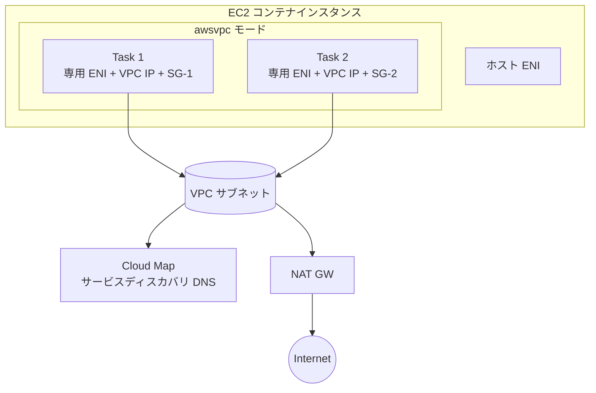

# Amazon ECS（Elastic Container Service）ネットワーク

> カテゴリ: コンテナ / 重要度: △（周辺）
> ANS-C01 では「ネットワークモード（awsvpc/bridge/host）」と「タスクごとの ENI/SG」が問われる。ネットワーク観点に絞る。
> 最終更新: 2026-05-24 ／ 出典は本ドキュメント末尾

---

## 1. 概要

Amazon ECS はマネージドなコンテナオーケストレーション。ネットワーク観点の核心は**タスクのネットワークモード**で、特に **awsvpc モード**は各タスクに専用 ENI と VPC の IP を割り当て、タスク単位の SG 適用を可能にする。Fargate では **awsvpc が必須**。

### 試験での位置づけ

- 「タスクごとに SG を分けたい / VPC ネイティブ IP が欲しい → awsvpc」という要件マッピングが頻出。
- サービスディスカバリ（Cloud Map）とプライベートサブネットからの外部接続が問われる。

---

## 2. コアコンセプト

| 概念 | 役割 | 試験での要点 |
|---|---|---|
| **awsvpc モード** | タスクに専用 ENI + VPC IP | **タスク単位で SG** 適用可。Fargate は必須。EC2 でも利用可 |
| **bridge モード** | Docker 仮想ブリッジ | EC2 のみ。動的ポートマッピングで ALB と連携 |
| **host モード** | ホスト ENI を直接利用 | EC2 のみ。ポート競合に注意・最高性能 |
| **none モード** | 外部ネットワークなし | 隔離タスク用 |
| **サービスディスカバリ** | Cloud Map による名前解決 | awsvpc では各タスク IP を DNS 登録 |
| **Service Connect** | サービス間通信（メッシュ的） | Cloud Map + Envoy。サービス名で接続 |

---

## 3. アーキテクチャ / 仕組み

- **awsvpc**: タスクごとに ENI が付き、**EC2 インスタンスの ENI 上限を消費**（タスク密度に影響、ENI トランキングで緩和可）。
- **bridge/host**: タスクはホストの ENI を共有。**host や bridge ではプライマリ IP が無いと ELB/Cloud Map 登録に失敗**するケースあり。

---

## 4. 試験頻出ポイント

- **awsvpc を選ぶ理由**: タスク単位の **SG 分離**、VPC フローログでのタスク IP 追跡、PrivateLink/ピアリング越しのタスク直接到達。Fargate は **awsvpc 固定**。
- **bridge の動的ポートマッピング**: 1ホストに同一コンテナを複数置ける。ALB のターゲットグループが動的ポートを解決。
- **host モード**: NAT を介さずホスト NIC を直接使い最高スループット。ただし**ポート競合**で同一ポートのタスクを複数置けない。
- **awsvpc の ENI 消費**: EC2 起動タイプではインスタンスタイプの ENI 上限がタスク数を律速。**ENI トランキング**で 1 インスタンスあたりの awsvpc タスク数を増やせる。
- **サービスディスカバリ**: ECS は Cloud Map に名前空間を作りタスク IP を登録。awsvpc の各タスク IP を直接 DNS 解決できる。
- プライベートサブネットのタスクが外部へ出るには **NAT Gateway**、AWS サービスへは **VPC エンドポイント**（[ECR](../ecr/README.md) の api/dkr + S3 が必須）。

---

## 5. 他サービスとの連携

- **[VPC](../../networking-content-delivery/vpc/README.md)**: サブネット/SG/ENI/NAT の基盤。awsvpc タスク IP はここから払い出し。
- **[Elastic Load Balancing](../../networking-content-delivery/elastic-load-balancing/README.md)**: ALB/NLB のターゲットにタスク（ip ターゲット=awsvpc、instance=bridge 動的ポート）を登録。
- **[ECR](../ecr/README.md)**: イメージ取得元。プライベート pull に api/dkr + S3 エンドポイント。
- **[Fargate](../fargate/README.md)**: サーバレス実行（awsvpc 固定）。
- **Route 53 / Cloud Map**: サービスディスカバリの DNS。

---

## 6. 制約・上限・コスト

| 項目 | 値 |
|---|---|
| Fargate のネットワークモード | **awsvpc 固定** |
| EC2 起動タイプ | awsvpc / bridge / host / none |
| awsvpc タスクの ENI 消費 | EC2 のインスタンスタイプ ENI 上限に依存（トランキングで拡張可） |

- **コスト**: ECS のオーケストレーション自体は無料（EC2 起動タイプ）。課金は EC2/Fargate・ELB・NAT・データ転送。awsvpc 多用時の NAT データ処理料に注意。

---

## 7. 出典

- [Amazon ECS task networking options for EC2 – AWS Docs](https://docs.aws.amazon.com/AmazonECS/latest/developerguide/task-networking.html)
- [Allocate a network interface for an Amazon ECS task (awsvpc) – AWS Docs](https://docs.aws.amazon.com/AmazonECS/latest/developerguide/task-networking-awsvpc.html)
- [Connect Amazon ECS applications to the internet – AWS Docs](https://docs.aws.amazon.com/AmazonECS/latest/developerguide/networking-outbound.html)
- [Service discovery – AWS Docs](https://docs.aws.amazon.com/AmazonECS/latest/developerguide/service-discovery.html)
