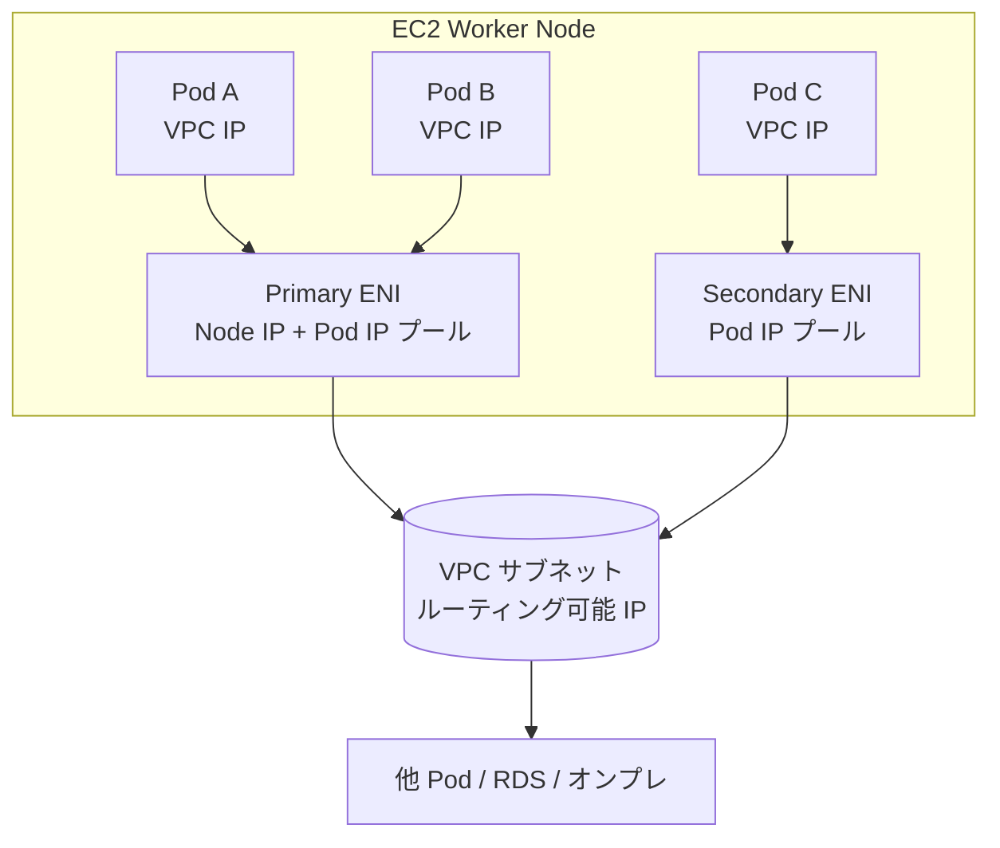
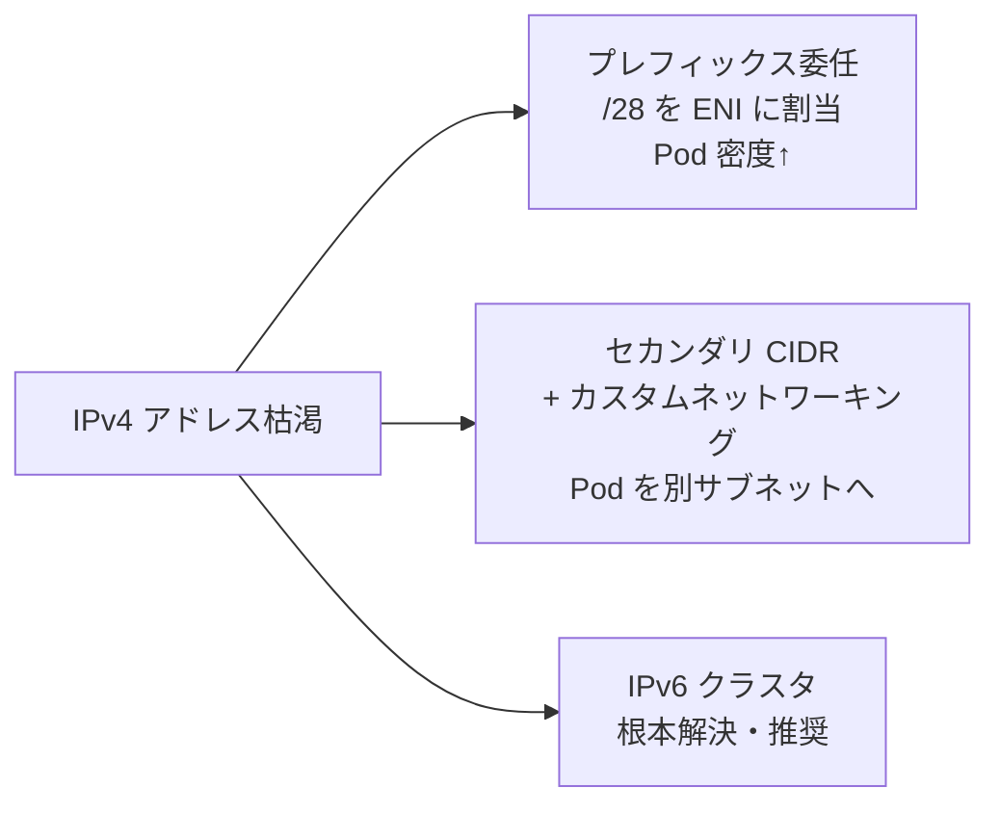
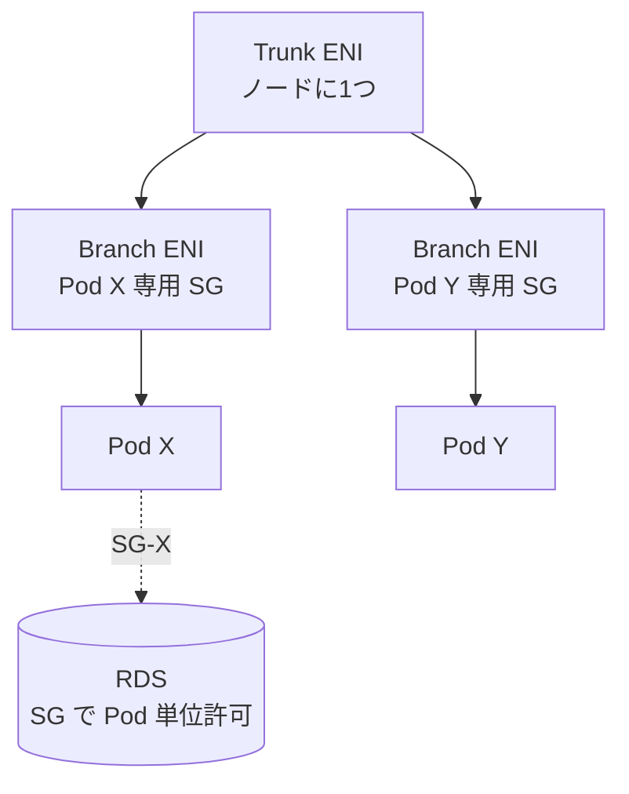

# Amazon EKS（Elastic Kubernetes Service）ネットワーク

> カテゴリ: コンテナ / 重要度: ○（重要）
> ANS-C01 では VPC CNI による「Pod が VPC のルーティング可能 IP を持つ」モデルと、それに起因する **IP 枯渇対策** が頻出。
> 最終更新: 2026-05-24 ／ 出典は本ドキュメント末尾

---

## 1. 概要

Amazon EKS はマネージド Kubernetes。ネットワークの核心は **Amazon VPC CNI プラグイン**で、各 Pod に**VPC 内のルーティング可能な実 IP**を割り当てる（オーバーレイ無し）。これにより VPC ネイティブな通信が可能になる反面、**Pod ごとに VPC の IP を消費**するため大規模クラスタでは **IPv4 枯渇**が設計上の最大論点になる。

### 試験での位置づけ

- 「EKS で Pod が増えると IP が枯渇する → どう解決するか」が定番。**プレフィックス委任 / セカンダリ CIDR + カスタムネットワーキング / IPv6** の選択を理解する。
- **AWS Load Balancer Controller**（ALB Ingress / NLB Service の IP/instance ターゲット）と **Security Groups for Pods**（branch ENI）も問われる。

---

## 2. コアコンセプト

| 概念 | 役割 | 試験での要点 |
|---|---|---|
| **VPC CNI** | Pod に VPC の実 IP を付与 | ノードの ENI にセカンダリ IP（またはプレフィックス）を束ねて Pod へ配布。**オーバーレイ無し** |
| **ENI / IP 上限** | Pod 数の上限を決める | **インスタンスタイプ依存**（ENI 数 × IP/ENi）。`max-pods` 算出の基礎 |
| **プレフィックス委任** | ENI に /28(IPv4) /80(IPv6) を割当 | API 呼び出し削減＋**Pod 密度向上**。`ENABLE_PREFIX_DELEGATION=true` |
| **カスタムネットワーキング** | Pod を**別サブネット/別 SG**へ | ENIConfig CRD。**セカンダリ VPC CIDR** から Pod IP を払い出し |
| **セカンダリ CIDR** | VPC に IP 空間を追加 | 100.64.0.0/10（CG-NAT 帯）等を追加して枯渇緩和 |
| **Security Groups for Pods** | Pod 単位で SG 適用 | **trunk ENI + branch ENI**。Pod に専用 SG を割当 |
| **AWS Load Balancer Controller** | ALB/NLB をプロビジョン | Ingress→ALB、Service(LB)→NLB。**ip / instance** ターゲットモード |
| **IPv6 クラスタ** | Pod に IPv6 を付与 | IPv4 枯渇の根本解決。Pod は IPv6、外部 IPv4 へは送信側 NAT |

---

## 3. アーキテクチャ / 仕組み

### VPC CNI による Pod IP 割り当て

- IP プールが枯渇すると CNI が**自動で別 ENI をアタッチ**し IP を確保。インスタンスタイプの **ENI 上限**まで継続 → そこで Pod 増加が頭打ち。
- Pod IP は VPC ネイティブなので、**ピアリング/TGW/Direct Connect 越しに Pod へ直接到達**できる（重複 CIDR は不可）。

### IP 枯渇対策の選択

### Security Groups for Pods（trunk/branch ENI）

---

## 4. IP 枯渇対策（最頻出）

| 手法 | 仕組み | メリット / 注意 |
|---|---|---|
| **プレフィックス委任** | ENI に **/28（IPv4・16 アドレス）** または **/80（IPv6）** のプレフィックスを割当。`ENABLE_PREFIX_DELEGATION=true`、`WARM_PREFIX_TARGET` 等で調整 | Pod 密度・起動速度向上、EC2 API 呼び出し削減。既存ノードへの混在は非推奨（**新規ノードグループ**で移行）。Linux のみ |
| **カスタムネットワーキング** | `ENIConfig` CRD で**セカンダリ VPC CIDR（例 100.64.0.0/10）のサブネット**から Pod IP を払い出し。Pod 専用 SG も指定可 | プライマリ CIDR の枯渇回避。ノードあたり Pod 数がやや減る・運用オーバーヘッド増 |
| **セカンダリ CIDR 追加** | VPC に追加 CIDR（CG-NAT 帯 100.64.0.0/10 等）を付与し Pod 用に使用 | RFC1918 を温存。カスタムネットワーキングと併用 |
| **IPv6 クラスタ** | Pod に IPv6 を割当。外部 IPv4 へは送信側 NAT で到達 | **枯渇の根本解決（AWS 推奨）**。クラスタ作成時に選択、後から IPv4↔IPv6 変更不可 |

- `max-pods` は **(ENI 数 × ENI あたり IP 数) − 予約**で決まり、インスタンスタイプ依存。プレフィックス委任で大幅に増やせる（既定上限は 110/ノードだが変更可）。

---

## 5. 試験頻出ポイント

- **Pod が VPC の実 IP を持つ**（オーバーレイ無し）= VPC CNI の根本特徴。だから IP 枯渇が起きる。
- **IP 枯渇の解法を要件で選ぶ**: Pod 密度を上げたい→**プレフィックス委任**、RFC1918 を使い切った/別空間に逃がす→**セカンダリ CIDR + カスタムネットワーキング**、恒久解→**IPv6**。
- **AWS Load Balancer Controller**:
  - **Ingress → ALB**、**Service type=LoadBalancer → NLB**。
  - **ip ターゲットモード**: NLB/ALB が **Pod IP に直接**転送（ホップ削減、Fargate でも利用可）。SG は**各 Pod の ENI**で選択。
  - **instance ターゲットモード**: ノードの NodePort 経由で kube-proxy が転送。SG は**ノードのプライマリ ENI**。
- **Security Groups for Pods**: **trunk ENI（ノードに1つ）+ branch ENI（Pod ごと）** で Pod 単位に SG を適用。Pod から RDS 等へ最小権限アクセスする要件で正解になりやすい。
- Pod がインターネットへ出る場合（プライベートサブネット）は **NAT Gateway 経由**。`AWS_VPC_K8S_CNI_EXTERNALSNAT` の挙動に注意。
- **サービスメッシュ**: AWS App Mesh は提供終了方針のため、現行は **Amazon VPC Lattice** や Istio/Envoy ベースが選択肢。L7 のサービス間通信制御・可観測性が論点。

---

## 6. 他サービスとの連携

- **[VPC](../../networking-content-delivery/vpc/README.md)**: セカンダリ CIDR・サブネット・SG・NAT GW・ルーティングの基盤。IP 設計の中心。
- **[Elastic Load Balancing](../../networking-content-delivery/elastic-load-balancing/README.md)**: ALB（Ingress）/ NLB（Service）を Load Balancer Controller がプロビジョン。
- **[EC2](../../compute/ec2/README.md)**: ワーカーノードの ENI/IP 上限が Pod 数を律速。
- **[Fargate](../fargate/README.md)**: Fargate プロファイルの Pod は専用 ENI（ip ターゲットモード必須）。
- **[ECR](../ecr/README.md)**: コンテナイメージの取得元（VPC エンドポイント経由でプライベート pull）。
- **[Route 53](../../networking-content-delivery/route-53/README.md)**: CoreDNS とクラスタ内 DNS、ExternalDNS 連携。

---

## 7. 制約・上限・コスト

| 項目 | 値 |
|---|---|
| ノードあたり Pod 数 | **インスタンスタイプ依存**（ENI×IP）。既定上限 110/ノード（変更可） |
| プレフィックスサイズ | IPv4: **/28（16 IP）**、IPv6: **/80** |
| プレフィックス委任 | Linux のみ。CNI v1.9.0 以上（v1.10.1+ 推奨） |
| VPC CNI ダウングレード | プレフィックス設定後は全ノード削除なしに 1.9.0 未満へ不可 |

- **コスト**: EKS コントロールプレーン時間料金 + ノード（EC2/Fargate）+ ELB + NAT Gateway データ処理 + セカンダリ CIDR/IPv6 自体は無料。NAT 経由のアウトバウンドが多い場合は VPC エンドポイント活用でコスト削減。

---

## 8. 出典

- [Amazon VPC CNI – EKS Best Practices Guide](https://docs.aws.amazon.com/eks/latest/best-practices/vpc-cni.html)
- [Assign more IP addresses to Amazon EKS nodes with prefixes – AWS Docs](https://docs.aws.amazon.com/eks/latest/userguide/cni-increase-ip-addresses.html)
- [Custom Networking – EKS Best Practices Guide](https://docs.aws.amazon.com/eks/latest/best-practices/custom-networking.html)
- [Security groups for Pods – AWS Docs](https://docs.aws.amazon.com/eks/latest/userguide/security-groups-for-pods.html)
- [Route internet traffic with AWS Load Balancer Controller – AWS Docs](https://docs.aws.amazon.com/eks/latest/userguide/aws-load-balancer-controller.html)
- [Learn about IPv6 addresses to clusters, Pods, and services – AWS Docs](https://docs.aws.amazon.com/eks/latest/userguide/cni-ipv6.html)
