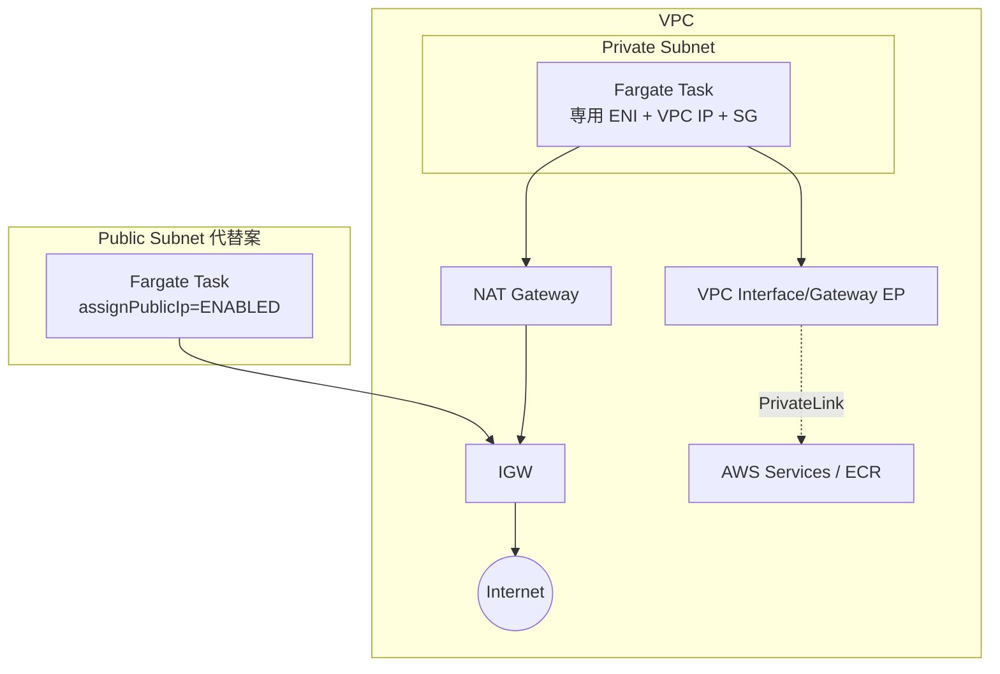

# AWS Fargate（ネットワーク観点）

> カテゴリ: コンテナ / 重要度: △（周辺）
> ANS-C01 では「awsvpc 固定 / タスクごとの ENI」と「アウトバウンド経路」が問われる。簡潔にネットワーク観点へ絞る。
> 最終更新: 2026-05-24 ／ 出典は本ドキュメント末尾

---

## 1. 概要

AWS Fargate は EC2 を管理せずにコンテナを実行するサーバレスコンピュート。ECS/EKS のデータプレーンとして動く。ネットワーク観点では、**awsvpc モード固定**で各タスク/Pod が**専用 ENI と VPC の IP**を持ち、ホスト概念が無いためアウトバウンド経路設計が論点になる。

### 試験での位置づけ

- 「ホストを管理しないので host/bridge は使えない → awsvpc 固定」「Fargate タスクをインターネットに出すには？」が問われる。

---

## 2. コアコンセプト

| 概念 | 役割 | 試験での要点 |
|---|---|---|
| **awsvpc 固定** | 唯一のネットワークモード | 各タスクに専用 ENI + VPC IP + 専用 SG。bridge/host は不可 |
| **タスク ENI** | タスク単位の仮想 NIC | PV 1.4.0 以降は**全トラフィックが単一タスク ENI を経由** |
| **assignPublicIp** | パブリック IP 割当 | パブリックサブネット配置時にタスクへ直接パブリック IP を付与可 |
| **アウトバウンド** | 外部/AWS への通信 | パブリック IP 直結、または NAT Gateway / VPC エンドポイント |

---

## 3. アーキテクチャ / 仕組み

- **ホストを共有しない**ため、各タスクは独立した ENI を持ち SG をタスク単位で適用できる。
- アウトバウンドの2択: **(A) パブリックサブネット + `assignPublicIp=ENABLED`**（タスクに直接パブリック IP）、**(B) プライベートサブネット + NAT Gateway**（推奨。AWS サービスは VPC エンドポイント）。

---

## 4. 試験頻出ポイント

- **awsvpc 固定**: Fargate では bridge/host を選べない。タスク単位 SG・VPC ネイティブ IP が常に得られる。
- **イメージ pull のアウトバウンド**: プライベートサブネットの Fargate は **ECR の ecr.api/ecr.dkr + S3 エンドポイント**、または NAT が無いと pull に失敗（[ECR](../ecr/README.md) 参照）。CloudWatch Logs 送信にもエンドポイント/NAT が要る。
- **パブリック IP**: プライベートサブネットでは付与不可。`assignPublicIp` はパブリックサブネット + IGW 経路が前提。
- **EKS on Fargate**: AWS Load Balancer Controller は **ip ターゲットモード必須**（ノードが無いため instance モード不可）。Security Groups for Pods はサポートされ、各 Pod が専用 ENI を持つ。
- プラットフォームバージョン **1.4.0 以降**は単一タスク ENI に集約され、エフェメラルストレージ等も整理されている。

---

## 5. 他サービスとの連携

- **[VPC](../../networking-content-delivery/vpc/README.md)**: サブネット/SG/ENI/NAT/エンドポイントの基盤。
- **[ECS](../ecs/README.md) / [EKS](../eks/README.md)**: Fargate を起動タイプ/プロファイルとして利用。
- **[ECR](../ecr/README.md)**: プライベート pull に api/dkr + S3 エンドポイントが前提。
- **[Elastic Load Balancing](../../networking-content-delivery/elastic-load-balancing/README.md)**: ip ターゲットでタスク IP に直接ルーティング。

---

## 6. 制約・上限・コスト

| 項目 | 値 |
|---|---|
| ネットワークモード | **awsvpc 固定** |
| タスクあたり ENI | 1（PV 1.4.0 以降、全通信が経由） |
| パブリック IP | パブリックサブネット + `assignPublicIp=ENABLED` のみ |

- **コスト**: vCPU/メモリ/エフェメラルストレージの従量課金。プライベートサブネット運用での NAT データ処理料を VPC エンドポイントで削減可能。

---

## 7. 出典

- [Amazon ECS task networking options for Fargate – AWS Docs](https://docs.aws.amazon.com/AmazonECS/latest/developerguide/fargate-task-networking.html)
- [Connect Amazon ECS applications to the internet – AWS Docs](https://docs.aws.amazon.com/AmazonECS/latest/developerguide/networking-outbound.html)
- [Fargate task networking considerations – AWS Docs](https://docs.aws.amazon.com/AmazonECS/latest/developerguide/fargate-task-networking.html)
