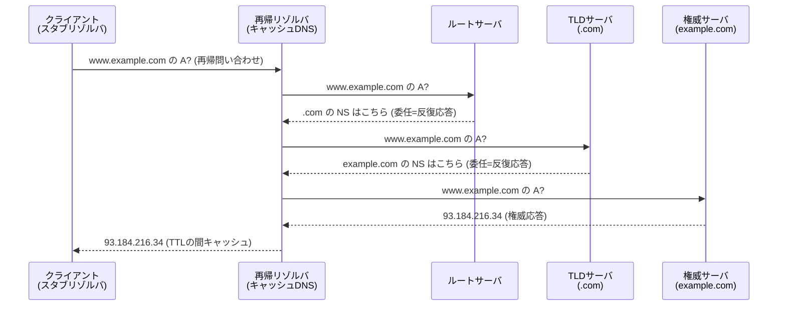
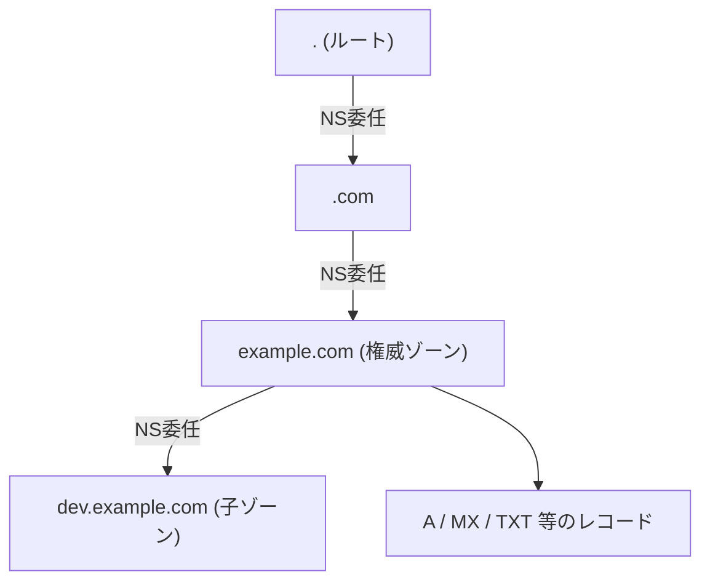

# DNS（ドメインネームシステム）の基礎

> カテゴリ: ネットワーク基礎 / 重要度: ◎（最重要）
> ANS-C01 では Route 53 を理解する前提として、DNS の名前解決フロー・レコード種別・TTL・委任を確実に押さえる必要がある。
> 最終更新: 2026-05-24 ／ 出典は本ドキュメント末尾

---

## 1. 概要

**DNS（Domain Name System）** は、人間が扱うドメイン名（`www.example.com`）を IP アドレス（`93.184.216.34` / `2606:2800:220:1:248:1893:25c8:1946`）に変換する、インターネットの分散型・階層型の名前解決システムである。世界中のサーバが**ゾーン（zone）** 単位で分担して責任を持ち、**委任（delegation）** によって階層をたどることで、単一障害点を持たずに膨大な名前空間をスケールさせる。

### なぜ ANS 試験で重要か

- Route 53（権威 DNS + Resolver）の問題は **DNS の基礎概念を理解していないと解けない**。再帰/反復解決、権威サーバとリゾルバの役割分担、レコード種別、TTL の挙動は前提知識として頻出。
- **ハイブリッド DNS**（オンプレ ↔ VPC の名前解決）では「どこが権威でどこが転送するか」を設計・トラブルシュートする。
- **フェイルオーバー / ヘルスチェック / ルーティングポリシー** は DNS の TTL・レコード応答の仕組みに依存する。TTL を理解しないと「切り替えに時間がかかる」系の引っかけに対応できない。
- 第1分野（設計）・第2分野（実装）・第3分野（運用・トラブルシュート）すべてに関わる横断的基礎。

---

## 2. コアコンセプト

| 概念 | 役割 | 試験での要点 |
|---|---|---|
| **権威 DNS サーバ (Authoritative)** | 自ゾーンのレコードの「正解」を保持し応答する | Route 53 のパブリック/プライベートホストゾーンがこれ |
| **リゾルバ (Resolver / Recursive)** | クライアントに代わって再帰的に名前を解決する | VPC+2 の Route 53 Resolver、ISP の DNS |
| **スタブリゾルバ (Stub)** | OS 上のクライアント。リゾルバへ問い合わせるだけ | `/etc/resolv.conf` 等で参照先を指定 |
| **ゾーン (Zone)** | 1 つの管理単位でのレコード集合 | SOA を頂点に持つ。委任で分割される |
| **委任 (Delegation)** | 下位ゾーンの権限を別サーバに委ねる | 親ゾーンの NS レコードで指定 |
| **レコード (Resource Record)** | A/AAAA/CNAME/MX 等の名前解決データ | §4 で詳細 |
| **TTL (Time To Live)** | レコードのキャッシュ保持秒数 | 短いほど切替が速いが負荷増。§5 |
| **正引き / 逆引き** | 名前→IP / IP→名前 | 逆引きは PTR + `in-addr.arpa` / `ip6.arpa` |

---

## 3. 名前解決フロー（再帰と反復）

クライアントから見ると 1 回の問い合わせだが、リゾルバの裏側ではルート → TLD → 権威の順に**反復的に**たどっている。

### 再帰問い合わせ vs 反復問い合わせ

| 種別 | 誰が誰へ | 動作 |
|---|---|---|
| **再帰問い合わせ (Recursive)** | クライアント → リゾルバ | 「最終的な答えをまるごと返して」と依頼。リゾルバが全部解決する責任を負う |
| **反復問い合わせ (Iterative)** | リゾルバ → ルート/TLD/権威 | 「知らないなら次に聞くべきサーバを教えて」。委任（NS）をたどる |

> 試験ポイント: **クライアントが行うのは再帰問い合わせ**、**リゾルバが上位サーバへ行うのは反復問い合わせ**。Route 53 Resolver（VPC+2）は再帰リゾルバとして振る舞い、権威サーバ（ホストゾーン）は反復応答の終端（権威応答）を返す。

### キャッシュ

- リゾルバは応答を **TTL の間キャッシュ**し、同じ問い合わせに対しルートまで遡らずに即答する。
- **ネガティブキャッシュ**: 「存在しない（NXDOMAIN）」も SOA の最小 TTL に従ってキャッシュされる。レコードを新規追加しても NXDOMAIN がキャッシュされていると一定時間引けないことがある。

---

## 4. レコード種別（頻出）

| タイプ | 意味 | 用途・要点 |
|---|---|---|
| **A** | ホスト名 → IPv4 アドレス | 最も基本。`example.com → 93.184.216.34` |
| **AAAA** | ホスト名 → IPv6 アドレス | "quad-A"。IPv6 対応に必須 |
| **CNAME** | 別名 → 別のドメイン名 | **Zone Apex（`example.com`）には設定不可**。他レコードと併存不可 |
| **ALIAS** | ドメイン → AWS リソース | **Route 53 独自拡張**。Zone Apex で使え、A/AAAA として応答。標準 DNS にはない |
| **NS** | ゾーンの権威ネームサーバ | **委任**を表す。親ゾーンに置くと下位ゾーンへ委任 |
| **SOA** | ゾーンの権威情報の起点 | シリアル番号・リフレッシュ間隔・**ネガティブキャッシュ TTL** 等。ゾーンに 1 つ |
| **MX** | メール配送先 + 優先度 | 数値が**小さいほど優先**。`10 mail.example.com` |
| **TXT** | 任意のテキスト | SPF/DKIM/DMARC、ドメイン所有権検証に多用 |
| **SRV** | サービスの場所（優先度/重み/ポート/ターゲット） | SIP・Microsoft AD 等のサービスディスカバリ |
| **PTR** | IP アドレス → ホスト名 | **逆引き**。`in-addr.arpa`(v4)/`ip6.arpa`(v6) に置く |
| **CAA** | 証明書発行を許可する CA を限定 | 不正な証明書発行の防止 |

### CNAME と ALIAS の違い（AWS 文脈で頻出）

| 観点 | CNAME | ALIAS |
|---|---|---|
| Zone Apex（`example.com`） | **不可** | **可** |
| 指す先 | 任意のドメイン名 | AWS リソース or 同一ゾーンの別レコード |
| 標準 DNS | 標準仕様 | **Route 53 独自**（外部から見ると A/AAAA） |
| IP 追従 | 手動 | リソース変化に自動追従・クエリ課金なし |

> 試験ポイント: **CNAME は Zone Apex に置けない**（RFC 上、Apex には SOA/NS が必須で CNAME と併存できない）。Apex を ELB/CloudFront に向けたいときは Route 53 の **ALIAS** を使う。

---

## 5. TTL（キャッシュ生存時間）

- **TTL** はレコードごとに秒単位で設定し、リゾルバがその時間だけ応答をキャッシュする。
- **短い TTL（例: 60 秒）**: 切替（フェイルオーバー・IP 変更）が速く反映される。ただし権威サーバへの問い合わせが増える。
- **長い TTL（例: 86400 秒）**: 負荷・コストが下がるが、変更の反映が遅い。
- **切替直前に TTL を下げる**のが定石。フェイルオーバー前に TTL を 60 秒に下げておけば、旧キャッシュの残存時間を短くできる。
- 注意: **クライアント/ブラウザ/中間リゾルバが TTL を無視・延長することがある**。DNS フェイルオーバーは「即座に全員が切り替わる」ものではない。確実な切替が必要なら ELB のターゲット切替や Global Accelerator（固定 IP）等を併用する。

---

## 6. ゾーン委任と正引き/逆引き

- **委任は親ゾーンの NS レコード**で行う。`example.com` を Route 53 で管理するには、親（レジストリ/`.com`）に Route 53 の 4 つの NS を登録する。
- **サブドメインの委任**: `dev.example.com` を別チームの DNS に委ねたいなら、`example.com` ゾーン内に `dev` の NS レコードを置く。
- **正引き（Forward）**: 名前 → IP（A/AAAA）。
- **逆引き（Reverse）**: IP → 名前（PTR）。特殊ドメイン `in-addr.arpa`（IPv4）/`ip6.arpa`（IPv6）にゾーンを作り、IP を逆順に並べる（例: `34.216.184.93.in-addr.arpa`）。逆引きゾーンの権限は通常 IP を割り当てた事業者（AWS 含む）が持つ。

---

## 7. AWS サービスとの接続

- **Route 53**: AWS のマネージド権威 DNS + ドメイン登録 + DNS ヘルスチェック。再帰リゾルバ（Route 53 Resolver）も提供し、ハイブリッド DNS・ルーティングポリシー・フェイルオーバーを実現する。本資料の概念がそのまま土台になる。詳細は [Route 53](../../networking-content-delivery/route-53/README.md) を参照。
- **AWS Cloud Map**: サービスディスカバリ。アプリのリソース（IP/URL/任意属性）を名前で登録し、DNS（A/AAAA/SRV）または API で解決する。マイクロサービスの動的な名前解決に DNS の仕組みを応用している。詳細は [Cloud Map](../../networking-content-delivery/cloud-map/README.md) を参照。
- VPC 内部の名前解決は **VPC+2 の Route 53 Resolver** が担い、プライベートホストゾーン（PHZ）と組み合わせて内部名を解決する。

---

## 8. よくある誤解・ひっかけ

- **「CNAME は Zone Apex に置ける」→ 誤り**。Apex には ALIAS を使う。これは ANS の超頻出ポイント。
- **「DNS フェイルオーバーは即座に全クライアントへ反映される」→ 誤り**。TTL とクライアントのキャッシュ無視により遅延する。確実性が要るなら別手段を併用。
- **「再帰問い合わせをするのは権威サーバ」→ 誤り**。再帰はクライアント→リゾルバ。権威サーバは反復応答（委任 or 権威応答）を返す。
- **「MX は値が大きいほど優先」→ 誤り**。MX の優先度は**小さいほど優先**。
- **「レコードを追加すればすぐ引ける」→ 誤り**。NXDOMAIN のネガティブキャッシュ（SOA の最小 TTL）が残っていると一定時間引けないことがある。
- **「ALIAS は標準 DNS のレコードタイプ」→ 誤り**。ALIAS は Route 53 独自で、外部からは A/AAAA に見える。
- **「TTL を 0 にすればキャッシュされない」→ 実装依存**。多くのリゾルバは最小 TTL を強制し、TTL を完全には信用しない。

---

## 9. 出典

- [Domain Name System (DNS) concepts – RFC 1034/1035 (IETF)](https://www.rfc-editor.org/rfc/rfc1034)
- [How Amazon Route 53 routes traffic for your domain – AWS Docs](https://docs.aws.amazon.com/Route53/latest/DeveloperGuide/welcome-dns-service.html)
- [Choosing between alias and non-alias records – AWS Docs](https://docs.aws.amazon.com/Route53/latest/DeveloperGuide/resource-record-sets-choosing-alias-non-alias.html)
- [Supported DNS record types – AWS Docs](https://docs.aws.amazon.com/Route53/latest/DeveloperGuide/ResourceRecordTypes.html)
- [How Route 53 Resolver works – AWS Docs](https://docs.aws.amazon.com/Route53/latest/DeveloperGuide/resolver.html)
- [What is AWS Cloud Map – AWS Docs](https://docs.aws.amazon.com/cloud-map/latest/dg/what-is-cloud-map.html)
