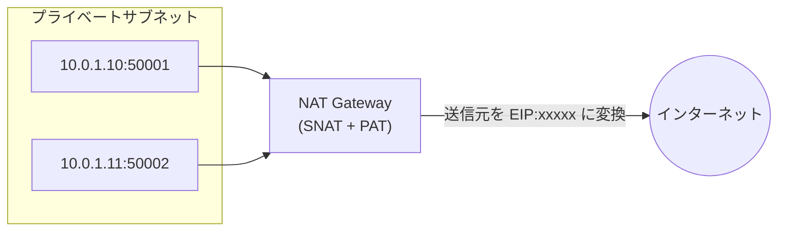
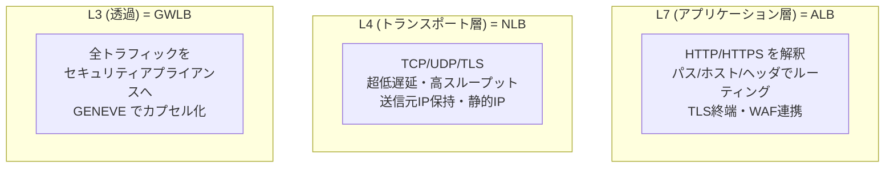
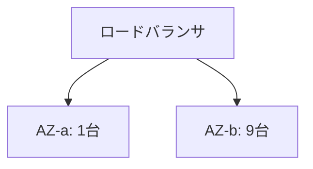

# NAT とロードバランシングの基礎概念

> カテゴリ: ネットワーク基礎 / 重要度: ◎（最重要）
> ANS-C01 では NAT Gateway・ALB/NLB/GWLB・クロスゾーン・Proxy Protocol・ターゲットタイプの理解にこれらの基礎概念が直結する。
> 最終更新: 2026-05-24 ／ 出典は本ドキュメント末尾

---

## 1. 概要

**NAT（Network Address Translation）** は IP アドレス（とポート）を書き換える技術で、プライベートアドレスのホストをインターネットへ出したり、アドレス重複を解消したりする。**ロードバランシング**は複数のバックエンドへトラフィックを分散し、可用性とスケーラビリティを高める技術で、動作する層（L4 / L7）によって機能が大きく異なる。両者ともパケットの宛先/送信元を扱う点で密接に関係する。

### なぜ ANS 試験で重要か

- **NAT Gateway / NAT インスタンス**の設計（AZ ごと配置・ルートテーブル・上限）は第1分野で頻出。SNAT/PAT の挙動理解が前提。
- **ALB（L7）・NLB（L4）・GWLB（L3 透過）** の使い分けは ANS の中核。**ヘルスチェック・クロスゾーン負荷分散・ターゲットタイプ・Proxy Protocol・ソース IP 保持**は実装/運用で必ず問われる。
- **ステートフル/ステートレス**の区別は SG/NACL/ファイアウォール設計に直結。
- リバースプロキシ・ロードバランシングアルゴリズム・接続維持は、性能とトラブルシュートの両面で問われる。

---

## 2. NAT の種別

| 種別 | 書き換え対象 | 用途・要点 |
|---|---|---|
| **SNAT (Source NAT)** | **送信元** IP を書き換え | プライベート → インターネットの外向き通信。**NAT Gateway はこれ** |
| **DNAT (Destination NAT)** | **宛先** IP を書き換え | 外部 → 内部へのポートフォワード。リバースプロキシ/LB の前段で使う |
| **PAT (Port Address Translation) / NAPT** | 送信元 IP + **ポート**を多重化 | 多数の内部ホストを 1 つのグローバル IP で共有。「IP マスカレード」。NAT Gateway は PAT で多重化 |

> 試験ポイント: **NAT Gateway は SNAT + PAT**でアウトバウンドのみ（インバウンドの新規接続は不可）。1 つの NAT Gateway は **1 EIP あたり最大約 55,000 同時接続/宛先**で、同一宛先への大量接続でポート枯渇が起きうる。**AZ ごとに NAT Gateway を配置**し、各 AZ のルートを自 AZ の NAT に向けるのがベストプラクティス（AZ 障害分離）。

### ステートフル vs ステートレス（NAT/FW 共通）

| | ステートフル | ステートレス |
|---|---|---|
| 状態保持 | 接続（フロー）を追跡 | 個々のパケットを独立評価 |
| 戻りトラフィック | 自動許可 | 明示ルールが必要 |
| AWS の例 | **セキュリティグループ**・NAT Gateway・ALB/NLB の接続追跡 | **ネットワーク ACL** |

---

## 3. L4 vs L7 ロードバランシング

| 観点 | **ALB (L7)** | **NLB (L4)** | **GWLB (L3透過)** |
|---|---|---|---|
| 動作層 | アプリケーション層 | トランスポート層 | ネットワーク層（透過） |
| プロトコル | HTTP/HTTPS/gRPC | TCP/UDP/TLS | IP（全トラフィック） |
| ルーティング | パス/ホスト/ヘッダ/メソッド | フローハッシュ | 5-tuple/3-tuple |
| 送信元 IP | 保持しない（`X-Forwarded-For`） | **保持する** | 保持する |
| 静的 IP | なし（DNS 名） | **あり（AZ ごと EIP 可）** | なし |
| 主用途 | Web アプリ・マイクロサービス | 高性能 TCP/UDP・固定 IP 要件 | ファイアウォール/IDS/IPS の挿入 |

---

## 4. リバースプロキシとロードバランシングアルゴリズム

- **リバースプロキシ**: クライアントとバックエンドの間に立ち、クライアントの代理でバックエンドへ接続する。**ALB はリバースプロキシ型**でクライアントとの接続とバックエンドへの接続を分離（接続終端）する。一方 **NLB はパススルー型**に近く、送信元 IP を保持する。
- リバースプロキシの効果: TLS 終端・キャッシュ・圧縮・WAF/認証の集約・バックエンド秘匿。

### 代表的なアルゴリズム

| アルゴリズム | 動作 | AWS での対応 |
|---|---|---|
| **ラウンドロビン** | 順番に均等配分 | ALB の既定 |
| **最小未処理リクエスト (LOR)** | 処理中リクエストが最少のターゲットへ | ALB で選択可 |
| **フローハッシュ** | 5-tuple のハッシュで同一フローを同一先へ | NLB（接続維持に有利） |
| **重み付け** | ターゲットグループ/ターゲットに重み | 加重ターゲットグループ |

---

## 5. ヘルスチェックと接続維持

### ヘルスチェック

- ロードバランサは各ターゲットへ定期的に**ヘルスチェック**を行い、**Healthy なターゲットにのみ**トラフィックを送る。
- **ALB**: HTTP/HTTPS でパス・ステータスコード（例: 200-399）を判定。
- **NLB**: TCP / HTTP / HTTPS。TCP は接続確立可否のみ。UDP ターゲットは別ポートの TCP/HTTP で代替監視するのが定石。
- **連続成功/失敗しきい値・間隔・タイムアウト**で Healthy/Unhealthy を判定。全ターゲットが Unhealthy のとき**フェイルオープン**（全ターゲットへ送る）する LB もある。

### 接続維持（スティッキーセッション / コネクション）

- **ALB のスティッキーセッション**: クッキー（LB 生成 `AWSALB` or アプリ定義）で同一クライアントを同一ターゲットへ。
- **NLB**: フローハッシュにより本質的に同一フローは同一ターゲットへ（**ソース IP アフィニティ**も選択可）。
- **アイドルタイムアウト**: ALB は既定 60 秒で無通信接続を切る。NLB の TCP アイドルタイムアウトは 350 秒（固定）。

---

## 6. ソース IP 保持と Proxy Protocol

- **NLB（instance/IP ターゲット）** は基本的に**クライアントのソース IP を保持**してバックエンドに届く。
- **ALB はソース IP を保持しない**（リバースプロキシのため）。元のクライアント IP は **`X-Forwarded-For` ヘッダ**で渡す。
- **Proxy Protocol v2**: L4 で接続のメタデータ（元の送信元 IP/ポート）をバイナリヘッダとして付与する仕組み。**NLB で TLS 終端しない場合や IP がプロキシ経由で失われる場合**に、バックエンドへ元のクライアント情報を伝えるために使う。
- **クライアント IP 保持の注意**: NLB の **同一 VPC 内・ターゲットが instance タイプ**等の条件でソース IP 保持の挙動が変わる。ループバック（hairpinning）問題に注意。

---

## 7. ターゲットタイプとクロスゾーン負荷分散

### ターゲットタイプ

| タイプ | 指す先 | 要点 |
|---|---|---|
| **instance** | EC2 インスタンス ID | ソース IP 保持。SG はインスタンスに適用 |
| **ip** | IP アドレス | オンプレ/別 VPC/コンテナを直接指せる。ハイブリッドで有用 |
| **lambda** | Lambda 関数 | ALB のみ |
| **alb** | ALB | NLB のターゲットに ALB を指定（L4+L7 連携） |

### クロスゾーン負荷分散

- **クロスゾーン ON**: LB ノードが**全 AZ の全ターゲットへ均等**に分散（上図で各ターゲットが等しく受ける）。
- **クロスゾーン OFF**: LB ノードは**自 AZ 内のターゲットのみ**へ分散（AZ ごとの台数が偏ると負荷も偏る）。
- **ALB は常にクロスゾーン ON（無効化不可・無料）**。**NLB / GWLB は既定 OFF**（有効化可。**AZ 間データ転送料が発生**する点が頻出）。

---

## 8. AWS サービスとの接続

- **VPC / NAT Gateway**: NAT Gateway は SNAT + PAT でプライベートサブネットの外向き通信を担う。AZ ごと配置・ルートテーブル・同時接続上限・ステートフルな挙動は本資料の概念が土台。詳細は [NAT/VPC](../../networking-content-delivery/vpc/README.md) を参照。
- **ELB（ALB/NLB/GWLB）**: L4/L7 の使い分け、ヘルスチェック、クロスゾーン、Proxy Protocol、ターゲットタイプ、ソース IP 保持はすべて本資料の概念がそのまま AWS の設定に対応する。詳細は [ELB](../../networking-content-delivery/elastic-load-balancing/README.md) を参照。

---

## 9. よくある誤解・ひっかけ

- **「NAT Gateway はインバウンド接続も受けられる」→ 誤り**。アウトバウンドのみ（SNAT+PAT）。外部公開には IGW + LB を使う。
- **「1 つの NAT Gateway を全 AZ で共有すれば十分」→ 設計上非推奨**。AZ 障害で他 AZ もインターネット断。AZ ごと配置が定石。
- **「ALB はクライアントのソース IP をバックエンドに渡す」→ 誤り**。`X-Forwarded-For` で渡す。生のソース IP は保持しない。NLB は保持する。
- **「クロスゾーン負荷分散はどの LB でも既定 ON」→ 誤り**。ALB は常時 ON、**NLB/GWLB は既定 OFF**で、有効化すると AZ 間転送料が発生。
- **「L7 と L4 は同じヘルスチェックができる」→ 誤り**。L7（ALB）はパス/ステータスで判定、L4（NLB）は TCP 接続可否が基本。UDP は代替監視が必要。
- **「NACL もステートフル」→ 誤り**。NACL はステートレス、SG はステートフル。
- **「Proxy Protocol を有効にすれば常にクライアント IP がわかる」→ 条件付き**。バックエンドが Proxy Protocol v2 を解釈できる必要があり、未対応だとヘッダがそのままデータとして混入し破損する。

---

## 10. 出典

- [NAT gateways – AWS Docs](https://docs.aws.amazon.com/vpc/latest/userguide/vpc-nat-gateway.html)
- [Compare AWS load balancer products – AWS Docs](https://docs.aws.amazon.com/elasticloadbalancing/latest/userguide/how-elastic-load-balancing-works.html)
- [Application Load Balancer – AWS Docs](https://docs.aws.amazon.com/elasticloadbalancing/latest/application/introduction.html)
- [Network Load Balancer – AWS Docs](https://docs.aws.amazon.com/elasticloadbalancing/latest/network/introduction.html)
- [Gateway Load Balancer – AWS Docs](https://docs.aws.amazon.com/elasticloadbalancing/latest/gateway/introduction.html)
- [Cross-zone load balancing – AWS Docs](https://docs.aws.amazon.com/elasticloadbalancing/latest/userguide/how-elastic-load-balancing-works.html#cross-zone-load-balancing)
- [Use Proxy Protocol to fetch client IP (NLB) – AWS Docs](https://docs.aws.amazon.com/elasticloadbalancing/latest/network/load-balancer-target-groups.html#proxy-protocol)
