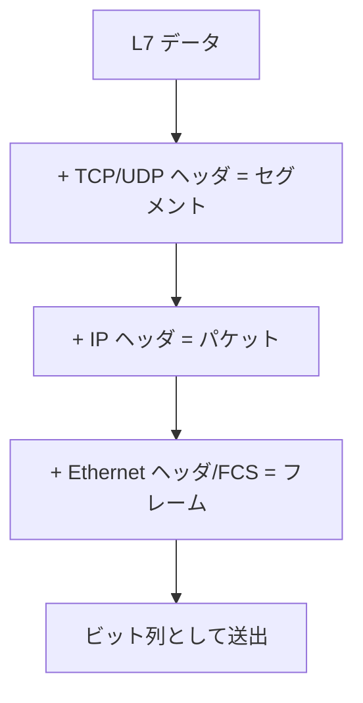

# OSI 参照モデルとカプセル化（ネットワーク基礎）

> カテゴリ: ネットワーク基礎 / 重要度: ◎（最重要）
> ANS-C01 全分野の前提知識。L4/L7 の区別は ELB・ファイアウォール問題で必須。
> 最終更新: 2026-05-24 ／ 出典は本ドキュメント末尾

---

## 1. 概要

OSI 参照モデルは、ネットワーク通信を **7 つの層**に分けて整理した概念モデル。実装上は **TCP/IP 4 階層モデル**が使われるが、AWS の試験・ドキュメントでは「L3」「L4」「L7」のように **OSI の層番号**で語られることが多い。本ドキュメントは各層の役割・カプセル化・L2/L3 の機器を試験対応の密度で整理する。

### なぜ ANS 試験で重要か

- **ELB の種類分け**が層で決まる: **ALB = L7**、**NLB = L4**、**GWLB = L3**。どの層で何ができるかの理解が直結。
- ファイアウォール / セキュリティ制御も層で分かれる: SG/NACL（L3/L4）、WAF（L7）、Network Firewall（L3-L7）。
- MTU・フラグメンテーション・カプセル化（L3）はトラブルシュート問題の基礎。
- 「どの層のヘッダで判断しているか」を問うひっかけが頻出。

---

## 2. OSI 7 階層と TCP/IP 4 階層の対応

| OSI 層 | 名称 | TCP/IP 4 階層 | PDU | 代表例 | アドレス |
|---|---|---|---|---|---|
| **L7** | アプリケーション | アプリケーション | データ | HTTP, DNS, TLS, SMTP | URL / ホスト名 |
| **L6** | プレゼンテーション | （同上） | データ | 暗号化・文字コード・圧縮 | — |
| **L5** | セッション | （同上） | データ | セッション管理 | — |
| **L4** | トランスポート | トランスポート | **セグメント**（TCP）/データグラム（UDP） | TCP, UDP | **ポート番号** |
| **L3** | ネットワーク | インターネット | **パケット** | IP, ICMP, IPsec | **IP アドレス** |
| **L2** | データリンク | リンク（ネットワークアクセス） | **フレーム** | Ethernet, ARP, VLAN | **MAC アドレス** |
| **L1** | 物理 | （同上） | ビット | ケーブル・電気信号・光 | — |

> 暗記語呂（下から）: 物 デ ネ ト セ プ ア。AWS では **L4 = ポート**、**L3 = IP**、**L2 = MAC** が即答できることが重要。

---

## 3. 各層の役割（試験で問われる粒度）

### L2 データリンク層（フレーム）

- 同一セグメント（同一ブロードキャストドメイン）内の**隣接ノード間**の転送。
- **MAC アドレス**で宛先を識別。**スイッチ**が活躍する層。
- PDU は**フレーム**。Ethernet ヘッダ（宛先/送信元 MAC・EtherType）＋ FCS。

### L3 ネットワーク層（パケット）

- **異なるネットワーク間**のエンドツーエンド到達性（ルーティング）。
- **IP アドレス**で宛先を識別。**ルータ**が活躍する層。
- PDU は**パケット**。IP ヘッダに TTL・フラグメント情報・プロトコル番号。

### L4 トランスポート層（セグメント）

- **ポート番号**でアプリ（プロセス）を識別。コネクションと信頼性の制御。
- **TCP**: コネクション指向・順序保証・再送・フロー制御（3-way ハンドシェイク）。
- **UDP**: コネクションレス・低オーバーヘッド（DNS, VoIP, QUIC の土台）。

### L7 アプリケーション層

- HTTP ヘッダ・パス・ホスト・Cookie など**アプリのコンテキスト**を扱う。
- ALB のパスベース/ホストベースルーティング、WAF のルールはこの層。

---

## 4. カプセル化とデカプセル化

各層は**上位層のデータを「ペイロード」として自層のヘッダを付与**して下位に渡す。これがカプセル化。受信側は逆順に剥がす（デカプセル化）。

- **送信時（カプセル化）**: L7 → L4（ポート付与）→ L3（IP 付与）→ L2（MAC 付与）。
- **受信時（デカプセル化）**: L1 → L2 → L3 → L4 → L7 の順でヘッダを剥がす。
- **VPN / トンネル**は「パケット全体を再びペイロードにして新しいヘッダで包む」= 二重カプセル化。これが **MTU を圧迫**する原因（後述）。

---

## 5. PDU（Protocol Data Unit）の呼び方

| 層 | PDU の呼称 |
|---|---|
| L7-L5 | データ |
| L4 | **セグメント**（TCP）/ **データグラム**（UDP） |
| L3 | **パケット** |
| L2 | **フレーム** |
| L1 | ビット |

> 「セグメント = L4」「パケット = L3」「フレーム = L2」の対応は頻出。混同を狙うひっかけに注意。

---

## 6. MAC アドレスと ARP

- **MAC アドレス**: NIC に割り当てられた 48bit の L2 識別子（例 `02:1a:...`）。
- **ARP（Address Resolution Protocol）**: 同一サブネット内で **IP アドレス → MAC アドレス**を解決。
  - 「この IP を持つのは誰？」をブロードキャストし、該当ホストが自分の MAC を返す。
  - ARP は**同一ブロードキャストドメイン内**でのみ機能（ルータを越えない）。
- 別ネットワーク宛の通信は、**デフォルトゲートウェイ（ルータ）の MAC**宛にフレームを送り、ルータが L3 でルーティングする。

---

## 7. スイッチ vs ルータ、ブロードキャストドメイン

| 観点 | スイッチ（L2） | ルータ（L3） |
|---|---|---|
| 動作層 | データリンク層（L2） | ネットワーク層（L3） |
| 識別子 | **MAC アドレス** | **IP アドレス** |
| テーブル | MAC アドレステーブル | ルーティングテーブル |
| 転送判断 | 同一セグメント内のポート選択 | ネットワーク間のルーティング |
| ブロードキャスト | **転送する**（同一ドメイン） | **遮断する**（ドメインを分割） |

- **ブロードキャストドメイン**: ブロードキャストフレームが届く範囲。**ルータ（L3 境界）で分割**される。
- **コリジョンドメイン**: スイッチの各ポートで分割（全二重では実質消滅）。
- **VLAN** は 1 つのスイッチを論理的に複数のブロードキャストドメインに分割する。
- AWS の VPC サブネットは**ブロードキャスト/マルチキャスト非対応**（従来の L2 ブロードキャストは流れない）点に注意。

---

## 8. MTU とフラグメンテーション

- **MTU（Maximum Transmission Unit）**: L2 フレームが運べる L3 ペイロードの最大サイズ。Ethernet は標準 **1500 バイト**、ジャンボフレームは **9001 バイト**（VPC 内）。
- カプセル化（VPN / GRE / VXLAN）でヘッダが増えると**実効ペイロードが減る**。
- **PMTUD（Path MTU Discovery）**は経路最小 MTU を ICMP で学習する。**ICMP Type3 Code4（Fragmentation Needed）を遮断**すると経路がブラックホール化して無応答になる。
- AWS の経路別 MTU 例: VPC 内 9001、**Internet Gateway 経由は 1500**、VPN/インターネット越えは小さくなりがち。

---

## 9. AWS サービスとの接続

- L7 ルーティング（ALB）と L4 高性能ロードバランシング（NLB）: [ELB（L4/L7）](../../networking-content-delivery/elastic-load-balancing/README.md)
- L3 でトラフィックを透過的にアプライアンスへ振り向ける（GENEVE カプセル化）: [GWLB](../../networking-content-delivery/elastic-load-balancing/README.md)
- サブネット・ルートテーブル・MTU・ブロードキャスト制約の実体: [VPC](../../networking-content-delivery/vpc/README.md)

---

## 10. よくある誤解・ひっかけ

| 誤解 | 正しい理解 |
|---|---|
| 「ALB は L4 ロードバランサ」 | ALB は **L7**。L4 は **NLB**、L3 は **GWLB** |
| 「スイッチが IP アドレスでルーティングする」 | スイッチは **L2 / MAC**。IP ルーティングはルータ（L3） |
| 「ブロードキャストはルータを越える」 | ルータは**ブロードキャストを遮断**しドメインを分割 |
| 「パケットとセグメントとフレームは同義」 | L3=パケット、L4=セグメント、L2=フレーム |
| 「ARP は別ネットワークの MAC も解決できる」 | ARP は**同一ブロードキャストドメイン内のみ** |
| 「VPC サブネット内でブロードキャストが使える」 | VPC は**ブロードキャスト/マルチキャスト非対応** |
| 「MTU を大きくすれば常に速くなる」 | 経路に 1500 区間があり ICMP を遮断すると**ブラックホール化** |
| 「カプセル化と暗号化は同じ」 | カプセル化は**ヘッダで包むこと**。暗号化は別概念（IPsec の ESP 等） |

---

## 出典

- AWS Documentation: Elastic Load Balancing / VPC User Guide（MTU, ジャンボフレーム）
- RFC 1122 (TCP/IP), ISO/IEC 7498-1 (OSI Reference Model), RFC 826 (ARP)
