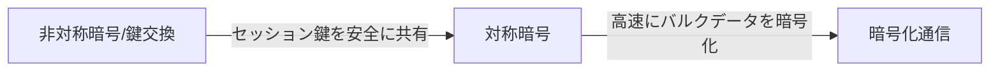
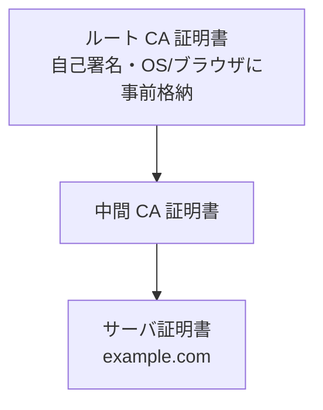
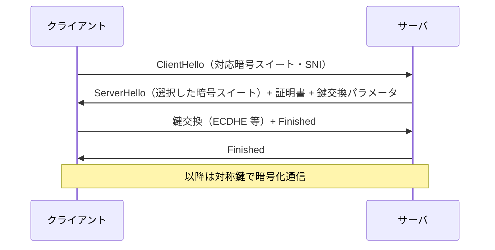

# TLS と VPN の暗号技術（ネットワーク基礎）

> カテゴリ: ネットワーク基礎 / 重要度: ◎（最重要）
> ANS-C01 第4分野（ネットワークセキュリティ）および第2分野（実装）の土台。
> 最終更新: 2026-05-24 ／ 出典は本ドキュメント末尾

---

## 1. 概要

ネットワーク上の通信を保護する暗号技術は、**機密性（盗聴防止）**・**完全性（改ざん検知）**・**認証（なりすまし防止）**の 3 つを実現する。AWS ネットワークでは、アプリケーション層に近い **TLS**（HTTPS / ACM / CloudFront / ALB）と、ネットワーク層の **IPsec**（Site-to-Site VPN / Client VPN）が主役となる。本ドキュメントは両者の暗号的な仕組みを試験対応の密度で整理する。

### なぜ ANS 試験で重要か

- 第4分野「ネットワークセキュリティ」で **TLS 終端の位置（ALB / CloudFront / NLB）**、**ACM の証明書管理**、**VPN の暗号化**が頻出。
- Site-to-Site VPN の **IKE / IPsec パラメータ（Phase1/2、PFS、DH グループ）** はトラブルシュート問題の前提知識。
- 「どこで暗号化が終端されるか」「PFS とは何か」「SNI で何ができるか」といった**概念の正確な理解**がひっかけ問題の鍵になる。

---

## 2. 対称暗号 vs 非対称暗号

| 観点 | 対称鍵暗号 | 非対称鍵暗号（公開鍵暗号） |
|---|---|---|
| 鍵 | **送受信で同じ鍵**を共有 | **公開鍵と秘密鍵のペア** |
| 速度 | **高速**（バルクデータ向き） | 低速（少量データ向き） |
| 代表アルゴリズム | **AES**（AES-128 / AES-256-GCM）、ChaCha20 | **RSA**、**ECDSA**、Diffie-Hellman (DH/ECDH) |
| 主な用途 | 実データの暗号化（TLS のレコード、IPsec の ESP） | 鍵交換・電子署名・認証 |
| 課題 | **鍵配送問題**（どう安全に共有するか） | 計算コストが高い |

### ハイブリッド方式（実際の TLS / IPsec の動作）

両者を組み合わせるのが定石。**非対称暗号で「対称鍵（セッション鍵）」を安全に共有**し、以降の**大量データは高速な対称暗号で暗号化**する。TLS も IPsec もこのハイブリッド構成を採用する。

---

## 3. PKI・証明書チェーン・ルート CA

公開鍵が「本当にその相手のものか」を保証する仕組みが **PKI（公開鍵基盤）**。中心となるのが **X.509 証明書** と **認証局（CA）** の階層構造。

| 要素 | 役割 | 試験での要点 |
|---|---|---|
| **ルート CA** | 信頼の起点。自己署名 | OS / ブラウザの**トラストストア**に事前格納される |
| **中間 CA** | ルートの権限を委譲 | サーバはルートではなく**中間証明書まで含めて提示**する必要がある |
| **サーバ証明書** | ドメインと公開鍵を束ねる | CN / SAN にドメイン名。CA の秘密鍵で**署名**される |
| **証明書チェーン** | サーバ→中間→ルートの検証経路 | チェーン不備は「証明書エラー」の典型原因 |
| **CRL / OCSP** | 失効確認 | 漏洩した証明書を無効化する仕組み |

### 検証の流れ

クライアントは、サーバ証明書の署名を**中間 CA の公開鍵**で検証し、中間 CA 証明書の署名を**ルート CA の公開鍵**で検証する。最終的に**トラストストアにあるルート CA**に到達できれば信頼が確立する。

---

## 4. TLS ハンドシェイク（1.2 と 1.3）

TLS は **ハンドシェイクで認証と鍵共有**を行い、その後**レコードプロトコルで対称暗号化**通信する。

### TLS 1.2 のハンドシェイク（簡略）

| 項目 | TLS 1.2 | TLS 1.3 |
|---|---|---|
| ハンドシェイク往復 | **2-RTT** | **1-RTT**（再接続は **0-RTT** 可） |
| 鍵交換 | RSA 鍵交換 or (EC)DHE | **(EC)DHE のみ**（PFS 必須） |
| 暗号スイート | 多数・脆弱なものも含む | **AEAD のみ**に整理（5 種程度） |
| 旧式暗号 | RC4 / CBC など残存 | **廃止**（前方秘匿性のないものを排除） |
| SNI | 平文 | **ESNI / ECH** で暗号化可（拡張） |

> 試験では「TLS 1.3 は **1-RTT** で高速」「TLS 1.3 は **常に PFS**」が頻出。

---

## 5. SNI（Server Name Indication）

1 つの IP / ポートで**複数ドメインの証明書を出し分ける**ための TLS 拡張。ClientHello に**接続先ホスト名**を載せる。

- **用途**: 1 台のサーバ / 1 つの ELB で複数ドメインをホスト（仮想ホスティング）。
- **AWS との関係**: ALB は **SNI に基づく複数証明書（最大 25 + デフォルト）**をサポート。CloudFront も SNI 対応（専用 IP は追加課金）。
- **注意**: TLS 1.2 までは SNI が**平文**で流れるため、接続先ドメインは盗聴可能（ECH で改善）。

---

## 6. 暗号スイート

TLS で使う暗号アルゴリズムの組み合わせ。TLS 1.2 の例: `ECDHE-RSA-AES128-GCM-SHA256`。

| 構成要素 | 例 | 役割 |
|---|---|---|
| 鍵交換 | **ECDHE** | セッション鍵の共有（PFS をもたらす） |
| 認証 | **RSA / ECDSA** | サーバ証明書の署名方式 |
| 対称暗号 | **AES128-GCM** | レコードの暗号化（AEAD） |
| ハッシュ | **SHA256** | 鍵導出・完全性 |

- **ECDHE で始まるスイート = PFS あり**。RSA 鍵交換（`TLS_RSA_*`）は PFS なし。
- AWS の **ELB セキュリティポリシー**や CloudFront の最小 TLS バージョンで、許可するスイートを制御する。

---

## 7. IPsec（VPN の中核）

IPsec は**ネットワーク層（L3）**で IP パケットを保護するプロトコル群。AWS の Site-to-Site VPN / Client VPN（OpenVPN ベースだが概念は同じ）の基礎。

### IKE（鍵交換）の 2 フェーズ

| フェーズ | 別名 | 目的 | 試験要点 |
|---|---|---|---|
| **IKE Phase 1** | ISAKMP SA | 双方を認証し**安全な管理用トンネル**を確立 | 認証（PSK / 証明書）、DH グループ、暗号・ハッシュを合意 |
| **IKE Phase 2** | IPsec SA | 実データ用の **SA（暗号鍵）**を確立 | Phase1 のトンネル上で交渉。PFS はここで効く |

### プロトコル: ESP vs AH

| プロトコル | 提供する保護 | 試験要点 |
|---|---|---|
| **ESP**（Encapsulating Security Payload） | **暗号化 + 完全性 + 認証** | 実運用はほぼ ESP。**NAT 越え（NAT-T / UDP 4500）**が必要な場合あり |
| **AH**（Authentication Header） | **完全性 + 認証のみ（暗号化なし）** | ヘッダも保護するが**暗号化しない**ため単独利用は稀。NAT と相性が悪い |

### モード: トンネル vs トランスポート

| モード | カプセル化 | 用途 |
|---|---|---|
| **トンネルモード** | **元の IP パケット全体**を暗号化し新しい IP ヘッダを付与 | **サイト間 VPN（ゲートウェイ間）**の標準。AWS VPN はこれ |
| **トランスポートモード** | ペイロードのみ暗号化、元 IP ヘッダは残す | ホスト間の End-to-End。VPN ゲートウェイ用途では使わない |

---

## 8. PFS（Perfect Forward Secrecy・前方秘匿性）

**セッションごとに使い捨ての鍵**を **(EC)DHE** で生成し、長期秘密鍵（サーバ秘密鍵）が将来漏洩しても**過去の通信を復号できない**ようにする性質。

- TLS では **ECDHE 系スイート**、TLS 1.3 では**常に有効**。
- IPsec では **IKE Phase2 で PFS を有効化**（新しい DH 交換を行う）。
- RSA 鍵交換（PFS なし）はサーバ秘密鍵が漏れると過去の全通信が復号され得る。

---

## 9. VPN の暗号（AWS 文脈での整理）

| 項目 | 要点 |
|---|---|
| **Site-to-Site VPN** | IPsec トンネルモード。**2 トンネル（冗長）**。IKEv1/IKEv2、PSK or 証明書認証 |
| **Client VPN** | OpenVPN ベース。**相互 TLS（証明書）**や SAML/AD 認証。TLS で保護 |
| **Direct Connect は暗号化されない** | 専用線だが**それ自体は暗号化なし**。機密性が必要なら **DX 上に VPN（IPsec）を重ねる** or **MACsec**（対応ロケーション） |
| **MACsec** | L2（802.1AE）の暗号化。一部の Direct Connect で利用可 |
| **TLS の終端位置** | CloudFront / ALB で終端 → 内部は再暗号化 or 平文。**NLB は TLS 終端 or TCP パススルー**を選べる |

---

## 10. AWS サービスとの接続

- 証明書管理（ACM）とアクセス制御: [ACM/証明書（IAM）](../../security-identity-compliance/iam/README.md)
- リモートユーザー向け VPN（相互 TLS / 認証）: [Client VPN](../../networking-content-delivery/client-vpn/README.md)
- 拠点間 IPsec VPN: [Site-to-Site VPN](../../networking-content-delivery/site-to-site-vpn/README.md)
- エッジでの TLS 終端・最小 TLS バージョン・SNI: [CloudFront](../../networking-content-delivery/cloudfront/README.md)

---

## 11. よくある誤解・ひっかけ

| 誤解 | 正しい理解 |
|---|---|
| 「対称暗号は鍵が 1 つだから安全性が低い」 | 速度のために**バルク暗号化に最適**。安全性はアルゴリズムと鍵長で決まる |
| 「TLS は非対称暗号で全データを暗号化する」 | 非対称は**鍵交換と認証のみ**。実データは対称鍵で暗号化（ハイブリッド） |
| 「Direct Connect は専用線なので暗号化されている」 | DX は**暗号化されない**。必要なら VPN over DX か MACsec |
| 「TLS 1.3 でも PFS は任意」 | TLS 1.3 は **常に PFS**（(EC)DHE のみ） |
| 「AH を使えば通信が暗号化される」 | AH は**認証・完全性のみ**で暗号化しない。暗号化は ESP |
| 「Site-to-Site VPN はトランスポートモード」 | ゲートウェイ間なので**トンネルモード** |
| 「SNI があれば接続先ドメインは秘匿される」 | TLS 1.2 までは SNI は**平文**。秘匿には ECH が必要 |
| 「ルート CA をサーバが送ればよい」 | サーバは**中間 CA まで**を送る。ルートはクライアントのトラストストアにある |

---

## 出典

- AWS Documentation: Site-to-Site VPN / Client VPN / ACM / CloudFront Developer Guide
- RFC 8446 (TLS 1.3), RFC 5246 (TLS 1.2), RFC 4301/4303 (IPsec/ESP), RFC 7296 (IKEv2)
