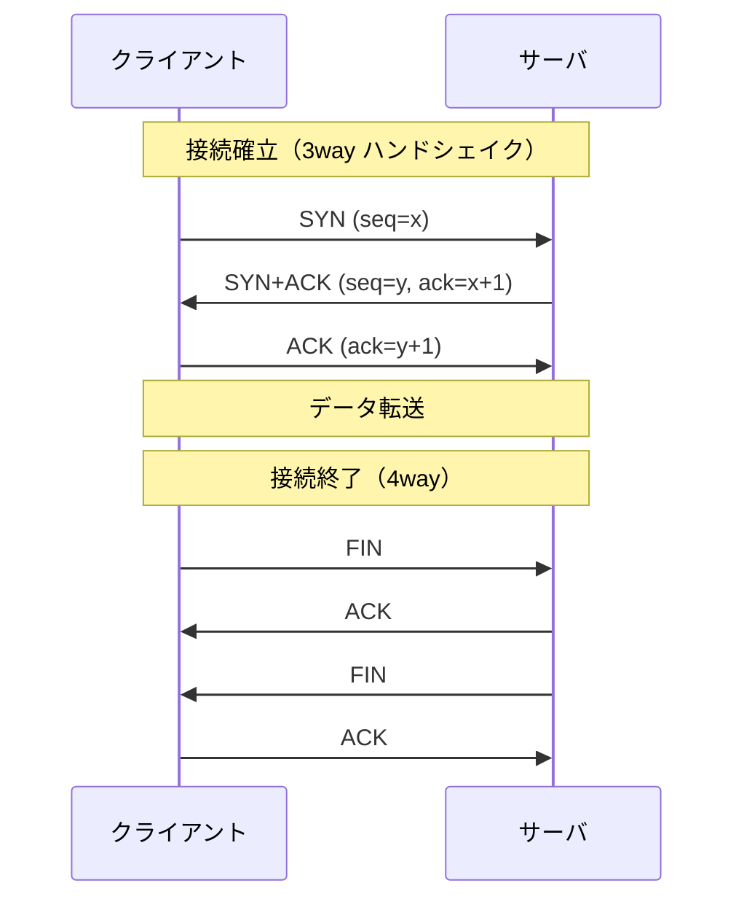
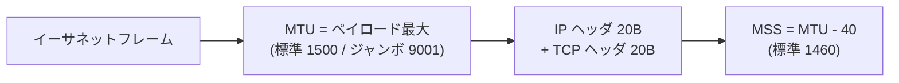

# トランスポート層（TCP / UDP）の基礎

> カテゴリ: ネットワーク基礎 / 重要度: ◎（最重要）
> ANS-C01 では NLB・セキュリティグループ・MTU/MSS・PMTUD・ヘルスチェックの理解に TCP/UDP の基礎が直結する。
> 最終更新: 2026-05-24 ／ 出典は本ドキュメント末尾

---

## 1. 概要

**トランスポート層（OSI 第4層 / L4）** は、ホスト間の論理的な通信路を提供する層で、代表的なプロトコルが **TCP（Transmission Control Protocol）** と **UDP（User Datagram Protocol）** である。TCP は信頼性のあるコネクション型、UDP は軽量なコネクションレス型。アプリケーションは**ポート番号**でサービスを識別し、IP アドレス + ポートの組（ソケット）で通信フローが定まる。

### なぜ ANS 試験で重要か

- **NLB（L4 ロードバランサ）** は TCP/UDP/TLS を扱う。ヘルスチェック・ターゲット・フロー・接続維持の挙動が TCP/UDP の理解に依存する。
- **セキュリティグループ / NACL** はプロトコル + ポートで制御する。**エフェメラルポート**の許可漏れは頻出のトラブル要因。
- **MTU / MSS / PMTUD / フラグメンテーション**は、ジャンボフレーム・VPN・Direct Connect・Transit Gateway の通信不良トラブルで必ず問われる。**ICMP の遮断**が原因のブラックホールは超頻出。
- ヘルスチェックの「TCP チェック」と「HTTP チェック」の違い、UDP のヘルスチェックの難しさも実装・運用で問われる。

---

## 2. TCP vs UDP

| 観点 | **TCP** | **UDP** |
|---|---|---|
| 接続 | コネクション型（3way ハンドシェイク） | コネクションレス |
| 信頼性 | 確認応答・再送・順序保証あり | なし（届く保証なし・順序保証なし） |
| フロー/輻輳制御 | あり（ウィンドウ制御） | なし |
| ヘッダ | 20 バイト〜（オプションで可変） | 8 バイト固定（軽量） |
| 速度/オーバーヘッド | 大きい | 小さい・低遅延 |
| 代表用途 | HTTP/HTTPS・SSH・SMTP・DB | DNS・DHCP・SNMP・VoIP・ストリーミング・QUIC |
| AWS での例 | NLB の TCP リスナ・ほとんどの API | NLB の UDP リスナ・Route 53 のクエリ(53) |

> 試験ポイント: **DNS は通常 UDP/53**（応答が大きい/ゾーン転送は TCP/53 にフォールバック）。**信頼性が最優先なら TCP、低遅延・多数の小パケットなら UDP**。NLB は TCP・UDP・TCP_UDP・TLS リスナをサポートする。

---

## 3. 3way ハンドシェイクと接続終了

- **SYN → SYN/ACK → ACK** で接続を確立。これが完了して初めてデータ転送に入る。
- **接続終了は FIN/ACK の 4way**。終了後 `TIME_WAIT` 状態で一定時間ソケットを保持する。
- **RST** は異常な接続リセット。閉じたポート宛・拒否時に返ることがある。
- ステートフルな機器（SG・NLB の接続追跡）は、このハンドシェイクの状態を追跡して戻りトラフィックを自動許可する。**UDP はハンドシェイクがない**ため、接続追跡はパケットのフロー（4-tuple/5-tuple）でエミュレートされる。

---

## 4. ポートとエフェメラルポート

| 範囲 | 名称 | 用途 |
|---|---|---|
| 0–1023 | **Well-known ポート** | HTTP(80)/HTTPS(443)/SSH(22)/DNS(53)/SMTP(25) 等 |
| 1024–49151 | 登録済みポート | アプリ固有 |
| 49152–65535 | **エフェメラルポート（動的）** | クライアント側の送信元ポートに使われる |

- 通信は **送信元 IP:送信元ポート → 宛先 IP:宛先ポート** の組で識別される。クライアントは接続ごとに**エフェメラルポート**を動的に割り当てる。
- **エフェメラルポートの範囲は OS により異なる**: Linux は概ね 32768–60999、Windows / AWS NAT Gateway 等は 1024–65535、ELB は 1024–65535。
- **NACL はステートレス**なので、インバウンドを許可しても**戻りトラフィック用にエフェメラルポート（例: 1024–65535）のアウトバウンドを明示許可**しないと通信が成立しない。これは超頻出の引っかけ。**セキュリティグループはステートフル**なので戻りは自動許可。

---

## 5. フロー（コネクション追跡）

- **フロー（接続）** は一般に 5-tuple（プロトコル, 送信元 IP, 送信元ポート, 宛先 IP, 宛先ポート）で識別される。
- **NLB はフローハッシュ**で同一フローを同一ターゲットに送る（**スティッキー性が高い** = 接続維持）。
- セキュリティグループの**接続追跡（connection tracking）** はフロー単位で状態を保持し、戻りを自動許可する。ただし**追跡されない接続（all-traffic ルール等）** や追跡テーブル上限の挙動がトラブルになることがある。

---

## 6. MTU / MSS とフラグメンテーション

| 用語 | 意味 |
|---|---|
| **MTU (Maximum Transmission Unit)** | 1 フレームで送れる IP パケットの最大サイズ。標準イーサネット **1500 バイト**、AWS のジャンボフレームは **9001 バイト** |
| **MSS (Maximum Segment Size)** | TCP が 1 セグメントで送れるデータ量。`MTU - IPヘッダ - TCPヘッダ`（IPv4 標準で 1500-40 = **1460**） |
| **フラグメンテーション** | MTU を超える IP パケットを分割すること。再送・性能低下の原因 |

- **AWS の MTU 要点**: VPC 内/同一リージョンのインスタンス間は最大 **9001**（ジャンボ）。ただし **VPN 接続・Internet Gateway 越え・一部の経路は 1500**。**インターネット宛のトラフィックは 1500 に制限**される。
- **PMTUD（Path MTU Discovery）**: 経路上の最小 MTU を見つける仕組み。送信側が DF（Don't Fragment）ビット付きで送り、中継ルータが大きすぎる場合 **ICMP Type3 Code4「Fragmentation Needed」** を返す。送信側はそれを受けてセグメントを縮める。

---

## 7. ICMP の役割（頻出）

| ICMP メッセージ | 用途 | 試験での要点 |
|---|---|---|
| **Echo Request/Reply (Type8/0)** | `ping` による疎通確認 | SG/NACL で ICMP を許可しないと ping が通らない |
| **Destination Unreachable: Fragmentation Needed (Type3 Code4)** | **PMTUD** に必須 | これを遮断すると**ブラックホール化**して大きいパケットだけ無応答に |
| **Time Exceeded (Type11)** | `traceroute` の経路表示 | TTL 切れを通知 |

> 試験ポイント: **ICMP（特に Type3 Code4）を SG/NACL/ファイアウォールで遮断すると PMTUD が機能せず、TCP ハンドシェイクは通るのに大きなデータ転送だけ固まる**という典型障害になる。ジャンボフレーム設定後の一部無応答は ICMP 遮断 + MTU ミスマッチを疑う。

---

## 8. AWS サービスとの接続

- **VPC**: セキュリティグループ（ステートフル）/NACL（ステートレス）はプロトコル + ポートで制御。エフェメラルポートの扱い、ICMP 許可、MTU/ジャンボフレームの挙動はすべて本資料の概念が土台。詳細は [VPC](../../networking-content-delivery/vpc/README.md) を参照。
- **ELB（特に NLB）**: NLB は L4 で TCP/UDP/TLS を扱い、フローハッシュで接続を維持する。TCP ヘルスチェックと HTTP/HTTPS ヘルスチェックの違い、UDP ターゲットのヘルスチェック制約も L4 理解が前提。詳細は [ELB](../../networking-content-delivery/elastic-load-balancing/README.md) を参照。

---

## 9. よくある誤解・ひっかけ

- **「NACL もステートフルなので戻りは自動許可」→ 誤り**。NACL はステートレス。エフェメラルポートのアウトバウンド許可が必要。SG はステートフル。
- **「ICMP は ping 用だけだから遮断してよい」→ 誤り**。PMTUD に必須の Type3 Code4 を遮断するとブラックホール障害になる。
- **「ジャンボフレーム(9001)はどこでも使える」→ 誤り**。インターネット宛・VPN・IGW 越えは 1500。経路に 1500 区間があれば PMTUD が必要。
- **「MSS と MTU は同じ」→ 誤り**。MSS = MTU − ヘッダ。IPv4 標準で 1460。
- **「UDP は接続を張るので 3way ハンドシェイクがある」→ 誤り**。UDP はコネクションレスでハンドシェイクなし。
- **「DNS は常に TCP」→ 誤り**。DNS は通常 UDP/53、応答が大きい場合やゾーン転送で TCP/53 を使う。
- **「NLB のヘルスチェックは常に HTTP」→ 誤り**。NLB は TCP チェックも可能で、UDP ターゲットの死活は別ポートの TCP/HTTP で代替することが多い。

---

## 10. 出典

- [Transmission Control Protocol – RFC 9293 (IETF)](https://www.rfc-editor.org/rfc/rfc9293)
- [User Datagram Protocol – RFC 768 (IETF)](https://www.rfc-editor.org/rfc/rfc768)
- [Network maximum transmission unit (MTU) for your EC2 instance – AWS Docs](https://docs.aws.amazon.com/AWSEC2/latest/UserGuide/network_mtu.html)
- [Path MTU Discovery – AWS Docs](https://docs.aws.amazon.com/AWSEC2/latest/UserGuide/network_mtu.html#path_mtu_discovery)
- [Security group connection tracking – AWS Docs](https://docs.aws.amazon.com/AWSEC2/latest/UserGuide/security-group-connection-tracking.html)
- [Network ACLs (ephemeral ports) – AWS Docs](https://docs.aws.amazon.com/vpc/latest/userguide/vpc-network-acls.html)
- [Network Load Balancer – AWS Docs](https://docs.aws.amazon.com/elasticloadbalancing/latest/network/introduction.html)
