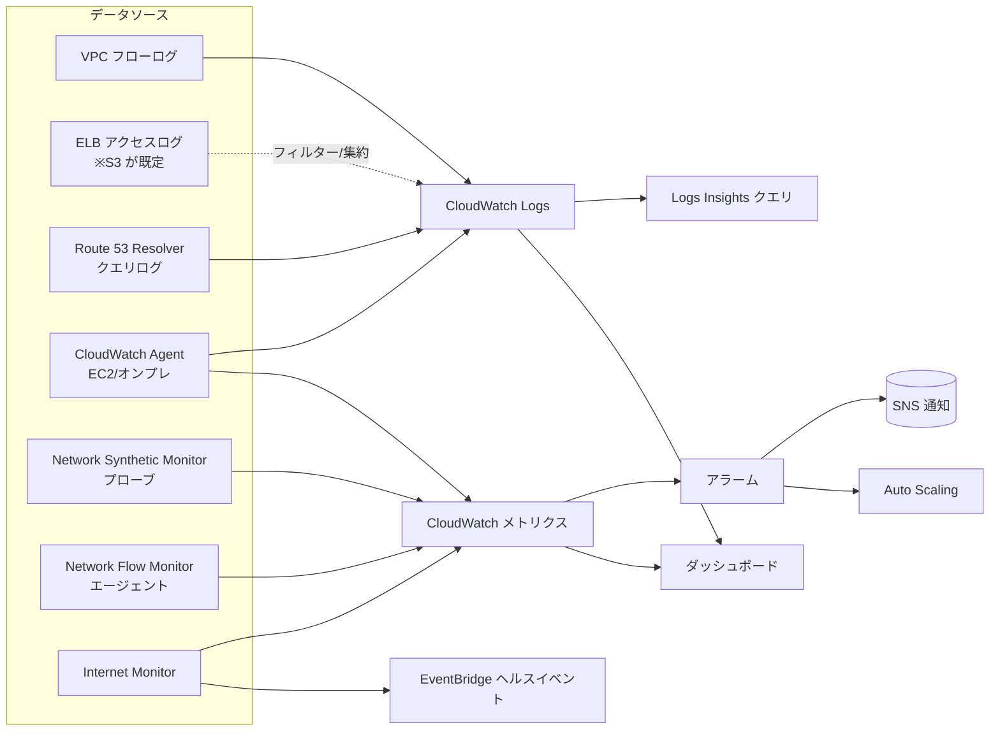

# Amazon CloudWatch（ネットワーク監視観点）

> カテゴリ: マネジメントとガバナンス / 重要度: ○
> 最終更新: 2026-05-24

---

## 1. 概要

Amazon CloudWatch は AWS リソースとアプリケーションの**メトリクス・ログ・イベントを収集し可視化・アラート・自動アクション**を行う統合監視サービス。ANS-C01 では「第3分野: ネットワーク管理と運用」の中核であり、**フローログ／ロードバランサーログの集約先**、**メトリクスとアラームによる異常検知**、そして専用機能である **Network Synthetic Monitor / Network Flow Monitor / Internet Monitor** によるネットワーク性能監視が問われる。

### 試験での位置づけ

- VPC フローログ・ELB アクセスログの**配信先（CloudWatch Logs）**としての役割。
- NAT Gateway・Transit Gateway・VPN・Direct Connect 等の**名前空間メトリクス**から閾値アラームを作り、運用を自動化する設計問題。
- **Logs Insights** によるフローログのクエリ分析（REJECT 多発、特定 IP の特定）。
- 3つの「Network Monitoring」機能（後述）の**使い分け**が新しめの頻出ポイント。

---

## 2. コアコンセプト

| 要素 | 役割 | ネットワーク観点の要点 |
|---|---|---|
| **メトリクス** | 名前空間ごとの時系列数値 | `AWS/NATGateway`・`AWS/TransitGateway`・`AWS/VPN`・`AWS/NetworkELB` 等。標準は無料、カスタムは課金 |
| **アラーム** | 閾値超過で通知/アクション | SNS 通知・Auto Scaling・EC2 アクション。複合アラーム可 |
| **CloudWatch Logs** | ログの集約・保管・検索 | フローログ・Route 53 Resolver クエリログ・ELB ログ等の受け皿。ロググループに保持期間を設定 |
| **Logs Insights** | ログのクエリ分析 | フローログを SQL ライクに集計（送信元別バイト数、REJECT 集計など） |
| **ダッシュボード** | メトリクス/ログの可視化 | クロスアカウント・クロスリージョン表示が可能 |
| **CloudWatch Agent** | OS/アプリのメトリクス・ログ収集 | EC2/オンプレのメモリ・ディスク・**カスタムログ**を取り込む。標準メトリクスでは取れない値を補完 |
| **メトリクスフィルター** | ログ→メトリクス変換 | ログ中のパターン出現回数をメトリクス化しアラーム化 |
| **EventBridge（旧 CW Events）** | イベント駆動の自動化 | 構成変更や Internet Monitor のヘルスイベントを起点に通知/Lambda 起動 |

---

## 3. アーキテクチャ / 仕組み

ネットワークの可観測性データは、メタデータ（フローログ）、性能指標（メトリクス）、能動計測（Synthetic / Flow / Internet Monitor）に分かれて CloudWatch に集約される。

---

## 4. 試験頻出ポイント

### 4-1. フローログ／ELB ログの集約

- VPC フローログの配信先は **CloudWatch Logs / S3 / Data Firehose**。CloudWatch Logs に送ると **Logs Insights** で即時クエリ可能、S3 は **Athena** で大規模・低コスト分析向き。
- ELB（ALB/NLB）の**アクセスログの既定保存先は S3**。CloudWatch には ELB のメトリクス（`ActiveFlowCount`、`ProcessedBytes`、`HealthyHostCount` など）が送られる。
- Logs Insights のフローログ分析例: REJECT が多い送信元 IP の特定、`dstport` 別の通信量集計など。

### 4-2. 3つのネットワーク監視機能の使い分け（最重要）

| 機能 | 計測対象 | 仕組み | 主な指標 | 典型ユースケース |
|---|---|---|---|---|
| **Network Synthetic Monitor**（旧 Network Monitor） | AWS ↔ オンプレ間の**ハイブリッド接続** | AWS マネージドの**プローブ**（エージェント不要、サブネットと宛先 IP を指定） | パケットロス、レイテンシ、**Network Health Indicator (NHI)** | Direct Connect/VPN 経由のオンプレ接続の劣化を数分で切り分け |
| **Network Flow Monitor** | **VPC 内の実ワークロード**の TCP フロー | インスタンスに**軽量エージェントを導入** | TCP RTT、再送、再送タイムアウト、転送バイト、NHI | 実トラフィックの遅延/パケットロスが「自社アプリ」か「AWS 基盤」かを判別 |
| **Internet Monitor** | アプリと**エンドユーザー間のインターネット**経路 | AWS のグローバル計測データ＋**city-network（クライアント所在地×ASN）**単位の計測 | 可用性、パフォーマンス、TTFB、ヘルスイベント | ISP/地域起因の遅延検知、CloudFront 等への切替え提案 |

判断のコツ:
- **オンプレ宛の能動計測（合成監視）** → Network Synthetic Monitor。
- **VPC 内ワークロードの実トラフィック** → Network Flow Monitor。
- **インターネット越しのエンドユーザー体感** → Internet Monitor（VPC/NLB/CloudFront/WorkSpaces を関連付け、ヘルスイベントは **EventBridge** に送られる）。
- **NHI（Network Health Indicator）** は Synthetic Monitor / Flow Monitor 共通で、劣化の原因が **AWS ネットワーク側か否か**を確率的に示すバイナリ指標。

### 4-3. CloudWatch Agent

- 標準メトリクスでは取得できない**メモリ・ディスク使用率・プロセス**や、アプリの**カスタムログ**を収集。
- EC2 だけでなく**オンプレサーバー**にも導入可能（ハイブリッド監視）。
- ログは CloudWatch Logs、メトリクスは CloudWatch メトリクスへ送る。

---

## 5. 他サービスとの連携

- **VPC フローログ**: 主要な配信先。フィールド・集約間隔の詳細は [VPC](../../networking-content-delivery/vpc/README.md) を参照。
- **Transit Gateway / VPN / Direct Connect**: 各サービスのメトリクスを CloudWatch に送出し、帯域・パケットドロップ・BGP 状態を監視。
- **CloudTrail**: API 操作の監査ログを CloudWatch Logs に連携し、メトリクスフィルター＋アラームで不正操作を検知（[CloudTrail](../cloudtrail/README.md)）。
- **EventBridge / SNS**: アラーム・ヘルスイベントの通知と自動修復の起点。
- **AWS Organizations**: クロスアカウント・オブザーバビリティで複数アカウントのメトリクス/ログを集約（[Organizations](../organizations/README.md)）。

---

## 6. 制約・上限・コスト

| 項目 | 値（既定） |
|---|---|
| 標準メトリクスの保持 | 最大 15 か月（粒度が時間経過で粗くなる集約） |
| アラーム / リージョン / アカウント | 5,000（引き上げ可） |
| Logs Insights 同時クエリ | アカウント・リージョンあたり 30 |
| ログ保持期間 | 既定は無期限（1日〜10年または無期限を設定可能） |

- **コスト発生源**: カスタムメトリクス、ログの取り込み・保管・Logs Insights スキャン量、ダッシュボード、Network Synthetic Monitor（**プローブ単位課金**）、Internet Monitor（モニタリングする city-network 数に依存）。
- 標準メトリクス（基本モニタリング、5分間隔）は無料。詳細モニタリング（1分）は課金。
- コスト最適化: フローログを大量分析するなら **S3 + Athena**、リアルタイム性が要るなら CloudWatch Logs + Insights を使い分ける。

---

## 7. 出典

- [What is Amazon CloudWatch? – AWS Docs](https://docs.aws.amazon.com/AmazonCloudWatch/latest/monitoring/WhatIsCloudWatch.html)
- [Using Network Synthetic Monitor – AWS Docs](https://docs.aws.amazon.com/AmazonCloudWatch/latest/monitoring/what-is-network-monitor.html)
- [What is Network Flow Monitor? – AWS Docs](https://docs.aws.amazon.com/AmazonCloudWatch/latest/monitoring/CloudWatch-NetworkFlowMonitor-What-is-NetworkFlowMonitor.html)
- [What is Internet Monitor? – AWS Docs](https://docs.aws.amazon.com/AmazonCloudWatch/latest/monitoring/CloudWatch-InternetMonitor.what-is-cwim.html)
- [CloudWatch metrics for your VPCs – AWS Docs](https://docs.aws.amazon.com/vpc/latest/userguide/vpc-cloudwatch.html)
- [CloudWatch service quotas – AWS Docs](https://docs.aws.amazon.com/AmazonCloudWatch/latest/monitoring/cloudwatch_limits.html)
- [Logging and monitoring in your VPC – AWS Docs](https://docs.aws.amazon.com/vpc/latest/userguide/logging-monitoring.html)
