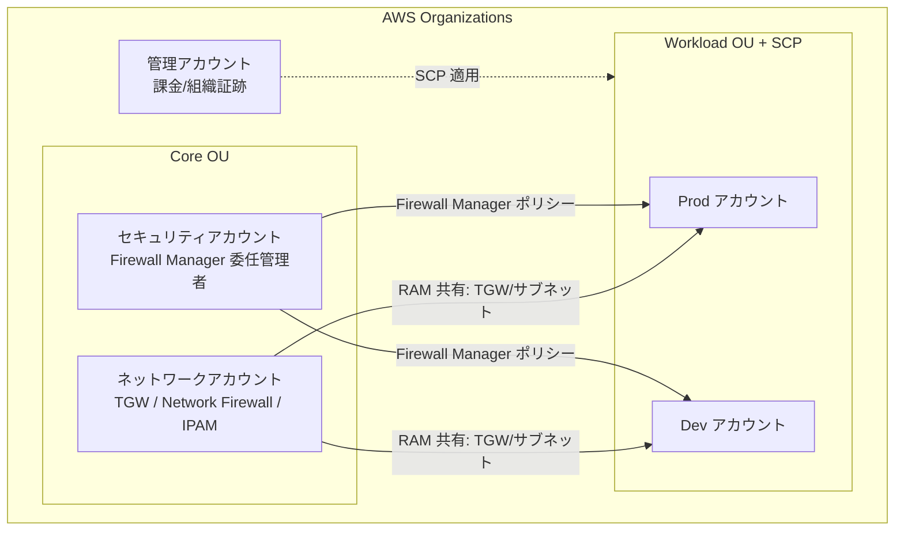

# AWS Organizations（マルチアカウント・ネットワーク統制観点）

> カテゴリ: マネジメントとガバナンス / 重要度: ○
> 最終更新: 2026-05-24

---

## 1. 概要

AWS Organizations は複数の AWS アカウントを**一元的に統制・課金集約**するサービス。OU（組織単位）でアカウントを階層化し、**SCP（サービスコントロールポリシー）**で許可の上限（ガードレール）を設定する。ANS-C01 では、Organizations が **RAM によるネットワークリソース共有**と **AWS Firewall Manager による全アカウント横断のセキュリティポリシー適用**の前提基盤であること、そして SCP によるネットワーク操作のガードレールが問われる。

### 試験での位置づけ

- **RAM / Firewall Manager / 組織証跡 / クロスアカウント監視**のすべての前提。
- **SCP** によるネットワーク変更の制限（IGW 作成禁止、特定リージョン以外の禁止など）。
- **委任管理者（delegated administrator）** によるネットワーク/セキュリティ運用の分離。

---

## 2. コアコンセプト

| 要素 | 役割 | ネットワーク統制での要点 |
|---|---|---|
| **管理アカウント** | 組織の頂点。課金・組織管理 | 組織証跡や Firewall Manager の有効化起点。日常運用は委任管理者に分離するのが推奨 |
| **OU（組織単位）** | アカウントの階層グループ | OU 単位で SCP を適用（例: Sandbox OU は VPC ピアリング禁止） |
| **SCP** | 許可の**上限**（ガードレール） | **許可を付与しない**。あくまで上限の制限。IAM 許可と AND で評価 |
| **RAM（Resource Access Manager）** | リソース共有 | VPC サブネット共有、Transit Gateway 共有、PHZ 共有など。組織との統合で共有が容易に |
| **AWS Firewall Manager** | セキュリティポリシーの一元適用 | SG/WAF/Network Firewall/Shield/DNS Firewall を全アカウントへ展開 |
| **委任管理者** | 管理アカウント以外に運用権限を委任 | Firewall Manager・RAM・IPAM 等を専用アカウントで運用 |

---

## 3. アーキテクチャ / 仕組み

典型的なマルチアカウント・ネットワーク構成。共有サービス/ネットワーク用アカウントに集約し、SCP でガードレールをかける。

- **SCP の評価**: SCP は許可を「与えない」。実効権限は **SCP（上限）∩ IAM ポリシー（付与）**。OU 階層に沿って上位の SCP も継承される。
- **RAM**: ネットワークアカウントが TGW やサブネットを共有し、各ワークロードアカウントが**自前の VPC/TGW を作らず**集約された基盤を利用 → IP 効率化・管理集中。組織と統合すると招待不要で共有可能。
- **Firewall Manager**: セキュリティアカウントを**委任管理者**にして、SG 監査・WAF・Network Firewall・DNS Firewall・Shield Advanced のポリシーを OU 単位で自動展開・是正する。

---

## 4. 試験頻出ポイント

- **SCP は「ガードレール（上限）」であり許可付与ではない**。例: `ec2:CreateInternetGateway` を `Deny` する SCP で、配下の全アカウントの IGW 作成を一律禁止できる。
- **ネットワーク向け SCP の典型**: 承認外リージョンの利用禁止、VPC ピアリング/IGW/VPN の作成禁止、特定 SG ルールの変更禁止、デフォルト VPC 削除の保護など。
- **RAM × Organizations**: 組織内共有を有効にすると、共有招待の承諾なしにサブネット/TGW を共有可能。**VPC 共有**は IP アドレス空間を効率化し管理を集中させる代表的パターン。
- **Firewall Manager の前提は Organizations** であり、かつ**委任管理者の指定**と **AWS Config の有効化**が必要。新規アカウント追加時も自動でポリシーが適用されるため、ガバナンスの抜け漏れを防げる。
- **組織証跡（CloudTrail）**・**クロスアカウント CloudWatch オブザーバビリティ**で監査・監視を集約。
- SCP は**管理アカウント自身には効かない**点に注意（ガードレールをすり抜けないよう運用は別アカウントへ）。

---

## 5. 他サービスとの連携

- **RAM**: TGW・サブネット・Route 53 解決ルール・Prefix List 等の共有基盤（ネットワークの集約設計の要）。
- **AWS Firewall Manager**: 全アカウント横断のセキュリティポリシー適用（[Network Firewall 等のセキュリティ統制](../../security-identity-compliance/network-firewall/README.md)）。
- **CloudTrail**: 組織証跡で全アカウント監査ログを集約（[CloudTrail](../cloudtrail/README.md)）。
- **AWS Config**: 組織アグリゲーターで全アカウントの構成準拠を集約。Firewall Manager の前提（[Config](../config/README.md)）。
- **Control Tower**: Organizations を土台にランディングゾーンとガードレールを自動構築（[Control Tower](../control-tower/README.md)）。
- **VPC / Transit Gateway**: 共有対象のネットワーク基盤は [VPC](../../networking-content-delivery/vpc/README.md)。

---

## 6. 制約・上限・コスト

| 項目 | 値（既定） |
|---|---|
| Organizations 自体の料金 | 無料（配下サービスの利用料のみ） |
| OU の階層 | ルート配下 最大5階層 |
| アカウントに適用される SCP | 上限あり（OU/アカウントあたり 5 ポリシー、各 SCP は最大サイズ制限あり） |
| 委任管理者 | サービスごとに指定可能 |

- Organizations 自体は無料。コストは配下の RAM 共有リソース・Firewall Manager・Config 等の利用料に依存。
- コスト最適化: VPC 共有・TGW 共有でアカウントごとの重複ネットワーク（NAT GW、エンドポイント等）を削減できる。

---

## 7. 出典

- [Service control policies (SCPs) – AWS Docs](https://docs.aws.amazon.com/organizations/latest/userguide/orgs_manage_policies_scps.html)
- [Service control policy examples – AWS Docs](https://docs.aws.amazon.com/organizations/latest/userguide/orgs_manage_policies_scps_examples.html)
- [Managing access permissions for an organization – AWS Docs](https://docs.aws.amazon.com/organizations/latest/userguide/orgs_permissions_overview.html)
- [Example SCPs for AWS Organizations and AWS RAM – AWS Docs](https://docs.aws.amazon.com/ram/latest/userguide/security-scp.html)
