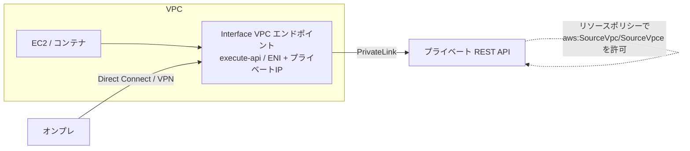
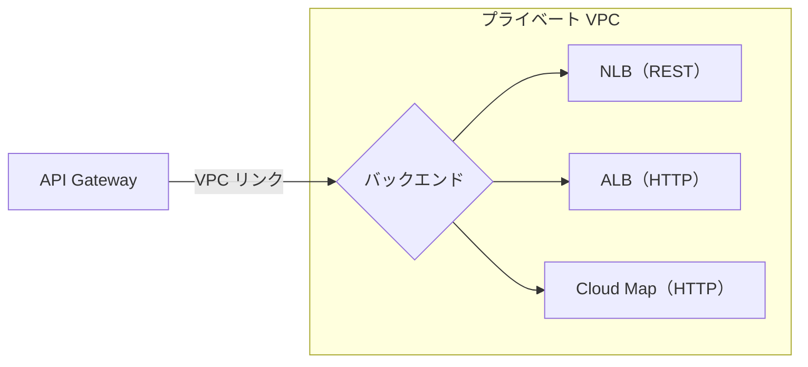
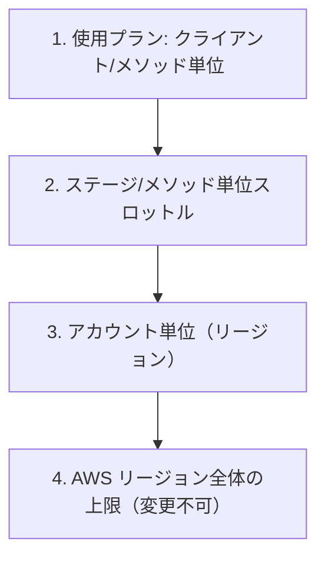
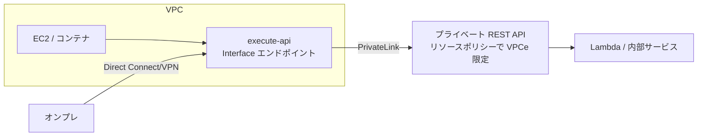
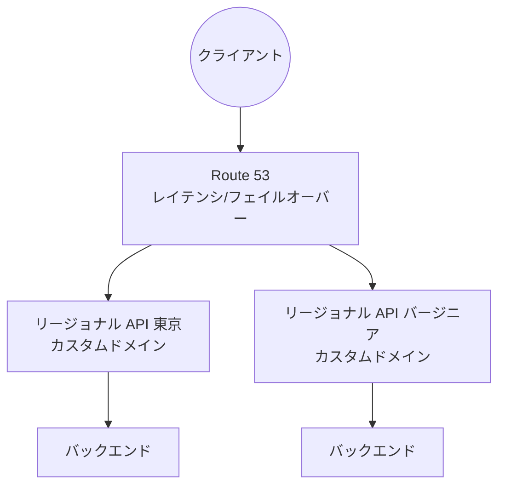

# Amazon API Gateway

> カテゴリ: ネットワークとコンテンツ配信 / 重要度: ○（重要）
> ANS-C01 ではネットワーク観点（エンドポイントタイプ・プライベート API・PrivateLink・カスタムドメイン）が論点。第1分野（設計）・第4分野（セキュリティ）で頻出。
> 最終更新: 2026-05-24 ／ 出典は本ドキュメント末尾

---

## 1. 概要

Amazon API Gateway は、API の作成・公開・保護・監視を行うフルマネージドサービス。REST / HTTP / WebSocket の各 API タイプを提供し、Lambda・HTTP バックエンド・他 AWS サービスへのフロントドアとして機能する。**ネットワーク観点では、API をどこに公開するか（エッジ最適化／リージョナル／プライベート）と、VPC 内バックエンドへの統合（VPC リンク）、PrivateLink による非公開化**が中心論点。

### 試験での位置づけ

- 論点: **エンドポイントタイプ（エッジ最適化/リージョナル/プライベート）**、**プライベート API（Interface VPC エンドポイント＋リソースポリシー）**、**カスタムドメイン**、**スロットリング**、**VPC 統合（VPC リンク）**。
- 「VPC 内からのみ呼べる API」→ プライベート API＋`execute-api` Interface エンドポイント。
- 「世界中のクライアント」→ エッジ最適化。「同一リージョン/EC2 からの呼び出し」→ リージョナル。

---

## 2. コアコンセプト

| 用語 | 役割 | 試験での要点 |
|---|---|---|
| **REST API** | フル機能（使用プラン/API キー/リクエスト検証等） | API 管理機能・キー単位レート制限が必要なら REST |
| **HTTP API** | 軽量・低コスト・低レイテンシ | REST より最大 71% 安・最大 60% 低レイテンシ。Lambda/HTTP プロキシ向き |
| **WebSocket API** | 双方向・**ステートフル**通信 | チャット・リアルタイム。サーバからプッシュ可 |
| **エンドポイントタイプ** | API のホスト名の公開先 | エッジ最適化 / リージョナル / プライベート（§3） |
| **ステージ** | デプロイ単位（dev/prod 等） | ステージ変数・スロットリング・ログ設定 |
| **リソースポリシー** | API への接続元を制御する IAM ポリシー | プライベート API の VPC/VPCe 制限に必須 |
| **VPC リンク** | API Gateway から VPC 内バックエンドへ統合 | REST は NLB、HTTP は ALB/NLB/Cloud Map |

### API タイプとエンドポイントタイプの対応

| | エッジ最適化 | リージョナル | プライベート |
|---|---|---|---|
| **REST API** | ◯（既定） | ◯ | ◯ |
| **HTTP API** | ✕ | ◯ | ✕ |
| **WebSocket API** | ✕ | ◯ | ✕ |

> **プライベート API・エッジ最適化は REST API のみ**。HTTP/WebSocket はリージョナルのみ。

---

## 3. エンドポイントタイプ（ネットワーク観点の中核）

```mermaid
flowchart TB
    subgraph Edge[エッジ最適化]
        U1((世界中のクライアント)) --> POP[CloudFront POP\n(AWS 管理)] --> APIe[API Gateway リージョナル基盤]
    end
    subgraph Reg[リージョナル]
        U2((同一リージョン/EC2)) --> APIr[API Gateway リージョナルエンドポイント]
    end
    subgraph Priv[プライベート]
        U3((VPC 内クライアント)) --> VPCE[Interface VPC エンドポイント\nexecute-api / ENI] --> APIp[プライベート API]
    end
```

| タイプ | 仕組み | 使いどころ |
|---|---|---|
| **エッジ最適化** | 内部で **CloudFront（AWS 管理）** を経由し最寄り POP へ。REST の既定 | クライアントが**地理的に分散** |
| **リージョナル** | リージョンのエンドポイントへ直接。CloudFront を挟まない | **同一リージョン/EC2 からの呼び出し**、自前 CloudFront を前段に置きたい、Route 53 レイテンシルーティング併用 |
| **プライベート** | **Interface VPC エンドポイント（`execute-api`／ENI、PrivateLink）** からのみアクセス。インターネット非公開 | **VPC 内/オンプレ（DX/VPN 経由）からのみ**呼ぶ |

- エッジ最適化のカスタムドメインは**全リージョン共通**。リージョナルのカスタムドメインは**そのリージョン固有**（複数リージョンで同名ドメイン＋Route 53 レイテンシ/フェイルオーバールーティング可能）。
- エッジ最適化はヘッダ名を**先頭大文字化**、リージョナル/プライベートは**ヘッダ名をそのまま**通す。

---

## 4. プライベート API（最頻出）



- **REST API のみ対応**。インターネットには公開されず、**`execute-api` Interface VPC エンドポイント（PrivateLink）**経由でのみ呼べる。トラフィックは AWS ネットワーク内に留まる。
- **アクセス制御は二段**:
  1. **API のリソースポリシー**: `aws:SourceVpc` / `aws:SourceVpce` 条件で特定 VPC/VPCe のみ許可（プライベート API では**リソースポリシーが必須**）。
  2. **VPC エンドポイントポリシー**: どの API を呼べるかをエンドポイント側で制御（データ境界の強化）。
- **プライベート DNS を有効化**すると、`Host` / `x-apigw-api-id` ヘッダなしで VPC 内から呼べる。ただし有効化中はパブリック API のデフォルトエンドポイントに VPC からアクセスできなくなる（必要なら private hosted zone で個別解決）。
- **ベストプラクティス**: 1 つの VPC エンドポイントで複数のプライベート API を共有（VPCe 数を削減）。VPC エンドポイントを API に**関連付ける**と Route 53 エイリアスが作られ呼び出しが容易に。
- **制約**: プライベート API は **TLS 1.2 のみ**。HTTP/2 リクエストは HTTP/1.1 に強制。IP タイプはデュアルスタックのみ（IPv4 のみ指定不可）。
- オンプレからは **Direct Connect / VPN → VPC → Interface エンドポイント**で到達可能。詳細は [PrivateLink](../privatelink/README.md)（または VPC の Interface エンドポイント）。

---

## 5. カスタムドメインと VPC 統合

### カスタムドメイン
- ACM 証明書で独自ドメインを設定。エッジ最適化は **`us-east-1` の ACM 証明書**、リージョナルは**そのリージョンの ACM 証明書**。
- リージョナル + Route 53 で**レイテンシベース/フェイルオーバールーティング**を組み、マルチリージョン API を実現。
- TLS 最小バージョンをカスタムドメインのセキュリティポリシー（TLS 1.0 / 1.2）で選択。

### VPC リンク（プライベートバックエンドへの統合）



- API Gateway 自体は VPC 外のマネージドサービス。VPC 内のプライベートな ELB/サービスへ繋ぐには **VPC リンク**を使う。
- **REST API → NLB**（VPC リンク）。**HTTP API → ALB / NLB / Cloud Map**。
- これによりインターネット公開せずに VPC 内バックエンドへルーティングできる。

---

## 6. スロットリング（頻出）

API Gateway は**トークンバケットアルゴリズム**でリクエストを制御。超過時は **`429 Too Many Requests`**。適用順は以下（上が優先）。



| レベル | 既定値 | 備考 |
|---|---|---|
| **アカウント単位（リージョン）** | 定常 **10,000 RPS**＋バーストバケット最大 **5,000**（HTTP/REST/WebSocket 横断） | 引き上げ申請可。一部新興リージョンは 2,500 RPS / バースト 1,250 |
| **ステージ/メソッド単位** | 設定可（アカウント上限以下） | メソッドごとに個別設定可 |
| **使用プラン（クライアント単位）** | API キーごとにレート＋バースト＋クォータ | アカウント上限以下。REST のみ |

- **使用プラン＋API キー**は **REST API のみ**の機能。クライアント単位のレート制限・課金・クォータが必要なら REST を選ぶ。
- スロットル/クォータは**ベストエフォート**（厳密な上限保証ではない）。
- バーストは AWS 側がアカウントの RPS から決定し、顧客は直接変更不可。

---

## 7. 試験頻出ポイント

- **VPC 内限定の API** → プライベート API（REST のみ）＋ `execute-api` Interface エンドポイント＋リソースポリシー（`aws:SourceVpce`）。
- **エッジ最適化は内部で CloudFront を使う**。リージョナル + 自前 CloudFront にすると、サービス管理の CloudFront を介さず制御しやすい。
- **HTTP/WebSocket はプライベート/エッジ最適化に非対応**（リージョナルのみ）。
- **プライベート API は TLS 1.2 のみ**。
- マルチリージョン耐障害 → リージョナル API ×複数 + Route 53 レイテンシ/フェイルオーバー、または [Global Accelerator](../global-accelerator/README.md) で固定 IP。
- **429** が出たら、アカウント/ステージ/使用プランのどのスロットルかを切り分ける。

---

## 8. 他サービスとの連携

- **AWS Lambda / HTTP バックエンド / 各 AWS サービス**: 統合先。
- **VPC（Interface エンドポイント / PrivateLink）**: プライベート API の入口、VPC リンクで VPC 内バックエンドへ。
- **[CloudFront](../cloudfront/README.md)**: エッジ最適化は内部で利用。リージョナル API の前段に独自 CloudFront＋WAF を置く構成も定番。
- **AWS WAF**: リージョナル API / CloudFront に関連付けて L7 防御。
- **Route 53**: カスタムドメインのレイテンシ/フェイルオーバールーティング。
- **ACM**: カスタムドメインの TLS 証明書（エッジ最適化は us-east-1）。
- **[Global Accelerator](../global-accelerator/README.md)**: NLB 等を介して API に固定 IP を提供する構成。

---

## 9. 制約・上限・コスト

| 項目 | 値 |
|---|---|
| アカウント単位スロットル | 10,000 RPS＋バースト 5,000（一部リージョンは 2,500/1,250） |
| 統合タイムアウト | REST: 最大 **29 秒**、HTTP: 最大 **30 秒** |
| プライベート API の TLS | TLS 1.2 のみ |
| プライベート/エッジ最適化対応 | REST API のみ |
| VPC リンク（REST/HTTP） | REST→NLB、HTTP→ALB/NLB/Cloud Map |

- **コスト**: API 呼び出し数（HTTP API は REST より最大 71% 安）、データ転送、キャッシュ（REST のステージキャッシュ）、プライベート API は Interface エンドポイントの時間＋データ課金が別途発生。

---

## 10. よくある設計パターン

### プライベート API（社内マイクロサービス）



- インターネット非公開。リソースポリシー＋VPC エンドポイントポリシーで二重に接続元を制限。

### マルチリージョン パブリック API



- 同名カスタムドメインを複数リージョンに展開し、Route 53 で最寄り/健全なリージョンへ。固定 IP が必要なら Global Accelerator を併用。

---

## 11. 出典

- [What is Amazon API Gateway? – AWS Docs](https://docs.aws.amazon.com/apigateway/latest/developerguide/welcome.html)
- [API endpoint types for REST APIs – AWS Docs](https://docs.aws.amazon.com/apigateway/latest/developerguide/api-gateway-api-endpoint-types.html)
- [Private REST APIs in API Gateway – AWS Docs](https://docs.aws.amazon.com/apigateway/latest/developerguide/apigateway-private-apis.html)
- [Choose between REST APIs and HTTP APIs – AWS Docs](https://docs.aws.amazon.com/apigateway/latest/developerguide/http-api-vs-rest.html)
- [Overview of WebSocket APIs in API Gateway – AWS Docs](https://docs.aws.amazon.com/apigateway/latest/developerguide/apigateway-websocket-api-overview.html)
- [Throttle requests to your REST APIs – AWS Docs](https://docs.aws.amazon.com/apigateway/latest/developerguide/api-gateway-request-throttling.html)
- [Amazon API Gateway quotas – AWS Docs](https://docs.aws.amazon.com/apigateway/latest/developerguide/limits.html)
