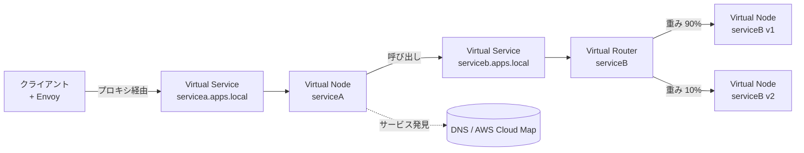

# AWS App Mesh

> カテゴリ: ネットワークとコンテンツ配信 / 重要度: △（周辺）
> ANS-C01 ではサービスメッシュによる L7 トラフィック制御・可観測性の文脈で登場。Envoy ベースの構成要素とコンテナ連携を押さえる。
> 最終更新: 2026-05-24 ／ 出典は本ドキュメント末尾

---

> [!IMPORTANT]
> **サポート終了予告**: AWS は **2026年9月30日**で AWS App Mesh のサポートを終了する。以降はコンソール/リソースへアクセスできなくなり、**Amazon ECS Service Connect への移行**が推奨されている。試験では概念理解は残るが、新規設計での採用は避ける。

---

## 1. 概要

AWS App Mesh は、サービス間通信を**監視・制御**するための **Envoy プロキシベースのサービスメッシュ**。各サービスに**サイドカープロキシ（Envoy）**を配置し、アプリのコードを変えずに**ルーティング・リトライ・L7 トラフィック制御・可観測性**を一元的に与える。サービス間通信を担う専用のインフラ層。

### 試験での位置づけ

- ネットワークの主要テーマではないが、**アプリ層（L7）のトラフィック制御**（カナリア/重み付けルーティング、ヘッダ/パスベースのルーティング、リトライ）と**サービス発見**の文脈で出る。
- 頻出論点: Virtual Service / Node / Router の役割、**Envoy サイドカー**の仕組み、ECS/EKS/EC2/Fargate との関係、**Cloud Map / DNS によるサービス発見**との連携。

---

## 2. コアコンセプト

| 用語 | 役割 | 試験での要点 |
|---|---|---|
| **メッシュ (Service Mesh)** | メッシュ内サービス間トラフィックの論理境界 | 他リソースを内包する最上位 |
| **仮想サービス (Virtual Service)** | 実サービスの抽象（発見名） | 仮想ノード直結 or 仮想ルーター経由で提供。**既存の発見名をそのまま使える** |
| **仮想ノード (Virtual Node)** | 発見可能な実サービス（ECS/K8s サービス）への論理ポインタ | サービス発見（DNS / Cloud Map）とリスナーを設定 |
| **仮想ルーター (Virtual Router) / ルート (Route)** | 仮想サービス宛トラフィックの分配 | **重み付け**で複数ノードへ分配。HTTP ヘッダ/パス/gRPC メソッドで条件分岐、リトライポリシー |
| **仮想ゲートウェイ (Virtual Gateway)** | メッシュ外からの入口（Ingress） | メッシュ境界の Envoy。外部クライアントの受け口 |
| **プロキシ (Envoy)** | 各サービスに併設するサイドカー | メッシュ設定を読み取り実際にトラフィックを転送 |

---

## 3. アーキテクチャ / 仕組み

### ポイント

- サービス同士は**直接通信せず、必ず Envoy プロキシ経由**で通信する。
- プロキシは App Mesh の設定（コントロールプレーン）を読み、ルーティングを実行（データプレーン）。
- **設定変更時にアプリやプロキシを再デプロイ不要** — メッシュ設定の更新だけでルーティングを切り替えられる（カナリアデプロイに有効）。
- **仮想ゲートウェイ**を入口にすると、メッシュ外クライアントからのトラフィックを受けられる。

---

## 4. 試験頻出ポイント

- **L7 トラフィック制御**: 仮想ルーターのルートで **HTTP ヘッダ / URL パス / gRPC サービス・メソッド名**による振り分け、**重み付けルーティング**（例 v1:90% / v2:10%）でカナリア/ブルーグリーン、リトライポリシー（回数・間隔・対象エラー）。
- **可観測性**: Envoy がメトリクス・ログ・**分散トレーシング**を出力。CloudWatch / AWS X-Ray / Prometheus / Grafana 等と連携し、サービス間通信を end-to-end で可視化。
- **サービス発見**: 仮想ノードの発見方法として **DNS** または **AWS Cloud Map** を指定。
- **アプリ無改修**: 既存の発見名（例 `serviceb.apps.local`）をそのまま使え、ルーティング制御をインフラ層に外出しできる。
- **前提**: 利用には AWS Fargate / ECS / EKS / EC2 上の Kubernetes / Docker on EC2 のいずれかで稼働中のサービスが必要。

---

## 5. 他サービスとの連携

- **Amazon ECS / AWS Fargate**: タスク定義に Envoy サイドカーを追加してメッシュへ参加。
- **Amazon EKS / Kubernetes**: App Mesh Controller for Kubernetes で CRD によりメッシュ構成を管理、Envoy を自動注入。
- **[AWS Cloud Map](../cloud-map/README.md)**: 仮想ノードのサービス発見先として利用（DNS と並ぶ選択肢）。
- **[VPC](../vpc/README.md)**: トラフィックは VPC ネットワーク上を流れ、SG/サブネットの制御を受ける。
- **CloudWatch / AWS X-Ray**: Envoy のメトリクス・ログ・トレースの収集先。
- **後継: Amazon ECS Service Connect**: サポート終了に伴う移行先（ECS ネイティブのサービス間接続・発見・可観測性）。

---

## 6. 制約・上限・コスト

- **App Mesh 自体の追加料金はなし**。利用する**コンピュート（ECS/EKS/EC2/Fargate）や Envoy が消費するリソース**、および出力先（CloudWatch/X-Ray 等）の料金が発生。
- **2026年9月30日でサポート終了**（最重要の制約）。新規採用は ECS Service Connect 等を検討。
- Envoy サイドカーの追加により、各タスク/Pod の CPU・メモリと若干のレイテンシオーバーヘッドが増える。

---

## 7. よくある設計パターン

- **カナリアデプロイ**: 仮想ルーターのルート重みを段階的に v2 へ寄せ、問題なければ 100% 切り替え（アプリ再デプロイ不要）。
- **ヘッダ/パスベースルーティング**: API バージョンやテナントを HTTP ヘッダ/パスで分岐。
- **メッシュ全体の可観測性**: 全サービスに Envoy を配し、メトリクス/トレースを集約して通信ボトルネックを特定。
- **Ingress 集約**: 仮想ゲートウェイで外部入口を一元化し、メッシュ内ルーティングへ橋渡し。
- **（推奨）移行**: 既存 App Mesh 構成を **ECS Service Connect** へ移行。

---

## 8. 出典

- [What Is AWS App Mesh? – AWS Docs](https://docs.aws.amazon.com/app-mesh/latest/userguide/what-is-app-mesh.html)
- [Virtual services – AWS Docs](https://docs.aws.amazon.com/app-mesh/latest/userguide/virtual_services.html)
- [Virtual nodes – AWS Docs](https://docs.aws.amazon.com/app-mesh/latest/userguide/virtual_nodes.html)
- [Virtual routers / Routes – AWS Docs](https://docs.aws.amazon.com/app-mesh/latest/userguide/virtual_routers.html)
- [Envoy image – AWS Docs](https://docs.aws.amazon.com/app-mesh/latest/userguide/envoy.html)
- [Migrating from AWS App Mesh to Amazon ECS Service Connect – AWS Blog](https://aws.amazon.com/blogs/containers/migrating-from-aws-app-mesh-to-amazon-ecs-service-connect/)
