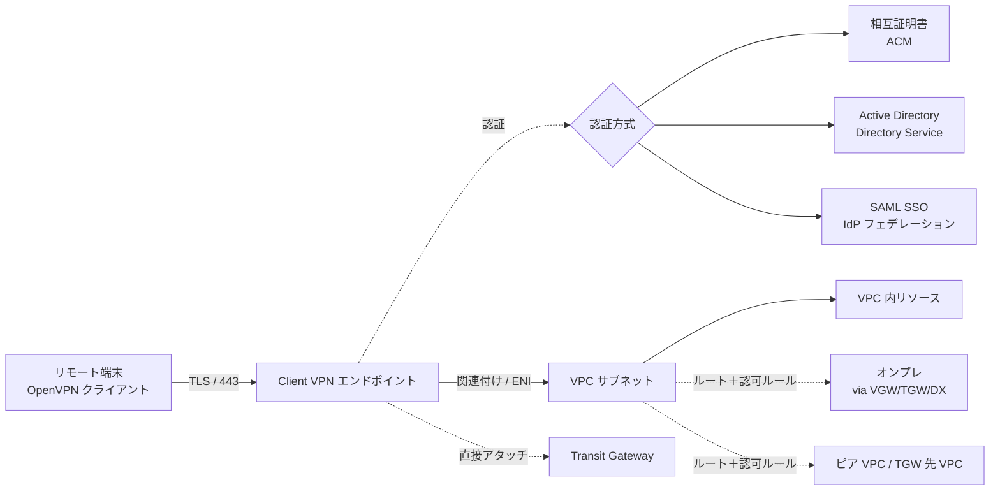
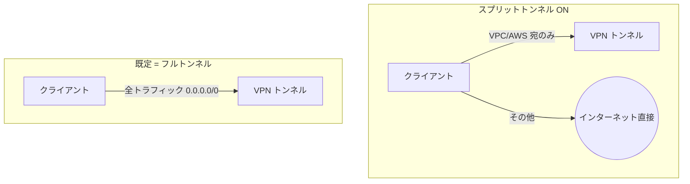

# AWS Client VPN

> カテゴリ: ネットワークとコンテンツ配信 / 重要度: △（周辺）
> ANS-C01 ではリモートアクセス VPN の選択肢として登場。Site-to-Site VPN との違い、認証方式、ルーティング（スプリットトンネル/認可ルール）を押さえる。
> 最終更新: 2026-05-24 ／ 出典は本ドキュメント末尾

---

## 1. 概要

AWS Client VPN は、**個々のエンドユーザー（クライアント端末）**から AWS および オンプレミスのリソースへ安全に接続するための**マネージド型クライアント VPN サービス**。OpenVPN ベースのクライアントから **TLS で暗号化**された接続を張る。拠点間を接続する Site-to-Site VPN と異なり、**人（デバイス）単位のリモートアクセス**が目的。

### 試験での位置づけ

- 「在宅勤務者が VPC 内リソースへアクセスしたい」「拠点ではなく個別端末からの接続」というシナリオで **Site-to-Site VPN ではなく Client VPN** を選ばせる問題。
- 頻出論点: **認証方式の選択**（相互証明書 / AD / SAML SSO）、**スプリットトンネル**による経路最適化、**認可ルール**によるアクセス制御、TGW 連携によるマルチ VPC/オンプレ到達。

---

## 2. コアコンセプト

| 用語 | 役割 | 試験での要点 |
|---|---|---|
| **Client VPN エンドポイント** | 全クライアントセッションの終端リソース | ここに認証・ルート・認可・関連付けを設定 |
| **ターゲットネットワーク（関連付け）** | エンドポイントに紐づけるネットワーク | **VPC サブネット**を関連付け、または **TGW へ直接アタッチ**。関連付けると ENI が作られる |
| **クライアント CIDR** | 接続クライアントへ払い出す IP 範囲 | IPv4 は**自分で指定**（例 `10.2.0.0/16`）。VPC/関連付け先と**重複不可**、/22〜/12。IPv6 は AWS が自動割当 |
| **ルートテーブル** | エンドポイントの宛先経路 | 関連付けサブネットの VPC へは自動。オンプレ/他 VPC/インターネットへは**手動でルート追加** |
| **認可ルール** | どのネットワークへ誰がアクセスできるか | **デフォルトで何も許可されない**。ネットワーク CIDR＋許可する AD/IdP グループを指定 |
| **ポート** | 443（既定）または 1194、TCP/UDP | TLS。443 はファイアウォール通過しやすい |
| **接続ログ** | 接続イベントを CloudWatch Logs へ | フォレンジック・利用分析・トラブルシュート |

> **SNAT**: IPv4 では、クライアント CIDR の送信元 IP が Client VPN ENI の IP に変換される（IPv6 は SNAT なしで元 IP が見える）。

---

## 3. アーキテクチャ / 仕組み

### 接続が成立するまでの流れ

1. 端末が設定ファイルでエンドポイントへ TLS 接続し、**認証**を通過。
2. クライアント CIDR から IP が払い出される。
3. **ルートテーブル**に宛先経路があり、かつ**認可ルール**でそのネットワークへのアクセスが許可されていれば疎通。両方が必要。

### スプリットトンネル vs フルトンネル（頻出）

- **既定はフルトンネル**: クライアントのルートを `0.0.0.0/0` で上書きし、**全通信を VPN 経由**にする。
- **スプリットトンネル ON**: エンドポイントのルートテーブルにある経路だけをクライアントへプッシュし、**該当宛先のみ VPN 経由**。それ以外は端末から直接インターネットへ。
  - メリット: AWS からの**アウトバウンド転送量（データ転送コスト）削減**、経路最適化。
  - 注意: スプリットトンネル時にルートテーブルへ `0.0.0.0/0` を入れるのは非推奨。ルートテーブル変更は**全接続がリセット**される。

---

## 4. 試験頻出ポイント

- **認証方式の使い分け**
  - **相互証明書認証**: サーバ証明書＋クライアント証明書（ともに ACM 管理）。小規模・IdP がない場合。
  - **Active Directory 認証**: AWS Directory Service（AD Connector でオンプレ AD 連携可）。既存 AD のグループで認可。
  - **SAML フェデレーション（SSO）**: IAM Identity Center や外部 IdP（Okta 等）。**SSO 要件＝SAML** を選ぶ。
- どの認証でも、**サーバ証明書（ACM）は必須**。
- **デフォルトでは誰も何もアクセスできない** → 必ず**認可ルール**で「ネットワーク CIDR ＋ 許可グループ」を定義。AD/SAML グループ単位の細かい制御が可能。
- **疎通には「ルート」と「認可ルール」の両方**が必要。片方だけでは通らない（トラブルシュート問題で頻出）。
- インターネットへ抜けさせたい場合: フルトンネル＋関連付けサブネットの VPC に IGW/NAT、ルートテーブルに `0.0.0.0/0`、認可ルールを追加。
- **可用性**: 複数 AZ のサブネットを関連付けると冗長化。1 サブネット = 1 AZ。

---

## 5. 他サービスとの連携

- **[Site-to-Site VPN](../../../ ../)** との対比: 拠点間 (S2S) か 個別端末 (Client) か。本リポジトリの VPN 章も参照。
- **[Transit Gateway](../transit-gateway/README.md)**: エンドポイントを **TGW へ直接アタッチ**、または関連付け VPC を TGW 経由にして、**複数 VPC / オンプレ**へ集約到達。
- **[VPC](../vpc/README.md)**: 関連付けサブネットに Client VPN ENI が作られ、SG で制御。
- **[Route 53 / Resolver](../route-53/README.md)**: クライアントへ配布する DNS サーバを指定し、プライベートホスト名解決。
- **AWS Directory Service / IAM Identity Center**: 認証・認可の ID ソース。
- **AWS Certificate Manager (ACM)**: サーバ/クライアント証明書の管理。
- **オンプレ / ピア VPC**: エンドポイントルートテーブルへ経路追加＋認可ルールで到達。

---

## 6. 制約・上限・コスト

| 項目 | 値 |
|---|---|
| クライアント CIDR のサイズ | /22（最小, 1024 IP）〜 /12（最大） |
| クライアント CIDR の重複 | 関連付けサブネットの VPC・ローカルルート・他関連付けと**重複不可** |
| 対応ポート | TCP/UDP 443（既定）または 1194 |
| プロトコル | OpenVPN（TLS） |

- **課金**: ①エンドポイント関連付け（サブネット）ごとの時間課金 ②アクティブな VPN 接続ごとの時間課金 ③データ転送 ④接続ログの CloudWatch Logs ⑤IGW ありサブネット関連付け時の EIP（使用中 public IPv4 課金）。
- **コスト最適化**: スプリットトンネルで不要なトラフィックを VPN に流さない。使わない関連付けは削除（関連付け課金が継続するため）。

---

## 7. よくある設計パターン

- **在宅勤務者の VPC アクセス**: SAML SSO 認証＋スプリットトンネル。VPC 宛のみトンネル、業務外通信は端末から直接。
- **マルチ VPC/オンプレ集約**: エンドポイントを TGW にアタッチし、TGW ルートテーブルで複数 VPC・DX/VPN 経由のオンプレへ到達。グループ別に認可ルール。
- **既存 AD 利用**: AD Connector でオンプレ AD と連携し、AD グループで認可ルールを定義。
- **証明書のみ運用（IdP なし）**: 相互証明書認証で小規模チームに配布。

---

## 8. 出典

- [What is AWS Client VPN? – AWS Docs](https://docs.aws.amazon.com/vpn/latest/clientvpn-admin/what-is.html)
- [Split-tunnel on Client VPN endpoints – AWS Docs](https://docs.aws.amazon.com/vpn/latest/clientvpn-admin/split-tunnel-vpn.html)
- [Authentication and authorization – AWS Docs](https://docs.aws.amazon.com/vpn/latest/clientvpn-admin/client-authentication.html)
- [Authorization rules – AWS Docs](https://docs.aws.amazon.com/vpn/latest/clientvpn-admin/cvpn-working-rules.html)
- [Transit Gateway integration with Client VPN – AWS Docs](https://docs.aws.amazon.com/vpn/latest/clientvpn-admin/cvpn-tgw.html)
- [Client VPN endpoint route table – AWS Docs](https://docs.aws.amazon.com/vpn/latest/clientvpn-admin/cvpn-working-routes.html)
- [AWS Client VPN quotas – AWS Docs](https://docs.aws.amazon.com/vpn/latest/clientvpn-admin/limits.html)
