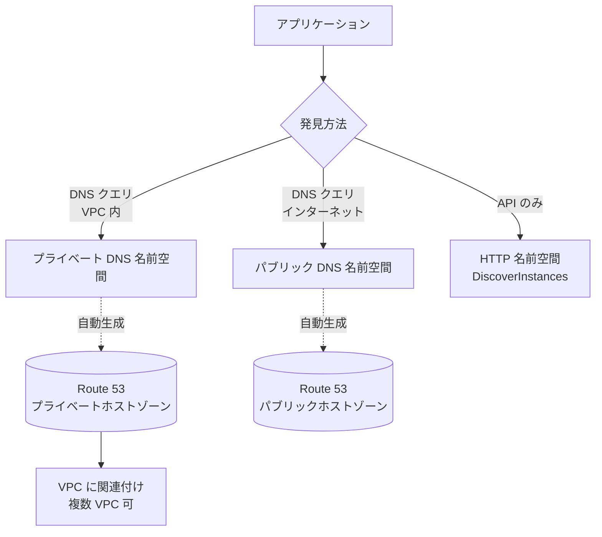

# AWS Cloud Map

> カテゴリ: ネットワークとコンテンツ配信 / 重要度: △（周辺）
> ANS-C01 ではサービスディスカバリと DNS の交点として登場。名前空間の種別（DNS/API・パブリック/プライベート）と Route 53 連携、コンテナ連携を押さえる。
> 最終更新: 2026-05-24 ／ 出典は本ドキュメント末尾

---

## 1. 概要

AWS Cloud Map は、アプリケーションが依存するバックエンドのリソース（EC2・ECS タスク・DynamoDB・SQS など）に**論理名（フレンドリ名）をマッピングし、動的に発見させる**マネージド型**サービスディスカバリ**サービス。リソースの増減に追従して**ヘルシーなインスタンスのみ**を返す。

### 試験での位置づけ

- ネットワークの中心テーマではないが、**プライベート DNS による名前解決**を Cloud Map が裏で Route 53 プライベートホストゾーンとして作る点がネットワーク観点で問われる。
- 頻出論点: **名前空間の種別選択**（VPC 内 DNS か / パブリック DNS か / API のみか）、**Route 53 プライベートホストゾーンの自動生成**、**ECS サービスディスカバリ**との関係、ヘルスチェック。

---

## 2. コアコンセプト

| 用語 | 役割 | 試験での要点 |
|---|---|---|
| **名前空間 (Namespace)** | サービスをグループ化する論理単位＝発見方法の指定 | リージョン固有。種別で**発見手段（DNS/API）と公開範囲**が決まる |
| **サービス (Service)** | リソース種別ごとのテンプレート | DNS レコード種別（A/AAAA/SRV/CNAME）やヘルスチェック設定を保持 |
| **サービスインスタンス** | 実リソースの登録エントリ | `RegisterInstance` API で登録。属性（IP/ポート等）を保持 |
| **DiscoverInstances API** | 名前空間＋サービスを指定して発見 | DNS を介さず**API でヘルシーなインスタンスを取得** |

---

## 3. 名前空間の種別（最重要）

| 名前空間種別 | 発見手段 | DNS / Route 53 | 用途 |
|---|---|---|---|
| **プライベート DNS 名前空間** | VPC 内の DNS クエリ ＋ DiscoverInstances API | **Route 53 プライベートホストゾーンを自動作成**（複数 VPC へ関連付け可） | VPC 内のマイクロサービス間 |
| **パブリック DNS 名前空間** | インターネット越しの DNS クエリ ＋ API | Route 53 パブリックホストゾーンを使用。登録ドメイン名が必要 | 公開エンドポイントの発見 |
| **HTTP 名前空間（API のみ）** | **DiscoverInstances API のみ**（DNS なし） | DNS レコードを作らない | DNS が不要 / IP を持たないリソース、SDK 経由の発見 |

> ネットワーク観点の核心: **プライベート DNS 名前空間 = Route 53 プライベートホストゾーンが裏で自動生成**され、VPC の DNS リゾルバ（VPC+2）で解決される。複数 VPC へ関連付けて共有可能。

---

## 4. 試験頻出ポイント

- **VPC 内のサービス間名前解決**が必要 → **プライベート DNS 名前空間**（Route 53 プライベートホストゾーンが自動で作られる）。
- **DNS に依存せず**ヘルシーなインスタンスを直接取得したい → **HTTP 名前空間 ＋ DiscoverInstances API**。
- 名前空間は**リージョン固有**。マルチリージョンでは各リージョンに作成が必要。
- **ヘルスチェック**: ①**Route 53 ヘルスチェック**（パブリックにルーティング可能な IP のヘルシー判定、追加課金）②**カスタムヘルスチェック**（サードパーティ/アプリ側が `UpdateInstanceCustomHealthStatus` で報告）。**ヘルシーなインスタンスのみ**が発見結果に返る。
- DNS レコード種別はサービスに紐づき、A / AAAA / SRV / CNAME をサポート（SRV はポートも返せる）。

---

## 5. 他サービスとの連携

- **[Route 53](../route-53/README.md)**: プライベート/パブリック DNS 名前空間の実体はホストゾーン。プライベートは VPC の DNS リゾルバで解決。
- **[VPC](../vpc/README.md)**: プライベートホストゾーンを VPC に関連付け、VPC 内から名前解決。
- **Amazon ECS**: **ECS サービスディスカバリ**は内部で Cloud Map を使い、タスク起動/停止に合わせてインスタンスを自動登録/解除。
- **Amazon EKS / Kubernetes**: ExternalDNS や AWS Cloud Map MCS コントローラ経由でサービスを登録し、クラスタ間ディスカバリに利用。
- **[App Mesh](../app-mesh/README.md)**: 仮想ノードのサービスディスカバリ先として Cloud Map を指定可能。

---

## 6. 制約・上限・コスト

- **リージョンサービス**（名前空間はリージョン固有）。
- **課金**: ①レジストリに登録したリソース（サービスインスタンス）の数 ②`DiscoverInstances` などの API 呼び出し回数。DNS 発見・Route 53 ヘルスチェックを使うと **Route 53 の DNS クエリ/ヘルスチェック料金**が別途発生。
- 前払いなし、従量課金。

---

## 7. よくある設計パターン

- **ECS マイクロサービス間通信**: ECS サービスディスカバリを有効化 → Cloud Map プライベート DNS 名前空間にタスクが自動登録され、`service.namespace.local` で相互解決。
- **DNS を介さない発見**: HTTP 名前空間でアプリが DiscoverInstances を直接呼び、ヘルシーな IP/ポートを取得（DNS キャッシュの影響を避ける）。
- **マルチ VPC 共有名前解決**: プライベート DNS 名前空間（Route 53 プライベートホストゾーン）を複数 VPC に関連付け、共通の名前空間で発見。

---

## 8. 出典

- [What Is AWS Cloud Map? – AWS Docs](https://docs.aws.amazon.com/cloud-map/latest/dg/what-is-cloud-map.html)
- [AWS Cloud Map namespaces – AWS Docs](https://docs.aws.amazon.com/cloud-map/latest/dg/working-with-namespaces.html)
- [AWS Cloud Map services – AWS Docs](https://docs.aws.amazon.com/cloud-map/latest/dg/working-with-services.html)
- [DiscoverInstances API – AWS Docs](https://docs.aws.amazon.com/cloud-map/latest/api/API_DiscoverInstances.html)
- [Service discovery (Amazon ECS) – AWS Docs](https://docs.aws.amazon.com/AmazonECS/latest/developerguide/service-discovery.html)
- [AWS Cloud Map Pricing](https://aws.amazon.com/cloud-map/pricing/)
