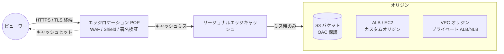
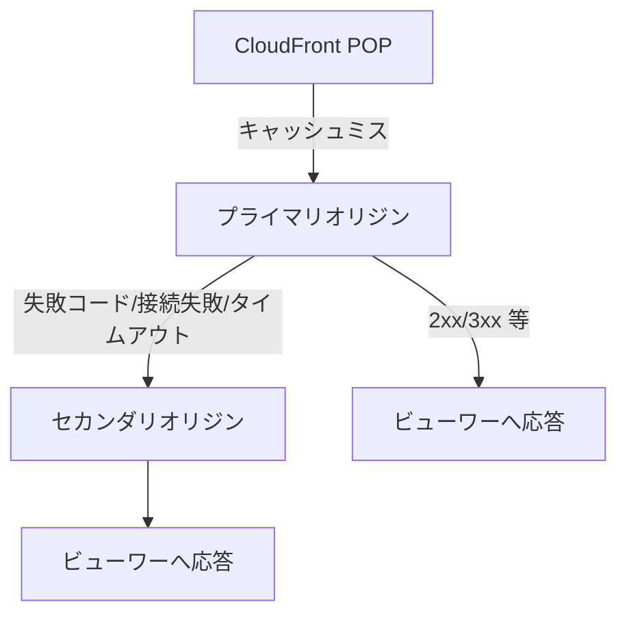
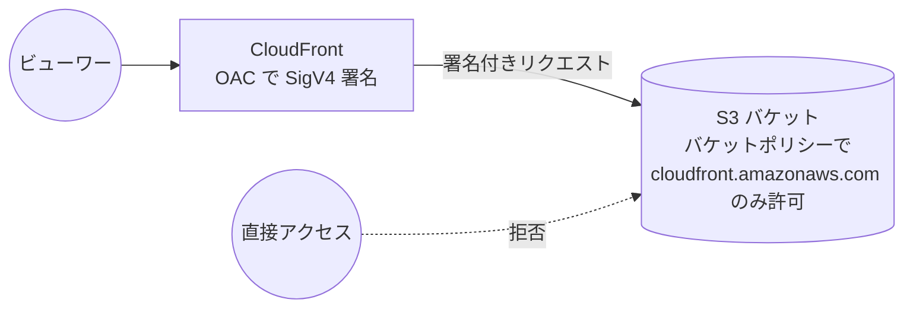
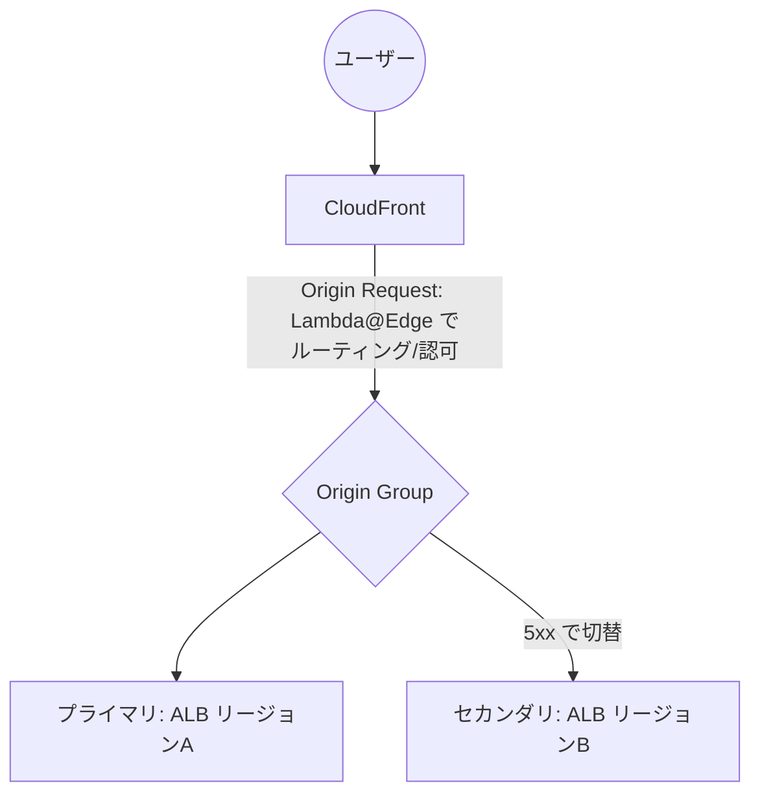

# Amazon CloudFront

> カテゴリ: ネットワークとコンテンツ配信 / 重要度: ○（重要）
> ANS-C01 第1分野（設計）・第4分野（セキュリティ）で頻出。エッジ配信・TLS・WAF/Shield 統合・署名付きアクセスが論点。
> 最終更新: 2026-05-24 ／ 出典は本ドキュメント末尾

---

## 1. 概要

Amazon CloudFront は AWS グローバルネットワークと世界中の**エッジロケーション（POP）／リージョナルエッジキャッシュ**を使い、静的・動的コンテンツを低レイテンシで配信する CDN サービス。ビューワーのリクエストを最寄りの POP にルーティングし、キャッシュヒットなら即時応答、ミスならオリジン（S3／HTTP サーバ／ALB 等）から取得してキャッシュする。

### 試験での位置づけ

- L7（HTTP/HTTPS）の**エッジキャッシュ＋セキュア配信**が中心。L4 の [Global Accelerator](../global-accelerator/README.md) との使い分けが最頻出。
- 論点: **OAC によるオリジン保護**、**CloudFront Functions vs Lambda@Edge**、**Origin Groups（フェイルオーバー）**、**WAF/Shield 統合**、**署名付き URL/Cookie**、**TLS セキュリティポリシー（SNI）**、**Field-Level Encryption**。
- 「全世界のユーザーに静的/動的 Web を配信」「S3 を直接公開せず保護」「DDoS/L7 攻撃を防御」→ CloudFront を選ぶ。

---

## 2. コアコンセプト

| 用語 | 役割 | 試験での要点 |
|---|---|---|
| **ディストリビューション** | 配信の単位。ドメイン `dxxxx.cloudfront.net` が払い出される | 代替ドメイン名(CNAME)＋ACM 証明書で独自ドメイン化 |
| **オリジン** | コンテンツの源泉（S3 / カスタム / ALB / VPC オリジン） | AWS オリジン→CloudFront 間のデータ転送は**無料** |
| **ビヘイビア（キャッシュ動作）** | パスパターンごとの挙動（TTL・許可メソッド・転送ヘッダ等） | **パスパターン**で振り分け。最長一致でなく**評価順（優先度）**で先頭一致 |
| **エッジロケーション(POP)** | キャッシュ・TLS 終端を行う拠点 | 最寄り POP で応答 |
| **リージョナルエッジキャッシュ** | POP とオリジンの間の二次キャッシュ層 | キャッシュヒット率を上げオリジン負荷を低減 |
| **OAC / OAI** | S3 等オリジンを CloudFront 経由のみに限定 | 新規は **OAC** 一択（§5） |
| **エッジ関数** | エッジでのコード実行 | CloudFront Functions / Lambda@Edge（§6） |

### オリジン種別

| オリジン | 種別 | 補足 |
|---|---|---|
| **S3 バケット（REST API エンドポイント）** | S3 オリジン | OAC/OAI で保護可。SSE-KMS・PUT/DELETE 対応は OAC のみ |
| **S3 静的ウェブサイトエンドポイント** | カスタムオリジン扱い | OAC/OAI **使用不可**。カスタムオリジンとして設定 |
| **ALB / EC2 / 任意の HTTP サーバ** | カスタムオリジン | オリジンプロトコルポリシー（HTTP/HTTPS/match-viewer）を設定 |
| **VPC オリジン** | プライベートな ALB/NLB/EC2 へ直接 | インターネット公開せずプライベートサブネットのリソースを配信 |
| **MediaPackage / MediaStore** | メディア配信 | 動画ストリーミング |

---

## 3. 全体アーキテクチャ



- TLS 終端・WAF 評価・署名付きアクセス検証・エッジ関数実行はすべて **POP** で行われる。
- AWS オリジン（S3/ELB/API Gateway）→CloudFront 間の転送料は**無料**。課金は CloudFront→ビューワーのアウトバウンドとリクエスト数。

---

## 4. Origin Groups（オリジンフェイルオーバー・頻出）



- **2 つのオリジン**（プライマリ＋セカンダリ）で構成。プライマリが失敗するとセカンダリへ自動切替。
- **フェイルオーバーを起こす HTTP ステータス**（選択式）: **400, 403, 404, 416, 429, 500, 502, 503, 504**。
- フェイルオーバーするのは **GET / HEAD / OPTIONS** のみ（POST/PUT 等はしない）。OPTIONS をキャッシュ対象メソッドに含めていないと OPTIONS はフェイルオーバーしない。
- **デフォルトのタイムアウト**: プライマリへ最大 30 秒（10 秒×3 回の接続試行）試みてから切替。
  - 接続タイムアウト 1–10 秒（既定 10）、接続試行 1–3 回（既定 3）、レスポンスタイムアウト 1–120 秒（既定 30）で高速化可能。
- Lambda@Edge を origin request/response トリガーで使うと、プライマリ・セカンダリ双方で**最大 2 回**発火しうる。
- DNS レベルのフェイルオーバーは [Route 53](../../../) のヘルスチェックで別途実現（CloudFront のフェイルオーバーとは別物）。

---

## 5. オリジン保護: OAC（OAI の後継）



| 観点 | OAC（推奨） | OAI（レガシー） |
|---|---|---|
| 対応リージョン | **全リージョン**（2022年12月以降の opt-in 含む） | 2023年1月以降の新リージョン非対応 |
| SSE-KMS（KMS 暗号化 S3） | **対応** | 非対応 |
| 動的リクエスト（PUT/DELETE） | **対応** | 非対応 |
| 署名 | **SigV4**（`always` 推奨） | レガシー方式 |
| 認可方式 | サービスプリンシパル `cloudfront.amazonaws.com` をバケットポリシーで許可＋`AWS:SourceArn` で特定ディストリビューションに限定 | `CloudFront Origin Access Identity` プリンシパル |

- **新規構築・移行は OAC 一択**。OAI は機能制限が多い。
- OAC で常時署名するには署名動作を **`always`（Sign requests 推奨）** に設定。`always` のとき CloudFront→S3 は常に HTTPS。
- S3 を **OAC で使う場合は Object Ownership を「Bucket owner enforced」**（ACL 無効）にする。
- **S3 ウェブサイトエンドポイントは OAC/OAI 非対応**（カスタムオリジン扱いになるため）。
- 移行手順: バケットポリシーに OAC と OAI の**両方を許可** → ディストリビューションを OAC に切替 → デプロイ完了後に OAI 許可を削除（無停止移行）。

---

## 6. エッジ関数: CloudFront Functions vs Lambda@Edge（頻出）

```mermaid
flowchart LR
    Viewer((ビューワー)) -->|Viewer Request| CF1{{CloudFront Functions\nまたは Lambda@Edge}}
    CF1 --> Cache[CloudFront キャッシュ]
    Cache -->|Origin Request| LE1{{Lambda@Edge}}
    LE1 --> Origin[オリジン]
    Origin -->|Origin Response| LE2{{Lambda@Edge}}
    LE2 --> Cache
    Cache -->|Viewer Response| CF2{{CloudFront Functions\nまたは Lambda@Edge}}
    CF2 --> Viewer
```

| 観点 | CloudFront Functions | Lambda@Edge |
|---|---|---|
| 言語 | JavaScript（ECMAScript 5.1 準拠） | Node.js / Python |
| トリガー | **Viewer Request / Viewer Response のみ** | Viewer Request/Response＋**Origin Request/Response** |
| 実行時間 | サブミリ秒 | 最大 **30 秒** |
| メモリ | 最大 **2 MB** | Viewer は 128 MB、Origin は最大 **10,240 MB(10GB)** |
| コード+ライブラリサイズ | 10 KB | 50 MB |
| スケール | 毎秒**数百万**リクエスト | リージョンあたり毎秒 **10,000** リクエスト |
| ネットワークアクセス | 不可 | **可**（他 AWS サービス連携・外部 API） |
| ファイルシステム / リクエストボディ | 不可 | **可** |
| 地理位置/デバイス情報 | 可（Viewer イベント） | Origin イベントでのみ可 |
| KeyValueStore | 対応（JS runtime 2.0） | 非対応 |

### 使い分け
- **CloudFront Functions**: キャッシュキー正規化、ヘッダ操作、URL リライト/リダイレクト、JWT 等トークンの軽量検証。超高頻度・超低遅延。
- **Lambda@Edge**: 数ミリ秒以上かかる処理、外部 API/AWS SDK 連携、リクエストボディ参照、Origin 段階での A/B やオリジン選択、SSR。

---

## 7. セキュリティ統合: WAF / Shield / TLS / 署名 / FLE

### WAF / Shield
- **AWS WAF** を CloudFront ディストリビューションに関連付け、SQLi・XSS・レートベース・地理ブロック・マネージドルール等を**エッジで**評価。WAF（CloudFront 用）は **`us-east-1`（CLOUDFRONT スコープ）** に作成する点に注意。
- **AWS Shield Standard** は CloudFront に自動適用（無料）。**Shield Advanced** で高度な L3/L4/L7 DDoS 防御・DRT 支援・コスト保護。
- 多層防御: 攻撃を**オリジンより手前のエッジ**で遮断できるのが CDN の利点。

### TLS セキュリティポリシー（ビューワー↔CloudFront）
セキュリティポリシーが**最小 SSL/TLS バージョン**と利用可能な暗号を決める。

| セキュリティポリシー | 最小プロトコル |
|---|---|
| `TLSv1.2_2018` / `2019` / `2021` / `2025` | **TLS 1.2**（推奨。2021/2025 ほど新しいほど弱い暗号を除外） |
| `TLSv1.1_2016` | TLS 1.1 |
| `TLSv1_2016` / `TLSv1` | TLS 1.0 |
| `TLSv1.3_2025` | **TLS 1.3 のみ** |
| `SSLv3` | 非推奨（レガシー） |

- **SNI（Server Name Indication）= 既定・無料**。1 つの IP を複数ディストリビューションで共有。SNI 非対応の旧クライアントを救うには**専用 IP（Dedicated IP）SSL**（月額課金、追加コスト大）。
- 独自ドメインの証明書は **ACM（`us-east-1`）** で発行・管理（CloudFront はグローバルだが証明書はバージニア北部）。
- TLS 1.3 では**耐量子鍵交換（X25519MLKEM768 等）**も対応。

### 署名付き URL / 署名付き Cookie（プライベートコンテンツ）

```mermaid
flowchart LR
    App[アプリ/認可サーバ\n秘密鍵で署名] -->|署名付き URL or Set-Cookie| Client((ユーザー))
    Client -->|署名付きリクエスト| POP[CloudFront\n公開鍵(Key Group)で検証]
    POP -->|検証OK| Origin[オリジン]
```

| 観点 | 署名付き URL | 署名付き Cookie |
|---|---|---|
| 用途 | **個別ファイル**へのアクセス、RTMP 等、URL を直接渡す | **複数ファイル**（HLS セグメント等）に一括アクセス、URL を変えたくない |
| ポリシー | Canned（単一URL・有効期限のみ）/ Custom（IP 制限・開始終了時刻等） | Custom ポリシー主体 |
| 署名者 | **トラステッドキーグループ（推奨）** または トラステッドサイナー（AWS アカウント、レガシー） | 同左 |

- **トラステッドキーグループ**を推奨（ルートアカウント不要・IAM で管理可）。公開鍵を CloudFront に登録し、秘密鍵でアプリ側が署名。

### Field-Level Encryption（FLE）
- ビューワーが送信する**特定フィールド（クレジットカード番号等の PII）をエッジで公開鍵暗号化**し、オリジンまで暗号化したまま転送。復号は権限を持つ下流コンポーネントの秘密鍵のみ。
- TLS による経路暗号化に加え、**機微フィールドを多重に保護**したいときに使用。最大 10 フィールド。

---

## 8. アクセスログとモニタリング

| ログ/機能 | 内容 |
|---|---|
| **標準ログ（アクセスログ）** | リクエスト詳細を **S3 / CloudWatch Logs / Data Firehose** へ出力（v2 ログ）。日時・エッジ位置・ステータス・キャッシュ結果等 |
| **リアルタイムログ** | Kinesis Data Streams 経由で**ほぼリアルタイム**にサンプリング配信。即時分析向け |
| **CloudWatch メトリクス** | リクエスト数・データ転送・4xx/5xx 率・キャッシュヒット率（追加メトリクスは有料） |

- キャッシュヒット率の低下や 5xx 増は標準/リアルタイムログとメトリクスで切り分ける。

---

## 9. CloudFront と Global Accelerator の使い分け（最頻出）

| 観点 | CloudFront | [Global Accelerator](../global-accelerator/README.md) |
|---|---|---|
| レイヤ | **L7（HTTP/HTTPS）** | **L4（TCP/UDP）** |
| キャッシュ | **あり**（エッジキャッシュ） | なし（プロキシのみ） |
| IP | ディストリビューションごとのドメイン名 | **2 つの静的 Anycast IP** |
| 主用途 | 静的/動的 Web・メディア配信・WAF/署名保護 | ゲーム・IoT・VoIP・非 HTTP、固定 IP 要件、リージョン即時フェイルオーバー |
| TLS 終端 | エッジで終端 | 終端しない（パススルー） |

> **キャッシュしたい・HTTP・WAF** なら CloudFront。**非 HTTP・固定 IP・L4 高速フェイルオーバー**なら Global Accelerator。両者を併用することも可能。

---

## 10. 他サービスとの連携

- **S3 / ALB / EC2 / API Gateway**: オリジン。AWS オリジンは転送無料。
- **[API Gateway](../api-gateway/README.md)**: エッジ最適化エンドポイントは内部で CloudFront を利用。リージョナル API に独自 CloudFront を前段に置く構成も可。
- **AWS WAF / Shield Advanced**: エッジでの L7 防御・DDoS 対策。
- **ACM（us-east-1）**: 独自ドメイン TLS 証明書。
- **Route 53**: 代替ドメイン名の Alias、DNS フェイルオーバー。
- **Lambda@Edge / CloudFront Functions**: エッジコンピューティング。
- **VPC オリジン**: プライベートサブネットの ALB/NLB/EC2 を非公開のまま配信。

---

## 11. 制約・上限・コスト

| 項目 | 値（既定） |
|---|---|
| オリジングループあたりのオリジン | 2（プライマリ＋セカンダリ） |
| フェイルオーバー対象ステータス | 400/403/404/416/429/500/502/503/504 から選択 |
| Lambda@Edge スケール | 10,000 req/s/リージョン |
| CloudFront Functions メモリ/サイズ | 2 MB / コード10 KB |
| デフォルト TTL | 24 時間（最小 0 秒、最大上限なし） |
| FLE フィールド数 | 最大 10 |

- **コスト発生源**: CloudFront→ビューワーのデータ転送（リージョン別）、HTTP/HTTPS リクエスト数、専用 IP SSL（月額）、追加メトリクス、Lambda@Edge/Functions 実行、リアルタイムログ。
- **無料/節約**: AWS オリジン→CloudFront 転送は無料、SNI 証明書は無料、Shield Standard 無料。料金区分（Price Class）で配信リージョンを限定しコスト最適化可能。

---

## 12. よくある設計パターン

### 静的サイト + S3 + OAC + WAF

```mermaid
flowchart LR
    User((ユーザー)) -->|HTTPS| CF[CloudFront\nWAF / TLSv1.2_2021]
    CF -->|SigV4 (OAC)| S3[(S3 非公開バケット)]
    CF -.WAF で攻撃遮断.-> User
```

- S3 は非公開、CloudFront 経由のみ（OAC）。WAF をエッジで適用。独自ドメインは ACM(us-east-1)＋Route53 Alias。

### 動的 API + Lambda@Edge + Origin Failover



- Origin Group で**マルチリージョンのフェイルオーバー**、Lambda@Edge で動的処理。署名付き Cookie で限定配信。

---

## 13. 出典

- [What is Amazon CloudFront? – AWS Docs](https://docs.aws.amazon.com/AmazonCloudFront/latest/DeveloperGuide/Introduction.html)
- [Restrict access to an Amazon S3 origin (OAC/OAI) – AWS Docs](https://docs.aws.amazon.com/AmazonCloudFront/latest/DeveloperGuide/private-content-restricting-access-to-s3.html)
- [Differences between CloudFront Functions and Lambda@Edge – AWS Docs](https://docs.aws.amazon.com/AmazonCloudFront/latest/DeveloperGuide/edge-functions-choosing.html)
- [Optimize high availability with CloudFront origin failover – AWS Docs](https://docs.aws.amazon.com/AmazonCloudFront/latest/DeveloperGuide/high_availability_origin_failover.html)
- [Serve private content with signed URLs and signed cookies – AWS Docs](https://docs.aws.amazon.com/AmazonCloudFront/latest/DeveloperGuide/PrivateContent.html)
- [Supported protocols and ciphers between viewers and CloudFront – AWS Docs](https://docs.aws.amazon.com/AmazonCloudFront/latest/DeveloperGuide/secure-connections-supported-viewer-protocols-ciphers.html)
- [Use field-level encryption to help protect sensitive data – AWS Docs](https://docs.aws.amazon.com/AmazonCloudFront/latest/DeveloperGuide/field-level-encryption.html)
- [Use AWS WAF protections – AWS Docs](https://docs.aws.amazon.com/AmazonCloudFront/latest/DeveloperGuide/distribution-web-awsff.html)
