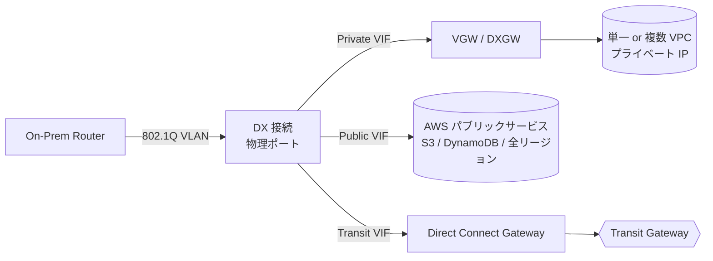
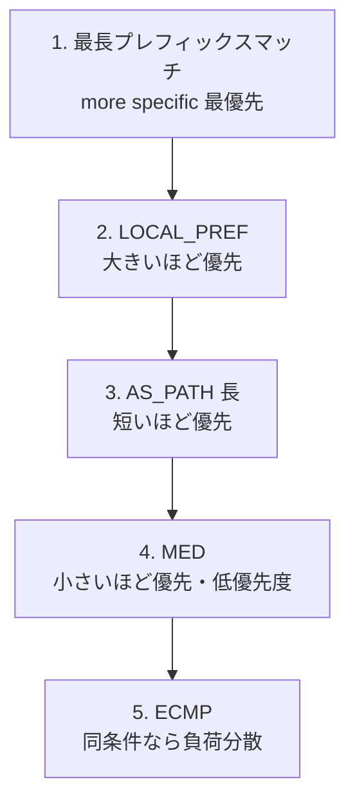
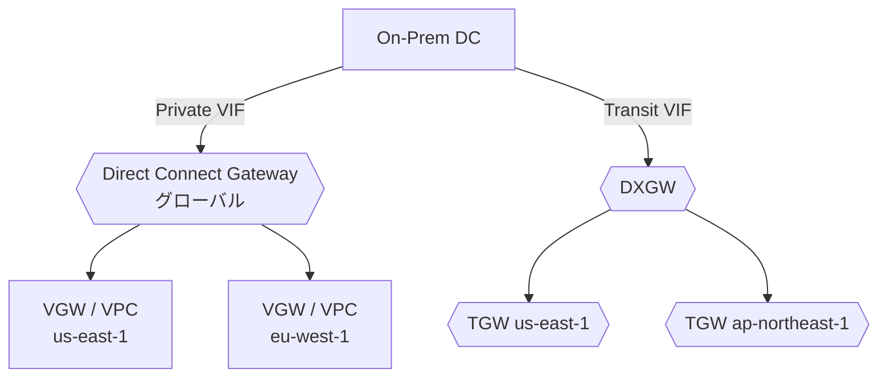
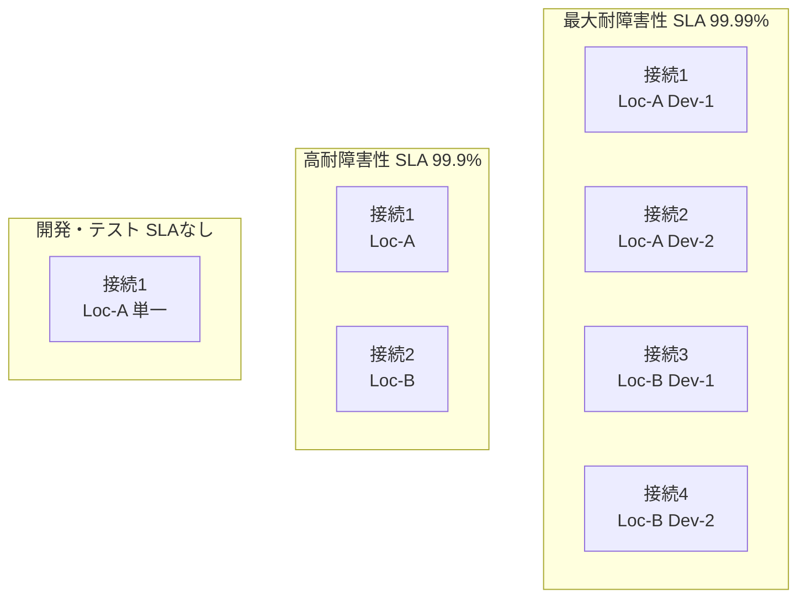
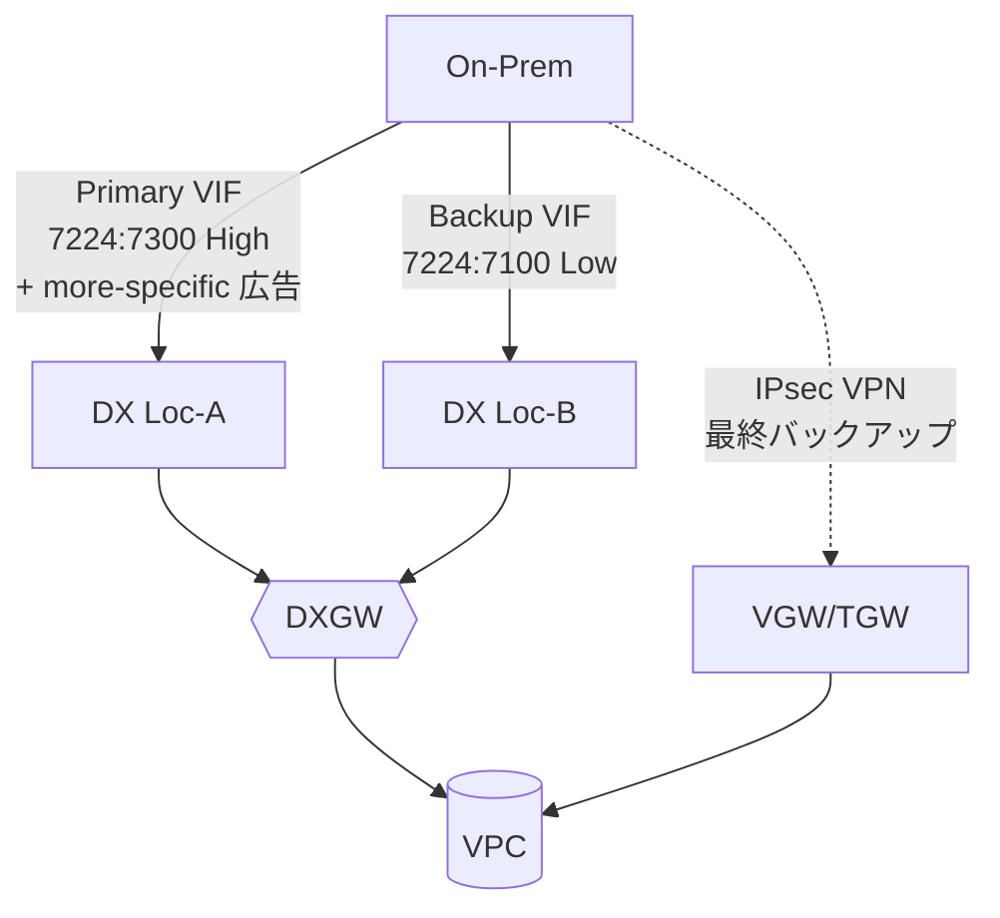
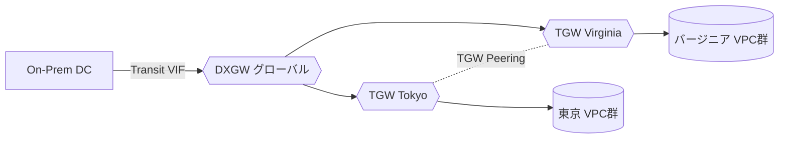

# AWS Direct Connect（DX）

> カテゴリ: ネットワークとコンテンツ配信 / 重要度: ◎（最重要）
> ANS-C01 第1分野（ハイブリッド接続）の最重要。BGP ルーティング制御が頻出。
> 最終更新: 2026-05-24 ／ 出典は本ドキュメント末尾

---

## 1. 概要

AWS Direct Connect は、オンプレミスのネットワークと AWS を**専用の光ファイバ（Ethernet）回線**で直結する物理接続サービス。インターネットを経由しないため、**一貫した低レイテンシ・高帯域・安定したスループット**を実現する。Direct Connect ロケーション（コロケーション施設）で顧客ルータと AWS ルータをクロスコネクトする。

### 試験での位置づけ

- 「専用線が欲しい」「安定帯域」「インターネット非経由」要件の正解。
- 最頻出は**BGP によるトラフィック制御**（§4: AS_PATH プリペンド・more-specific・LOCAL_PREF・BGP コミュニティ）と**冗長性設計モデル（SLA）**（§7）。
- VIF 三種の使い分け、Direct Connect Gateway によるマルチリージョン/マルチアカウント、MACsec、SiteLink も頻出。

---

## 2. コアコンポーネント

| コンポーネント | 役割 | 試験での要点 |
|---|---|---|
| **接続（Connection）** | 物理ポート。Dedicated / Hosted | 速度 1/10/100/400 Gbps（Dedicated）。Hosted はパートナー経由 |
| **VIF（仮想インターフェイス）** | 接続上の論理 IF（802.1Q VLAN） | Private / Public / Transit の3種（§3） |
| **Direct Connect Gateway（DXGW）** | VIF と VGW/TGW を束ねるグローバル GW | マルチリージョン・マルチアカウント接続（§5） |
| **LAG（Link Aggregation Group）** | 複数接続を LACP で束ねる | 同速度・同ロケーション。最大4本（<100G）/ 2本（100G） |
| **LOA-CFA** | 相互接続承認書 | クロスコネクト手配時にコロケ事業者へ提出する書類 |
| **MACsec** | L2 回線暗号化（IEEE 802.1AE） | Dedicated **10G / 100G** で対応（§6） |
| **VGW / TGW** | AWS 側の終端 | Private VIF→VGW/DXGW、Transit VIF→DXGW→TGW |

### Dedicated vs Hosted

| 観点 | Dedicated 接続 | Hosted 接続 |
|---|---|---|
| 提供元 | AWS が物理ポートを占有割当 | APN パートナーが分割提供 |
| 速度 | 1 / 10 / 100 / 400 Gbps | 50 Mbps〜10 Gbps（パートナー次第、細かい帯域） |
| VIF 数 | 最大51（Private/Public 50＋Transit 4 を合算51） | **1接続あたり VIF は1つ** |
| MACsec | 対応（10G/100G） | 一般に非対応 |

---

## 3. 仮想インターフェイス（VIF）三種

| VIF 種別 | 接続先 | 用途 | 重要点 |
|---|---|---|---|
| **Private VIF** | VGW または DXGW | VPC へプライベート IP で接続 | 1 Private VIF = 1 VGW（DXGW 経由で複数 VPC/リージョン）。広告経路 **100/BGP（IPv4・IPv6 各）** |
| **Public VIF** | AWS パブリックサービス | S3・DynamoDB 等へ**全リージョン**でアクセス | パブリック IP 必須。広告経路 **1,000**。全広告に `NO_EXPORT` 付与。推移ルーティング不可 |
| **Transit VIF** | DXGW（→ TGW） | TGW 経由で多数 VPC / マルチアカウント / マルチリージョン | Dedicated あたり最大4。AWS→オンプレ広告は DXGW 単位で制御 |

---

## 4. BGP ルーティングとトラフィック制御（◎最頻出）

DX のルーティングは BGP で行い、**経路選択は以下の優先順位**で評価される（共通の BGP 経路選択則）。

### Private / Transit VIF のトラフィック制御（インバウンド＝AWS→オンプレの戻り）

オンプレからの広告に**LOCAL_PREF コミュニティ**を付けて AWS 側の戻り経路を制御する。

| コミュニティ | 意味 | 用途 |
|---|---|---|
| `7224:7100` | **Low（低）** local preference | Active/Passive のパッシブ（バックアップ）側 |
| `7224:7200` | **Medium（中）** local preference | デフォルト。Active/Active 負荷分散（同タグで ECMP） |
| `7224:7300` | **High（高）** local preference | Active/Passive のアクティブ（優先）側 |

- LOCAL_PREF は **AS_PATH より先に評価**され、**高いほど優先**。
- **Active/Active（負荷分散）**: 全 VIF に同じタグ（例 `7224:7200`）→ ECMP。
- **Active/Passive（フェイルオーバ）**: アクティブに `7224:7300`、パッシブに `7224:7100`。
- 同一プレフィックス長・同 LOCAL_PREF・同 AS_PATH・同 MED の複数 Private/Transit VIF で **ECMP**（ASN は一致不要）。

### アウトバウンド（オンプレ→AWS）の制御 = オンプレ側で設定

- **more-specific（より長いプレフィックス）広告**が最優先。Active/Passive はアクティブ側でより細かいプレフィックスを広告。
- **AS_PATH プリペンド**（自 ASN を複数回付加）で経路を長く見せて非優先化。
- ※ プレフィックス長と LOCAL_PREF が同じ時に初めて AS_PATH が効く点に注意。

### Public VIF のスコープ BGP コミュニティ（広告範囲の制御）

| インバウンド（オンプレ→AWS に付与し伝播範囲を制御） | 意味 |
|---|---|
| `7224:9100` | ローカル AWS リージョンのみ |
| `7224:9200` | 同一大陸の全リージョン |
| `7224:9300` | グローバル（全パブリックリージョン）※無タグ時のデフォルト |

| アウトバウンド（AWS が広告経路に付与） | 意味 |
|---|---|
| `7224:8100` | DX ロケーションと同一リージョン発の経路 |
| `7224:8200` | 同一大陸発の経路 |
| 無タグ | 他大陸発の経路 |

- Public VIF の広告は**全て `NO_EXPORT`** 付き（AWS 網内のみ使用）。私有 ASN を使うと AWS が **7224 に置換**するため、プリペンドは外部に効かない。

---

## 5. Direct Connect Gateway（DXGW）

- **グローバルリソース**。1つの DX 接続から**複数リージョン・複数アカウント**の VPC/TGW へ到達（中国リージョン除く）。
- **Private VIF → DXGW**: VGW を最大20まで関連付け（リージョンまたぎ可）。**VGW 同士は DXGW 経由で相互通信不可**（ハブにならない）。
- **Transit VIF → DXGW**: TGW を最大6（DXGW あたり）。DXGW あたり Private/Transit VIF は最大30。
- **Allowed prefixes**: DXGW から TGW 構成で、オンプレへ広告するプレフィックスを制御。
- DXGW 自体は無料（マルチアカウント DXGW でも追加課金なし）。

---

## 6. MACsec・SiteLink

### MACsec（回線暗号化）

- IEEE 802.1AE による**ニアラインレートの L2 point-to-point 暗号化**。
- **Dedicated 10 Gbps / 100 Gbps** 接続かつ対応 PoP で利用可（Hosted は一般に非対応）。
- IPsec VPN と異なり**スループット低下が小さい**（L2 で暗号化）。コンプライアンスで「DX でも暗号化必須」要件の解。

### SiteLink

- DX **ロケーション間（オンプレ拠点間）を AWS グローバルバックボーン経由で直接接続**する機能。
- トラフィックは AWS リージョンを経由せず、最短経路で拠点間を結ぶ（AWS をグローバル WAN として利用）。
- MACsec 対応ポート/PoP なら SiteLink も MACsec 可。広告プレフィックス上限 100。

---

## 7. 冗長性設計モデル（Resiliency Toolkit）（◎暗記）

| モデル | SLA | 接続数 | ロケーション | 用途 |
|---|---|---|---|---|
| **最大耐障害性** | **99.99%** | 独立した接続を**各ロケーションに別々のデバイスで** | **2 ロケーション以上** | 重要本番ワークロード |
| **高耐障害性** | **99.9%** | **2 接続** | **2 ロケーション**（別デバイス） | 一般本番 |
| **開発/テスト** | SLAなし | 1 接続（複数 VIF で論理冗長は可） | 1 ロケーション | 非クリティカル |
| **VPN バックアップ** | – | 1 DX ＋ S2S VPN フェイルオーバ | 1 | コスト重視のバックアップ |

- **VPN バックアップ**: DX 障害時に Site-to-Site VPN へフェイルオーバ。TGW/VGW で DX 経路（伝播）を優先し、DX 断時に VPN 経路へ自動切替。

---

## 8. 他サービスとの連携

- **[VPC](../vpc/README.md)**: Private VIF → VGW で単一 VPC、または DXGW 経由で複数 VPC。
- **[Transit Gateway](../transit-gateway/README.md)**: **Transit VIF → DXGW → TGW** で多数 VPC・マルチアカウント・マルチリージョンを集約。
- **[Site-to-Site VPN](../site-to-site-vpn/README.md)**: DX のバックアップ、または **Private IP VPN over DX**（DX 上に IPsec を張り暗号化＋プライベート）。
- **Route 53 / S3 等パブリックサービス**: Public VIF で全リージョンへプライベート経路アクセス。
- **[RAM](../../security-identity-compliance/ram/README.md)**: DXGW・Hosted VIF を他アカウントへ共有。

---

## 9. 制約・上限・BGP タイマー（暗記推奨）

| 項目 | 値 |
|---|---|
| ポート速度（Dedicated） | 1 / 10 / 100 / 400 Gbps（単一モードファイバ） |
| Private/Public VIF / Dedicated | 50（Transit 4 と合算で最大51） |
| Transit VIF / Dedicated | 4 |
| VIF / Hosted 接続 | **1** |
| 経路広告（Private/Transit VIF, オンプレ→AWS） | **IPv4・IPv6 各100**（超過で BGP セッション idle ダウン） |
| 経路広告（Public VIF） | **1,000** |
| 接続 / LAG | 4（<100G）/ 2（100G） |
| DXGW / アカウント | 200 |
| VGW / DXGW | 20 ／ TGW / DXGW = 6 |
| VIF / DXGW（Private+Transit） | 30 |
| **BGP デフォルト hold** | **90秒**（最小3秒）、keepalive 30秒（最小1秒） |
| **BFD** | 各 VIF で非同期 BFD が自動有効（ルータ側設定で発効）。最小検出間隔 300ms × 乗数3 |
| ASN | カスタマ側 1〜4,294,967,294、Amazon 側 Public VIF は 7224 固定 |
| MTU | Private/Transit VIF で**ジャンボフレーム 9001** 設定可。Ethernet フレーム 1522 / 9023 対応 |

- **コスト**: ①ポート時間課金（速度・接続種別で決定）＋②**アウトバウンドデータ転送（DTO）**。インターネット経由より DTO 単価が安い。DXGW 自体は無料。

---

## 10. よくある設計パターン

### Active/Passive フェイルオーバ（BGP コミュニティ＋VPN バックアップ）

- 戻り（AWS→オンプレ）は LOCAL_PREF コミュニティ、行き（オンプレ→AWS）は more-specific / AS_PATH プリペンドで制御し、DX を優先・VPN を最終バックアップに。

### グローバル集約（Transit VIF ＋マルチリージョン TGW）

---

## 11. 出典

- [What is Direct Connect? – AWS Docs](https://docs.aws.amazon.com/directconnect/latest/UserGuide/Welcome.html)
- [Direct Connect routing policies and BGP communities – AWS Docs](https://docs.aws.amazon.com/directconnect/latest/UserGuide/routing-and-bgp.html)
- [Direct Connect quotas – AWS Docs](https://docs.aws.amazon.com/directconnect/latest/UserGuide/limits.html)
- [AWS Direct Connect Resiliency Toolkit – AWS Docs](https://docs.aws.amazon.com/directconnect/latest/UserGuide/resiliency_toolkit.html)
- [AWS Direct Connect SLA](https://aws.amazon.com/directconnect/sla/)
- [AWS Direct Connect Resiliency Recommendations](https://aws.amazon.com/directconnect/resiliency-recommendation/)
- [Influencing Traffic over Hybrid Networks using Longest Prefix Match – AWS Blog](https://aws.amazon.com/blogs/networking-and-content-delivery/influencing-traffic-over-hybrid-networks-using-longest-prefix-match/)
- [Adding MACsec security to AWS Direct Connect connections – AWS Blog](https://aws.amazon.com/blogs/networking-and-content-delivery/adding-macsec-security-to-aws-direct-connect-connections/)
