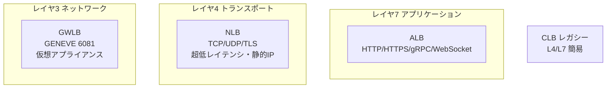
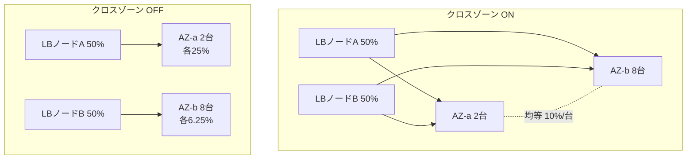
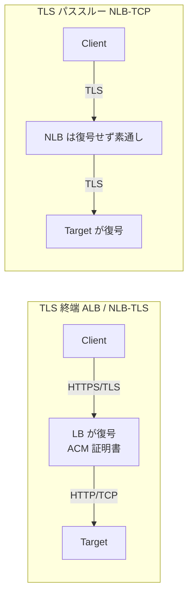
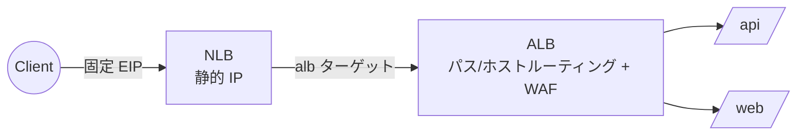
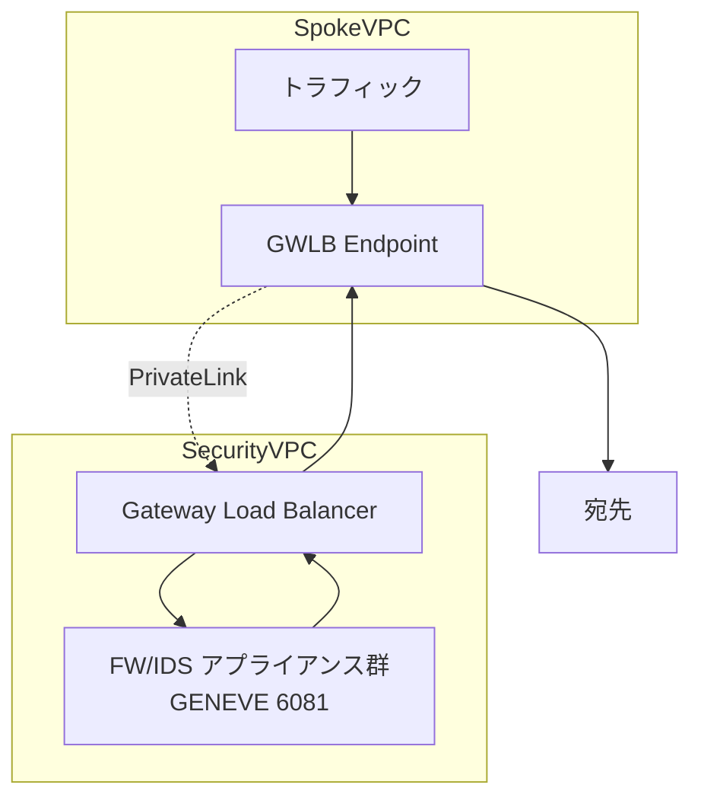

# Elastic Load Balancing (ELB)

> カテゴリ: ネットワークとコンテンツ配信 / 重要度: ◎（最重要）
> ALB/NLB/GWLB/CLB の使い分けと挙動（クロスゾーン・送信元 IP・TLS）は ANS-C01 の頻出領域。
> 最終更新: 2026-05-24 ／ 出典は本ドキュメント末尾

---

## 1. 概要

Elastic Load Balancing は、受信トラフィックを複数の AZ にある複数のターゲット（EC2 / IP / Lambda / コンテナ / 仮想アプライアンス）へ自動分散するマネージドサービス。ヘルスチェックで健全なターゲットのみへルーティングし、需要に応じて自動スケールする。4種類のロードバランサ（**ALB / NLB / GWLB / CLB**）がある。

### 試験での位置づけ

- 第1分野（設計）〜第3分野（運用）で頻出。
- 特に重要: **4種の使い分け（OSI 層・プロトコル・ターゲット・送信元 IP 保持）**、**クロスゾーン負荷分散のデフォルト挙動（ALB は常時 ON / NLB・GWLB は OFF）**、**ターゲットグループの種類**、**TLS 終端 vs パススルー**、**Proxy Protocol v2**、**SNI**、**ACM 連携**、**EKS の AWS Load Balancer Controller**。

---

## 2. コアコンセプト

| 概念 | 役割 | 試験での要点 |
|---|---|---|
| **リスナー (Listener)** | プロトコル + ポートで接続を待ち受ける | フロント側プロトコル。ルールでターゲットへ振り分け |
| **ターゲットグループ** | ターゲットの集合 + ヘルスチェック設定 | instance / ip / lambda / GENEVE 等。§4 |
| **ヘルスチェック** | ターゲットの死活監視 | 不健全ターゲットへの送信停止 |
| **クロスゾーン負荷分散** | 全 AZ のターゲットへ均等分散するか | LB 種別でデフォルトが異なる。§5（最頻出） |
| **スキーム** | internet-facing / internal | 内部 LB のノードはプライベート IP のみ |
| **AZ / ノード** | 有効化した AZ ごとに LB ノードを作成 | ALB は最低2 AZ 必須 |

---

## 3. ロードバランサ 4 種比較（最重要）

| 観点 | ALB | NLB | GWLB | CLB（旧世代） |
|---|---|---|---|---|
| OSI 層 | **L7（アプリ）** | **L4（トランスポート）** | **L3（ネットワーク）+ GENEVE** | L4 / L7 |
| リスナープロトコル | HTTP, HTTPS（gRPC/WebSocket） | TCP, UDP, TCP_UDP, TLS | IP（GENEVE 6081） | TCP, SSL, HTTP, HTTPS |
| 主用途 | Web アプリ、コンテンツベースルーティング | 超低レイテンシ、高スループット、静的 IP、TCP/UDP | FW/IDS/IPS 等の**仮想アプライアンス連携** | 旧 EC2-Classic 互換（非推奨） |
| ターゲット | instance / ip / lambda / ALB | instance / ip / ALB | instance / ip | instance |
| **静的 IP / EIP** | なし（DNS 名のみ） | **AZ ごとに静的 IP / EIP 関連付け可** | なし | なし |
| **送信元 IP 保持** | しない（X-Forwarded-For で伝達） | **保持**（instance/ip ターゲットでクライアント IP を透過） | 保持（GENEVE でカプセル化） | しない（XFF） |
| TLS 終端 | 可 | 可（TLS リスナー）/ パススルー（TCP） | - | 可（SSL） |
| クロスゾーン デフォルト | **常時 ON**（無効化不可、TG 単位で OFF 可） | **OFF** | **OFF** | コンソール ON / API・CLI OFF |
| WAF 連携 | **可** | 不可 | 不可 | 不可 |
| MTU | 9001（ジャンボフレーム） | 9001 | **8500** | 9001 |

### 使い分けの判断ポイント（頻出）

- **HTTP ヘッダ/パス/ホストでルーティング、WAF 連携** → **ALB**。
- **静的 IP（EIP）が欲しい / UDP / 超低レイテンシ / 送信元 IP をそのまま見たい** → **NLB**。
- **サードパーティのファイアウォール/IDS を透過的に挿入** → **GWLB**（GENEVE で全パケットを検査層へ）。
- **CLB は新規採用しない**（移行先は ALB/NLB）。試験では「レガシー」「EC2-Classic」の文脈で登場。

---

## 4. ターゲットグループ

| ターゲットタイプ | 対応 LB | 説明 |
|---|---|---|
| **instance** | ALB / NLB / GWLB / CLB | EC2 インスタンス ID で登録。送信元 IP はクライアント IP のまま見える（NLB） |
| **ip** | ALB / NLB / GWLB | プライベート IP で登録。オンプレ/ピアVPC/コンテナの IP も可 |
| **lambda** | **ALB のみ** | Lambda 関数をターゲット化（サーバーレス Web） |
| **alb** | **NLB のみ** | NLB の背後に ALB を置く（静的 IP + L7 ルーティングの両立） |

| ターゲットグループプロトコル | 対応 LB |
|---|---|
| **HTTP / HTTPS** | ALB |
| **TCP / UDP / TCP_UDP / TLS** | NLB |
| **GENEVE** | GWLB |

- ターゲットグループ単位で**ヘルスチェックプロトコル・パス・しきい値**を設定。
- ターゲットの IP アドレスタイプは **IPv4 / IPv6**（IPv6 TG は dualstack LB で使用）。

---

## 5. クロスゾーン負荷分散（最頻出・暗記必須）

| LB 種別 | クロスゾーンのデフォルト | 備考 |
|---|---|---|
| **ALB** | **常に ON**（LB レベルで無効化不可） | ターゲットグループレベルでのみ OFF 可能 |
| **NLB** | **OFF** | 後から ON/OFF 可。ON にすると AZ をまたぐ転送に**データ転送課金（$0.01/GB）** |
| **GWLB** | **OFF** | 後から ON/OFF 可 |
| **CLB** | コンソール作成は ON / API・CLI 作成は OFF | 後から変更可 |

- **OFF の場合**: 各 LB ノードは**自 AZ 内のターゲットのみ**へ分散 → AZ ごとのターゲット数が偏ると負荷も偏る（上図 OFF: AZ-a は各25%、AZ-b は各6.25%）。
- **ON の場合**: 全 AZ のターゲットへ均等分散（上図: 全10台が各10%）。
- 試験での引っかけ: 「NLB で AZ ごとのターゲット数が違うのに偏って負荷がかかる」→ **クロスゾーンが OFF だから**。ON にするか各 AZ のターゲット数を揃える。

---

## 6. スティッキーセッション（セッション維持）

- **ALB**: アプリケーションベース（LB 生成 Cookie `AWSALB`、またはアプリ Cookie）。期間ベースとアプリベースの2種。
- **NLB**: ソース IP アフィニティ（送信元 IP + プロトコル）でフローを同一ターゲットへ。Cookie は使わない。
- **CLB**: 期間ベース Cookie（`AWSELB`）またはアプリ生成 Cookie。
- ステートフルなアプリで「同一ユーザーを同じバックエンドへ」必要なときに使用。スケーリング/可用性とのトレードオフに注意。

---

## 7. TLS 終端 vs パススルー、Proxy Protocol、SNI

| 方式 | 復号場所 | 用途 |
|---|---|---|
| **TLS 終端** | LB（ALB / NLB の TLS リスナー） | LB で証明書集中管理、WAF 適用、バックエンド負荷軽減 |
| **TLS パススルー** | ターゲット（NLB の TCP リスナー） | エンドツーエンド暗号化必須、ターゲットで証明書管理、相互 TLS |

- **Proxy Protocol v2**: NLB / CLB で有効化すると、TCP ペイロードの先頭に**クライアントの実 IP・ポート**（PrivateLink 経由ならエンドポイント ID も）を付与。NLB は送信元 IP を保持するが、**PrivateLink エンドポイント経由や ALB ターゲットの場合は実 IP が NLB ノード IP に置き換わる**ため、実 IP が必要なら Proxy Protocol v2 を使う。
- **SNI（Server Name Indication）**: ALB / NLB は1つの HTTPS/TLS リスナーに**複数の証明書**を載せ、ClientHello の SNI に応じて適切な証明書を選択。1リスナーで複数ドメインの HTTPS を提供（マルチテナント）。
- **ACM 連携**: ALB / NLB の証明書は **AWS Certificate Manager (ACM)** で発行・自動更新。ACM 証明書は ELB / CloudFront / API Gateway で利用可（EC2 へエクスポート不可な点に注意）。

---

## 8. AWS Load Balancer Controller（EKS）

- Kubernetes（EKS）上で **Ingress リソース → ALB**、**Service (type: LoadBalancer) → NLB** を自動プロビジョニングするコントローラ。
- **IP モード**: Pod の IP を直接ターゲット登録（VPC CNI 前提）。`instance` モードより効率的でレイテンシが低い。
- IngressGroup で複数 Ingress を1つの ALB に集約しコスト削減。ターゲットタイプ・SG・SSL などをアノテーションで制御。
- 試験では「EKS で ALB/NLB を K8s ネイティブに管理」=このコントローラ。

---

## 9. 他サービスとの連携

- **Route 53**: エイリアスレコードで Zone Apex から LB を参照、Failover/Latency で複数 LB を束ねる（[Route 53](../route-53/README.md)）。
- **PrivateLink**: NLB / GWLB は**エンドポイントサービスのフロントに必須**（[PrivateLink](../privatelink/README.md)）。
- **VPC**: サブネット配置、SG（ALB/NLB は SG 可、GWLB は不可）、MTU（[VPC](../vpc/README.md)）。
- **ACM / WAF / Shield**: 証明書、ALB への WebACL、DDoS 保護。
- **Auto Scaling**: ターゲットグループへ ASG を関連付け、健全性に応じスケール。
- **Global Accelerator**: NLB/ALB を背後に置き、エニーキャストの静的 IP とグローバル最適経路を提供。
- **Amazon Application Recovery Controller (ARC)**: Zonal Shift で障害 AZ から LB トラフィックを退避。

---

## 10. 制約・上限・コスト

| 項目 | デフォルト値 |
|---|---|
| ALB/NLB / リージョン | 50（引き上げ可） |
| ターゲットグループ / リージョン | 3,000 |
| ALB のリスナー | 50 / LB |
| ALB のルール（デフォルト除く） | 100 / LB |
| ALB のターゲット | 1,000 / LB |
| NLB のターゲット（TG あたり） | 500 / AZ |
| 証明書 / リスナー（SNI） | 25（デフォルト証明書除く） |
| ALB が最低必要な AZ 数 | **2** |
| MTU | ALB/NLB/CLB 9001、GWLB 8500 |

- **コスト**: LB 時間課金 + **LCU（ALB）/ NLCU（NLB）/ GLCU（GWLB）**（新規接続数・アクティブ接続・処理バイト・ルール評価等で算出）。
- NLB はクロスゾーン ON 時に **AZ 間データ転送 $0.01/GB** が発生。ALB/CLB は同シナリオで非課金。

---

## 11. よくある設計パターン

### 静的 IP + L7 ルーティングの両立（NLB → ALB）

- ファイアウォールのホワイトリストに**固定 IP**が必要だが、L7 のコンテンツルーティングや WAF も使いたい → **NLB の前段（静的 IP）+ ALB をターゲット**にする定番構成。

### 集中型インスペクション（GWLB + GENEVE）

- GWLB が GENEVE（ポート6081）で全パケットを仮想アプライアンスへ透過カプセル化。アプライアンスはスケールアウトしフロー一貫性を保つ。詳細は [PrivateLink](../privatelink/README.md)。

---

## 12. 出典

- [How Elastic Load Balancing works – AWS Docs](https://docs.aws.amazon.com/elasticloadbalancing/latest/userguide/how-elastic-load-balancing-works.html)
- [Application, Network, and Gateway Load Balancing の比較 – AWS](https://aws.amazon.com/compare/the-difference-between-the-difference-between-application-network-and-gateway-load-balancing/)
- [Cross-zone load balancing for target groups – AWS Docs](https://docs.aws.amazon.com/elasticloadbalancing/latest/application/disable-cross-zone.html)
- [Target groups for your Network Load Balancers (Proxy protocol) – AWS Docs](https://docs.aws.amazon.com/elasticloadbalancing/latest/network/load-balancer-target-groups.html)
- [Gateway Load Balancers – AWS Docs](https://docs.aws.amazon.com/elasticloadbalancing/latest/gateway/gateway-load-balancers.html)
- [SSL/TLS certificates for ALB (SNI) – AWS Docs](https://docs.aws.amazon.com/elasticloadbalancing/latest/application/create-https-listener.html)
- [AWS Load Balancer Controller – AWS EKS Docs](https://docs.aws.amazon.com/eks/latest/userguide/aws-load-balancer-controller.html)
- [Elastic Load Balancing FAQs – AWS](https://aws.amazon.com/elasticloadbalancing/faqs/)
- [Elastic Load Balancing quotas – AWS Docs](https://docs.aws.amazon.com/elasticloadbalancing/latest/userguide/load-balancer-limits.html)
