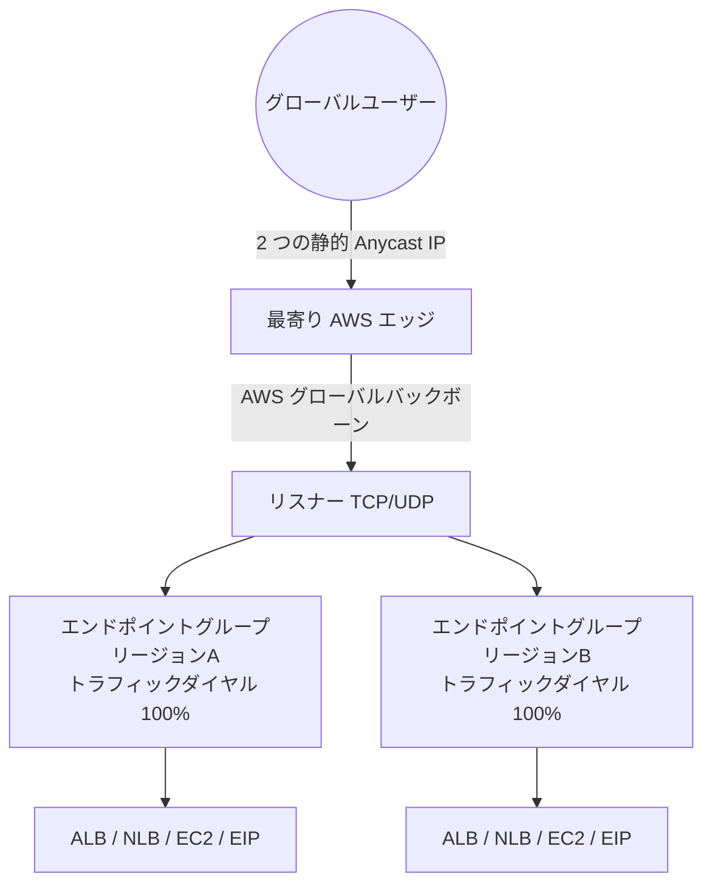
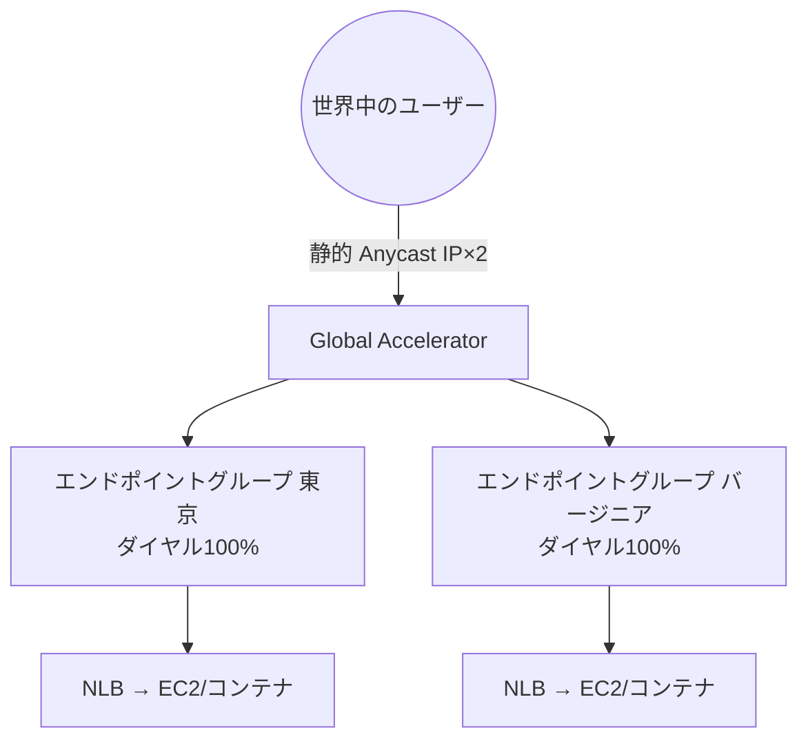
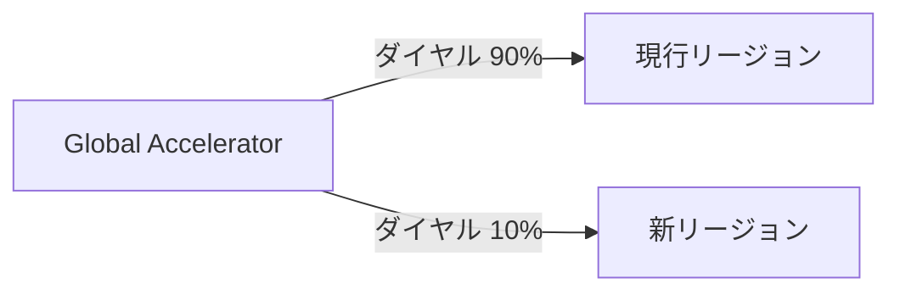

# AWS Global Accelerator

> カテゴリ: ネットワークとコンテンツ配信 / 重要度: ○（重要）
> ANS-C01 第1分野（設計）で頻出。L4 のグローバル可用性・固定 IP・高速フェイルオーバーが論点。CloudFront との使い分けが定番問題。
> 最終更新: 2026-05-24 ／ 出典は本ドキュメント末尾

---

## 1. 概要

AWS Global Accelerator は、**2 つの静的 Anycast IP アドレス**を単一のエントリポイントとして提供し、ユーザーのトラフィックを最寄りの AWS エッジから **AWS グローバルネットワーク**経由で最適なリージョンエンドポイント（ALB/NLB/EC2/EIP）へ届ける **L4（TCP/UDP）** のネットワークサービス。インターネット経由のホップを減らし、可用性・パフォーマンス・フェイルオーバー速度を改善する。

### 試験での位置づけ

- **キャッシュしない L4 プロキシ**。HTTP に限定されない（ゲーム・IoT・VoIP・MQTT 等）。
- 論点: **静的 Anycast IP（固定エントリポイント）**、**トラフィックダイヤル/エンドポイント重み**、**クライアントアフィニティ**、**高速ヘルスチェックフェイルオーバー**、**クライアント IP 保持**、**[CloudFront](../cloudfront/README.md) との違い**。
- 「固定 IP が必要」「非 HTTP プロトコル」「リージョン障害から即座にフェイルオーバー」「複数リージョンへ最適ルーティング」→ Global Accelerator。

---

## 2. コアコンセプト

| 用語 | 役割 | 試験での要点 |
|---|---|---|
| **静的 Anycast IP** | 固定エントリポイント | **IPv4 で 2 個**、デュアルスタックは計 4 個（IPv4×2＋IPv6×2）。BYOIP 可 |
| **ネットワークゾーン** | IP の物理的分離単位（AZ 類似） | 各ゾーンから 1 IP を提供。一方が使えなくても他方へリトライ可 |
| **アクセラレーター** | トラフィックを束ねる最上位リソース | **Standard** と **Custom routing** の 2 種 |
| **リスナー** | ポート/プロトコルで着信を受ける | **TCP / UDP / 両方**。L7 ではない |
| **エンドポイントグループ** | **リージョン 1 つ = 1 グループ** | **トラフィックダイヤル**で割合制御 |
| **エンドポイント** | 実際の宛先 | ALB / NLB / EC2 / EIP。**重み**で比率制御 |
| **トラフィックダイヤル** | グループ単位の流量割合 | Blue/Green・性能テスト・段階移行に利用 |

---

## 3. アーキテクチャ/仕組み



- ユーザーは最寄りエッジで AWS ネットワークに入り、以降は**輻輳の少ない AWS バックボーン**を通る。
- **ヘルス・クライアント位置・設定（重み/ダイヤル）**に基づき最適なリージョンへルーティング。
- Standard アクセラレーターのエンドポイントは **NLB / ALB / EC2 / EIP**。Custom routing は **VPC サブネット（プライベート IP）**のみ。

### Standard vs Custom routing

| | Standard | Custom routing |
|---|---|---|
| ルーティング | ヘルス・位置・重みで**最適**な宛先 | ユーザーを**決定論的に特定**の宛先へ（IP/ポートのマッピング） |
| エンドポイント | NLB/ALB/EC2/EIP | VPC サブネット内の EC2（プライベート IP） |
| 用途 | 一般的な可用性/性能改善 | ゲームセッション割当等、特定インスタンスへ固定したい場合 |
| デュアルスタック | 対応 | 非対応 |

---

## 4. 試験頻出ポイント

- **静的 Anycast IP は 2 個**（IPv4）。アクセラレーターが存在する限り保持（disable しても保持）。**delete で失効**。BYOIP（IPv4）で自社 IP を持ち込める。
- **2 つのネットワークゾーン**から 1 IP ずつ提供 → 片方の IP がクライアント網でブロックされても、クライアントはもう一方の IP にリトライ可能。
- **クライアント IP アドレスの保持**: ALB/EC2 エンドポイントへはクライアントの実 IP を保持可能（セキュリティグループでクライアント IP 制御可）。
- **トラフィックダイヤル**（エンドポイントグループ単位、0–100%）と**エンドポイント重み**（エンドポイント単位）を区別する。ダイヤル=リージョンへ流す割合、重み=グループ内での比率。
- **クライアントアフィニティ**:
  - **None（既定）**: 5 タプル（送信元 IP/ポート＋宛先 IP/ポート＋プロトコル）でハッシュ。リクエストごとに分散。
  - **Source IP（2 タプル）**: 送信元 IP＋宛先 IP で固定 → 同一クライアントを同一エンドポイントへ（セッション維持）。
- **CloudFront との違い**: GA は L4・キャッシュなし・固定 IP。CloudFront は L7・キャッシュあり（§7、[CloudFront](../cloudfront/README.md)）。

---

## 5. ヘルスチェックと高速フェイルオーバー（頻出）


- ヘルスチェック間隔: **10 秒 または 30 秒**（既定 30 秒）。
- 異常しきい値: 既定 **3 回**（範囲 2–10）。正常しきい値: 既定 **2 回**（範囲 2–10）。
- ALB/NLB エンドポイントは**そのリソース自身のヘルスチェック設定**に従う（GA は結果を尊重）。EC2/EIP は GA のヘルスチェックを使う。
- 不健全なエンドポイント/リージョンを検知すると**数十秒で自動フェイルオーバー**。DNS の TTL に依存する Route 53 フェイルオーバーより**速く・固定 IP のまま**切替できるのが利点。
- ARC のゾーンシフト/ゾーンオートシフト、VPC Block Public Access も尊重。

---

## 6. Accelerated Site-to-Site VPN 基盤

```mermaid
flowchart LR
    OnPrem[オンプレ顧客ゲートウェイ] -->|最寄りエッジ| Edge[AWS エッジ\n(Global Accelerator 基盤)]
    Edge -->|AWS バックボーン| VGW[Transit Gateway VPN\nアクセラレーション有効]
    VGW --> VPC[(VPC)]
```

- **Accelerated Site-to-Site VPN** は Global Accelerator のエッジを基盤に、VPN トラフィックを最寄りエッジから AWS バックボーンへ載せてレイテンシ・ジッターを改善。
- **Transit Gateway にアタッチする VPN（TGW VPN）でのみ有効化可能**（VGW 直アタッチの VPN では不可）。詳細は [Site-to-Site VPN](../site-to-site-vpn/README.md) / [Transit Gateway](../transit-gateway/README.md)。

---

## 7. CloudFront との使い分け（最頻出）

| 観点 | Global Accelerator | [CloudFront](../cloudfront/README.md) |
|---|---|---|
| レイヤ | **L4（TCP/UDP）** | **L7（HTTP/HTTPS）** |
| キャッシュ | **なし**（プロキシ） | **あり**（エッジキャッシュ） |
| エントリ | **2 つの静的 Anycast IP** | ディストリビューションのドメイン名 |
| プロトコル | 非 HTTP 含む（ゲーム/IoT/VoIP/MQTT） | HTTP/HTTPS 中心 |
| TLS | 終端しない（パススルー） | エッジで終端 |
| フェイルオーバー | リージョン障害に**高速・固定 IP** | オリジングループ（HTTP） |
| 代表用途 | 固定 IP・L4・即時リージョンフェイルオーバー | 静的/動的 Web・メディア・WAF/署名保護 |

> **キャッシュ・HTTP・WAF が必要** → CloudFront。**非 HTTP・固定 IP・L4 高速フェイルオーバー** → Global Accelerator。両者は併用可（例: CloudFront の前段ではなく別経路として）。

---

## 8. 他サービスとの連携

- **ALB / NLB / EC2 / EIP**: Standard エンドポイント。ALB は内部/インターネット向けどちらも可。
- **[Transit Gateway](../transit-gateway/README.md) + VPN**: Accelerated Site-to-Site VPN の基盤。
- **[API Gateway](../api-gateway/README.md)**: 直接エンドポイントにはできないが、NLB＋VPC リンク等を介して固定 IP 提供する構成あり（AWS ブログ参照）。
- **ARC（Application Recovery Controller）**: ゾーンシフト連携。
- **AWS Shield Advanced**: GA の Anycast IP も DDoS 保護対象。
- **Route 53**: GA の DNS 名や IP に対する DNS ルーティング（ただし GA 自体がグローバルルーティングを担うため役割は補完的）。

---

## 9. 制約・上限・コスト

| 項目 | 値 |
|---|---|
| 静的 IP（IPv4） | **2 個**／デュアルスタックは計 4 個 |
| エンドポイントグループ | リージョンごとに 1 つ |
| トラフィックダイヤル | 0–100%（グループ単位） |
| エンドポイント重み | 0–255（エンドポイント単位） |
| ヘルスチェック間隔 | 10 / 30 秒 |
| クライアントアフィニティ | None（5 タプル）/ Source IP（2 タプル） |

- **コスト**: 各アクセラレーターの**固定時間料金**＋**データ転送プレミアム（DT-Premium）**（AWS バックボーン利用分のリージョン別従量）。CloudFront のようなキャッシュ割引はない。
- DT-Premium は入口リージョンと宛先リージョンの組み合わせで決まる。

---

## 10. よくある設計パターン

### マルチリージョン アクティブ/アクティブ（固定 IP）



- 最寄りリージョンへ最適ルーティング。一方のリージョン障害時は**固定 IP のまま**他方へ高速フェイルオーバー。クライアントは IP/DNS を変えなくてよい。

### Blue/Green・段階移行（トラフィックダイヤル）



- 新リージョンのダイヤルを少しずつ上げてカナリア移行。問題があれば即 0% に戻す。

---

## 11. 出典

- [What is AWS Global Accelerator? – AWS Docs](https://docs.aws.amazon.com/global-accelerator/latest/dg/what-is-global-accelerator.html)
- [AWS Global Accelerator components – AWS Docs](https://docs.aws.amazon.com/global-accelerator/latest/dg/introduction-components.html)
- [How AWS Global Accelerator works / accelerator types – AWS Docs](https://docs.aws.amazon.com/global-accelerator/latest/dg/introduction-how-it-works.html)
- [Health checks for endpoints in standard accelerators – AWS Docs](https://docs.aws.amazon.com/global-accelerator/latest/dg/about-endpoint-groups-automatic-health-checks.html)
- [Client affinity – AWS Docs](https://docs.aws.amazon.com/global-accelerator/latest/dg/about-endpoint-groups-client-affinity.html)
- [Accelerated Site-to-Site VPN connections – AWS Docs](https://docs.aws.amazon.com/vpn/latest/s2svpn/accelerated-vpn.html)
- [Accessing an Amazon API Gateway via static IP addresses provided by AWS Global Accelerator – AWS Blog](https://aws.amazon.com/blogs/networking-and-content-delivery/accessing-an-aws-api-gateway-via-static-ip-addresses-provided-by-aws-global-accelerator/)
