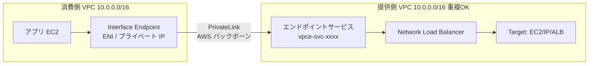
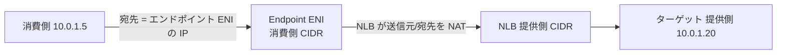
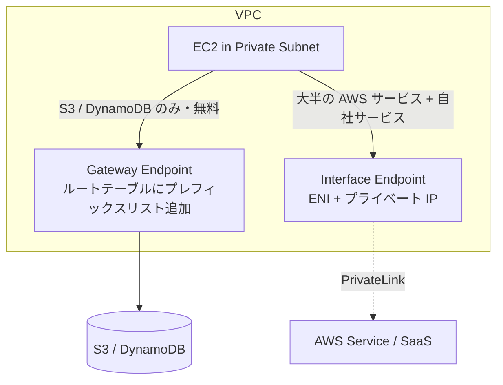
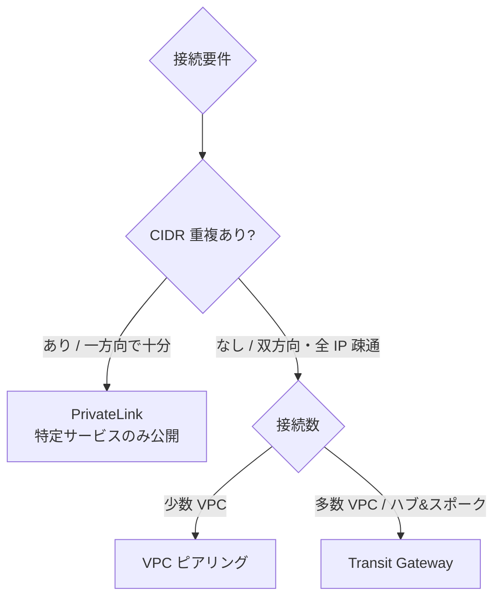
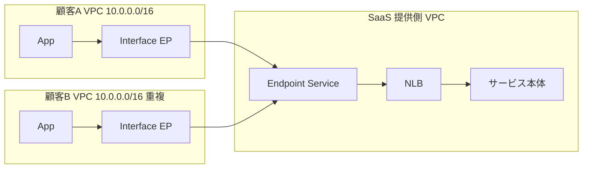
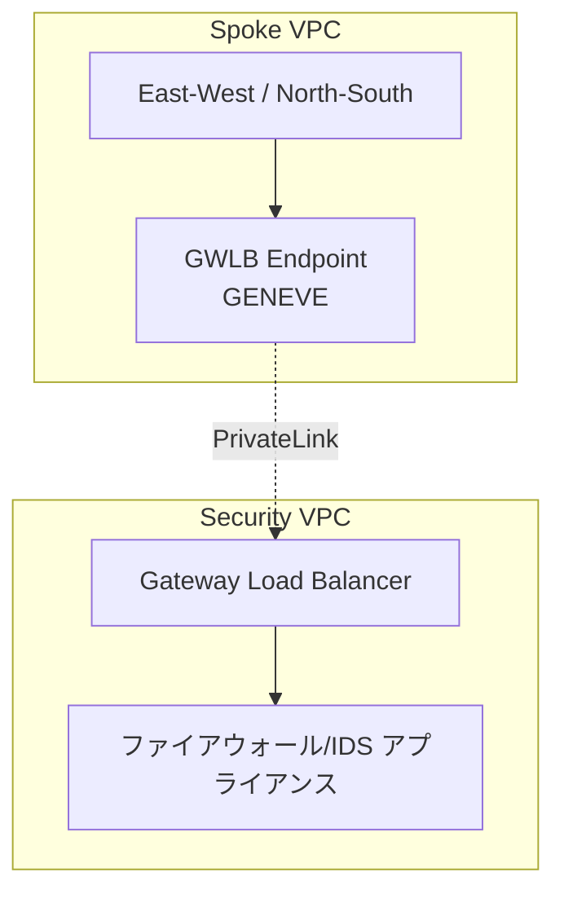

# AWS PrivateLink

> カテゴリ: ネットワークとコンテンツ配信 / 重要度: ◎（最重要）
> 「プライベートにサービスを公開・接続する」設計の中核。CIDR 重複・一方向接続の解決策として頻出。
> 最終更新: 2026-05-24 ／ 出典は本ドキュメント末尾

---

## 1. 概要

AWS PrivateLink は、VPC・AWS サービス・オンプレミス・他アカウントのサービスを、**インターネットや VPC ピアリング・NAT・IGW を経由せず**、VPC 内のプライベート IP（ENI）で接続する技術。接続は **Interface VPC エンドポイント（ENI）** と、提供側の **エンドポイントサービス（NLB / GWLB の背後）** で構成される。

### 試験での位置づけ

- 第1分野（設計）・第4分野（セキュリティ・コンプライアンス）で超頻出。
- 特に重要: **Interface エンドポイント vs Gateway エンドポイント**、**エンドポイントサービスの仕組み（NLB/GWLB）**、**CIDR が重複していても接続できる理由（NLB による NAT）**、**エンドポイントポリシー**、**ピアリング/TGW との使い分け**、**プライベート DNS**。
- 「重複 CIDR の2つの組織を双方向でなく**一方向（消費側→提供側）でつなぎたい**」「特定のサービスだけ最小権限で公開したい」場合の定番解。

---

## 2. コアコンセプト

| 概念 | 役割 | 試験での要点 |
|---|---|---|
| **Interface VPC エンドポイント** | 消費側 VPC に ENI（プライベート IP）を作りサービスへ接続 | PrivateLink の消費側。時間 + データ課金 |
| **エンドポイントサービス** | 提供側がサービスを公開（**NLB か GWLB が必須**） | `com.amazonaws.vpce.<region>.vpce-svc-xxxx` という名前 |
| **Gateway VPC エンドポイント** | **S3 / DynamoDB 専用**。ルートテーブル経由 | PrivateLink ではない。無料。§5 |
| **プライベート DNS** | サービスの正規ドメイン名をエンドポイント IP へ解決 | 透過的にアクセス可能にする |
| **エンドポイントポリシー** | エンドポイント経由のアクセスを IAM で制限 | リソースベースポリシー。最小権限 |
| **サービスコンシューマ / プロバイダ** | 消費側 / 提供側の AWS プリンシパル | 接続承認（Acceptance）を制御 |

---

## 3. アーキテクチャ（Interface エンドポイント + エンドポイントサービス）

- 消費側は **Interface エンドポイント（ENI）** を作り、提供側の **エンドポイントサービス名**を指定して接続。
- 提供側は **NLB または GWLB** をエンドポイントサービスに紐付ける（**ALB は直接は不可**。ただし NLB のターゲットに ALB を置く構成は可）。
- 接続は **AWS のプライベートバックボーン**で完結。IGW / NAT / ピアリング / TGW を一切経由しない。
- **接続は本質的に一方向**: 消費側 → 提供側へ接続を開始する。提供側から消費側へは接続を開始できない（戻りトラフィックのみ）。

### CIDR が重複していても接続できる理由（頻出）

- 消費側は**自 VPC 内のエンドポイント ENI の IP**を宛先にするだけで、提供側の IP を意識しない。
- **NLB が IP NAT を行う**ため、消費側と提供側の CIDR が完全に重複していても通信可能。これが PrivateLink がピアリング/TGW より優れる最大のポイント。
- 提供側のアプリが見る送信元 IP は**NLB ノードのプライベート IP**（消費側の実 IP ではない）。実 IP / エンドポイント ID が必要なら **Proxy Protocol v2** を NLB で有効化する。

---

## 4. エンドポイントポリシーとアクセス制御

- **エンドポイントポリシー**（Interface/Gateway エンドポイントに付与する IAM リソースポリシー）で、そのエンドポイント経由で**どのプリンシパルがどのリソースに何をできるか**を制限。
- 例: S3 Gateway エンドポイントに「特定バケットへの `s3:GetObject` のみ許可」を設定し、データ流出経路を絞る。
- 提供側は**接続承認（Acceptance required）**を有効化すると、消費側からの接続リクエストを手動承認できる。許可プリンシパル（アカウント/IAM ロール/ARN）も明示的に登録する。
- NLB 自体に SG を付け、消費側 IP からのインバウンドを制御することも可能（または PrivateLink 経由トラフィックの SG 評価を無効化）。

---

## 5. Gateway エンドポイント vs Interface エンドポイント（最頻出）

| 観点 | Gateway エンドポイント | Interface エンドポイント (PrivateLink) |
|---|---|---|
| 対象 | **S3 / DynamoDB のみ** | 大半の AWS サービス + 自社/SaaS サービス |
| 仕組み | **ルートテーブル**にマネージドプレフィックスリスト経由のルート追加 | **ENI + プライベート IP** を VPC 内に作成 |
| DNS | パブリック DNS のまま（経路がルートで変わる） | プライベート DNS でサービス正規名を ENI に解決 |
| オンプレからの利用 | **不可**（VPC 内のみ。ルート起点が必要） | **可能**（DX/VPN 経由でオンプレからエンドポイント ENI に到達できる） |
| クロスリージョン | 不可 | **可能**（NLB ベースのサービスのみ） |
| 課金 | **無料**（データ転送料なし） | **時間課金 + データ処理課金** |

> 試験での判断:
> - **S3/DynamoDB へ VPC 内からプライベートアクセス + コスト最小 → Gateway エンドポイント**。
> - **オンプレ（DX/VPN）から S3 にプライベートアクセス → Interface エンドポイント**（Gateway は経路上不可）。
> - その他のサービスや自社公開 → Interface（PrivateLink）。

---

## 6. ピアリング / TGW との使い分け（頻出）

| 方式 | 接続範囲 | CIDR 重複 | 方向 | 用途 |
|---|---|---|---|---|
| **PrivateLink** | **特定のサービス/エンドポイント1つ** | **OK**（NLB が NAT） | 一方向（消費→提供） | サービス公開、SaaS、最小露出 |
| **VPC ピアリング** | VPC 全体（IP レベル） | **不可** | 双方向 | 少数 VPC 間のフルメッシュ |
| **Transit Gateway** | 多数 VPC/オンプレを集約 | **不可**（要再アドレッシング/Private NAT） | 双方向 | 大規模ハブ&スポーク |

- **PrivateLink**: 「相手 VPC 全体ではなく**特定サービス1つだけ**を、CIDR 重複を気にせず、最小権限で公開したい」場合の最適解。スケール時に管理が単純（VPC 数が増えてもルート管理不要）。
- **TGW/ピアリング**: ネットワーク同士をルーティングで広く相互接続。重複 CIDR は許容しない。

---

## 7. プライベート DNS

- エンドポイントサービスには**プライベート DNS 名**を関連付けできる。これにより消費側は**サービスの正規ドメイン名**（例: `service.example.com` や AWS サービスの `secretsmanager.us-east-1.amazonaws.com`）でアクセスでき、アプリの設定変更が不要。
- 仕組み: エンドポイントを作成すると、消費側 VPC の Route 53 Resolver にプライベート DNS が設定され、正規名がエンドポイント ENI のプライベート IP に解決される。
- 前提: 消費側 VPC で **`enableDnsSupport` と `enableDnsHostnames` を有効化**していること。
- 自社カスタムプライベート DNS 名を使う場合、提供側は**ドメイン所有権の検証（TXT レコード）**が必要。
- エンドポイントは、プライベート DNS の他にも **Regional DNS 名**（`vpce-xxxx.svc.region.vpce.amazonaws.com`）と **Zonal DNS 名**を持ち、AZ を指定したアクセスができる。

---

## 8. 他サービスとの連携

- **ELB（NLB / GWLB）**: エンドポイントサービスのフロントに**必須**。NLB はサービス公開、GWLB は仮想アプライアンス（FW/IDS）連携（[ELB](../elastic-load-balancing/README.md)）。
- **VPC**: Interface/Gateway エンドポイント、CIDR 重複解決（[VPC](../vpc/README.md)）。
- **Route 53 Resolver / PHZ**: プライベート DNS の解決（[Route 53](../route-53/README.md)）。
- **Transit Gateway / Direct Connect / VPN**: オンプレや他 VPC から Interface エンドポイントへ到達（[VPC](../vpc/README.md)）。
- **Gateway Load Balancer**: GWLB エンドポイント（GWLBe）で集中型トラフィックインスペクション。
- **AWS RAM / Organizations**: エンドポイントサービスの許可プリンシパルをアカウント単位で管理。

---

## 9. 制約・上限・コスト

| 項目 | デフォルト値 |
|---|---|
| Interface エンドポイント / VPC | 50（引き上げ可。クロスリージョンも同枠で消費） |
| Gateway エンドポイント / リージョン | 20 |
| エンドポイントサービス / リージョン | 20（引き上げ可） |
| エンドポイントサービスに許可するプリンシパル | 数千規模（引き上げ可） |
| 1 NLB が紐付けられるエンドポイントサービス | **1**（逆に1サービスは複数 NLB 可） |
| GWLB エンドポイント | **AZ・サービスあたり1つ** |
| エンドポイントごとの帯域 | 既定 10 Gbps、最大 100 Gbps まで自動スケール |

- **コスト**: Interface エンドポイントは **ENI 時間課金（AZ 数 × 時間）+ データ処理課金（GB あたり）**。Gateway エンドポイント（S3/DynamoDB）は**無料**。
- コスト最適化: S3/DynamoDB は Interface ではなく **Gateway エンドポイント**を使えば無料（オンプレからの利用が要件でない限り）。

---

## 10. よくある設計パターン

### SaaS / 共有サービスのプライベート公開（重複 CIDR 対応）

- 多数の顧客 VPC（CIDR 重複あり）に対し、提供側は**1つのエンドポイントサービス**で公開。各顧客は自 VPC に Interface エンドポイントを作るだけ。ピアリング不要・ルート管理不要でスケールする。

### 集中型インスペクション（GWLB + GWLBe）

- GWLB をエンドポイントサービスとして公開し、各 VPC に **GWLB エンドポイント（GWLBe）** を配置。トラフィックを GENEVE で集中インスペクション層へ透過的に転送。

---

## 11. 出典

- [What is AWS PrivateLink? – AWS Docs](https://docs.aws.amazon.com/vpc/latest/privatelink/what-is-privatelink.html)
- [Access an AWS service using an interface VPC endpoint – AWS Docs](https://docs.aws.amazon.com/vpc/latest/privatelink/create-interface-endpoint.html)
- [Create a service powered by AWS PrivateLink – AWS Docs](https://docs.aws.amazon.com/vpc/latest/privatelink/create-endpoint-service.html)
- [Gateway endpoints – AWS Docs](https://docs.aws.amazon.com/vpc/latest/privatelink/gateway-endpoints.html)
- [Access virtual appliances through AWS PrivateLink (GWLB) – AWS Docs](https://docs.aws.amazon.com/vpc/latest/privatelink/vpce-gateway-load-balancer.html)
- [Manage DNS names for endpoint services – AWS Docs](https://docs.aws.amazon.com/vpc/latest/privatelink/manage-dns-names.html)
- [Endpoint policies – AWS Docs](https://docs.aws.amazon.com/vpc/latest/privatelink/vpc-endpoints-access.html)
- [AWS PrivateLink quotas – AWS Docs](https://docs.aws.amazon.com/vpc/latest/privatelink/vpc-limits-endpoints.html)
- [Cross-Region connectivity for AWS PrivateLink – AWS Blog](https://aws.amazon.com/blogs/networking-and-content-delivery/introducing-cross-region-connectivity-for-aws-privatelink/)
