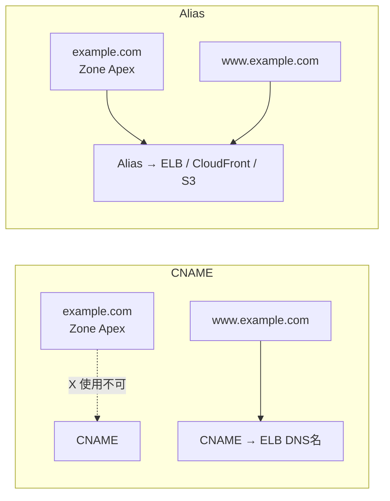
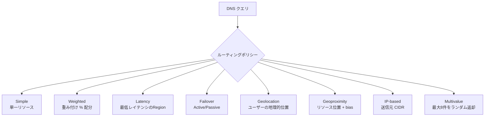
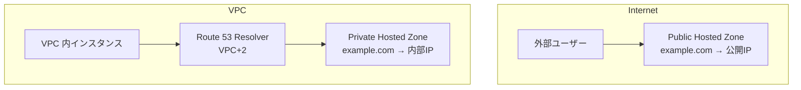
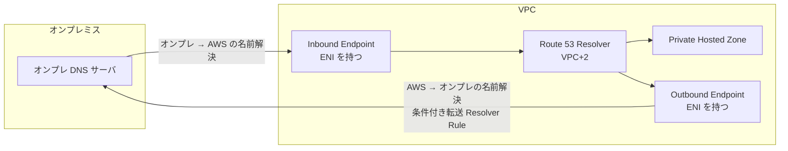
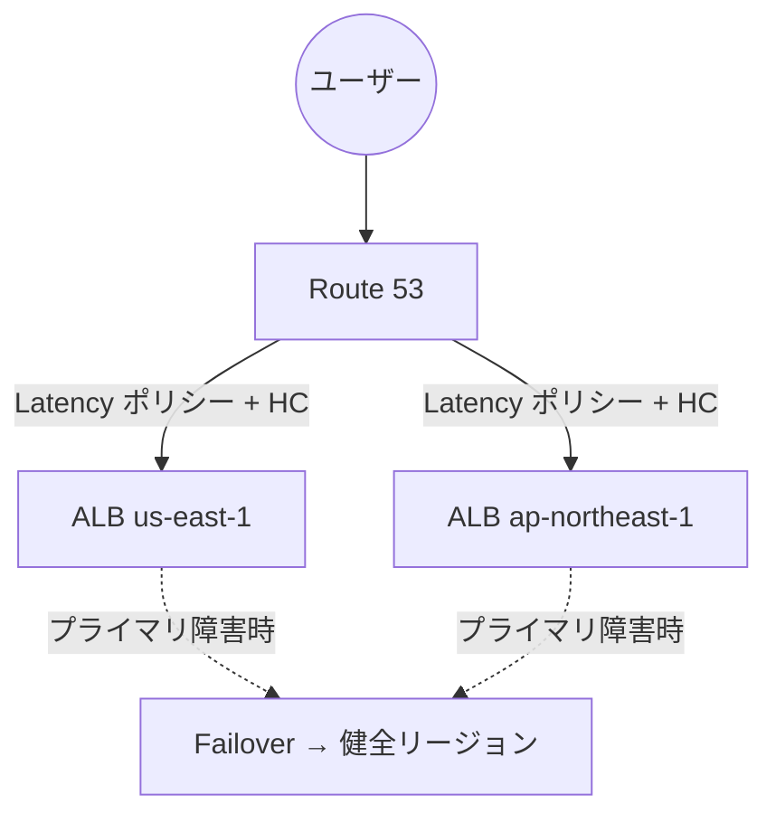
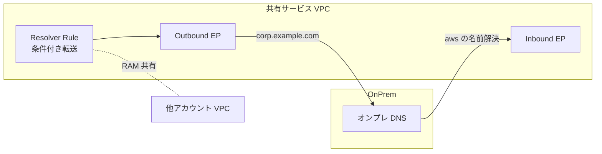

# Amazon Route 53

> カテゴリ: ネットワークとコンテンツ配信 / 重要度: ◎（最重要）
> ANS-C01 のDNS分野の中核。ハイブリッドDNS・ルーティングポリシー・ヘルスチェックは確実に得点したい領域。
> 最終更新: 2026-05-24 ／ 出典は本ドキュメント末尾

---

## 1. 概要

Amazon Route 53 は AWS のスケーラブルかつ高可用な**権威 DNS（Authoritative DNS）**・**ドメイン登録**・**DNS ヘルスチェック**を提供するマネージドサービス。加えて **Route 53 Resolver** により、VPC とオンプレミス間の**ハイブリッド DNS 解決（再帰 DNS）**を実現する。名前の "53" は DNS のポート番号 53 に由来。

### 試験での位置づけ

- 第1分野（ネットワーク設計）・第2分野（実装）・第3分野（運用・トラブルシュート）で頻出。
- 特に重要: **7+1 種のルーティングポリシー**、**エイリアスレコード**、**パブリック/プライベートホストゾーンと split-horizon DNS**、**Route 53 Resolver のインバウンド/アウトバウンドエンドポイント**、**ヘルスチェックとフェイルオーバー**、**DNSSEC / DNS Firewall**。
- ハイブリッドネットワークの問題では、Direct Connect / VPN とセットで「オンプレ ↔ VPC の名前解決をどう設計するか」が問われる。

---

## 2. コアコンセプト

| 概念 | 役割 | 試験での要点 |
|---|---|---|
| **ホストゾーン (Hosted Zone)** | ドメインのレコードを保持するコンテナ | パブリックとプライベートの2種。プライベートは VPC に関連付け |
| **パブリックホストゾーン** | インターネット向けの権威 DNS | 4つのネームサーバ（NS）が割り当てられる |
| **プライベートホストゾーン (PHZ)** | VPC 内部のみで解決される DNS | VPC の `enableDnsHostnames`/`enableDnsSupport` が必要 |
| **レコード (Resource Record Set)** | A/AAAA/CNAME/MX 等の DNS レコード | §3 で詳細 |
| **エイリアスレコード** | AWS リソースを指す Route 53 拡張 | Zone Apex で使える・無料・自動追従。§3 |
| **ルーティングポリシー** | クエリへの応答方法 | 8種類（Simple/Weighted/Latency/Failover/Geolocation/Geoproximity/IP-based/Multivalue）。§4 |
| **ヘルスチェック** | エンドポイント/他HC/CloudWatch監視 | フェイルオーバーの判定に使う。§6 |
| **Route 53 Resolver** | VPC の再帰リゾルバ（VPC+2） | インバウンド/アウトバウンドエンドポイントでハイブリッド DNS。§7 |
| **トラフィックフロー** | ルーティングを視覚的に組み合わせるポリシー | 複数ポリシーをツリー状に合成 |

---

## 3. レコードとエイリアス

### 主なレコードタイプ

| タイプ | 用途 |
|---|---|
| **A / AAAA** | ホスト名 → IPv4 / IPv6 |
| **CNAME** | 別名 → 別のドメイン名（**Zone Apex 不可**） |
| **エイリアス (Alias)** | AWS リソース（ELB/CloudFront/S3/API GW/別レコード等）への Route 53 独自参照 |
| **MX / TXT / NS / SOA / SRV / CAA / PTR** | メール / 検証 / 委任 / 逆引き等 |

### CNAME vs エイリアス（最頻出）

| 観点 | CNAME | エイリアス (Alias) |
|---|---|---|
| Zone Apex（例: `example.com`） | **使用不可** | **使用可能** |
| 指す先 | 任意のドメイン名 | **AWS リソース or 同一ゾーンの別レコード** |
| 課金 | クエリ課金あり | **AWS リソース宛は無料** |
| IP 追従 | 手動 | リソースの IP 変化に**自動追従** |
| レコードタイプ表現 | CNAME | A/AAAA として応答（裏でターゲット解決） |

> 試験での判断: **Zone Apex を ELB/CloudFront に向けたい → 必ずエイリアス**。CNAME は Apex で使えない。

---

## 4. ルーティングポリシー（8種・最重要）

| ポリシー | 動作 | 典型ユースケース | ヘルスチェック |
|---|---|---|---|
| **Simple** | 1レコードで1つ以上の値を返す（複数値はランダム） | 単一サーバ | 関連付け不可 |
| **Weighted** | 重み比率でトラフィックを配分（0〜255） | Blue/Green、カナリアリリース、A/Bテスト | 可 |
| **Latency (LBR)** | ユーザーから最も低レイテンシの AWS リージョンへ | マルチリージョンで応答速度最優先 | 可 |
| **Failover** | プライマリ障害時にセカンダリへ（Active-Passive） | DR、メンテナンスページへの切替 | **必須** |
| **Geolocation** | ユーザーの**国/大陸/州**で振り分け | コンプライアンス・言語別・地域制限 | 可。`Default` で未マッチを受ける |
| **Geoproximity** | **リソースの地理的位置 + bias** で範囲を拡縮 | リソース近接 + トラフィック量の手動調整 | 可。Traffic Flow 必須 |
| **IP-based** | 送信元 IP の **CIDR ブロック**で振り分け | ISP / 大企業ネットワーク単位の最適化 | 可 |
| **Multivalue** | **最大8件**の正常レコードをランダム返却 | 簡易な負荷分散 + 各値のヘルスチェック | 可（各レコード個別） |

### 試験での識別ポイント

- **Geolocation（ユーザーの位置）と Geoproximity（リソースの位置 + bias）の違い**は頻出。トラフィック量を手動でシフトしたい（bias）なら Geoproximity。
- **Latency = リージョンベース**（実測レイテンシ）、**Geolocation = ユーザーの地理的位置ベース**。混同に注意。
- **Multivalue は LB の代替ではない**。最大8件・ランダム・各値にヘルスチェック可。ALB/NLB のような高度な分散はしない。
- Geolocation は最も具体的なマッチ（州 > 国 > 大陸 > Default）が優先される。`Default` レコードを置かないと未マッチのユーザーが `NoAnswer` になる。

---

## 5. ホストゾーンと Split-Horizon DNS

- **同名のパブリック PHZ とプライベート PHZ** を作ると、**VPC 内からはプライベート、外部からはパブリック**の応答を返す = **split-horizon (split-view) DNS**。
- PHZ を有効にするには対象 VPC で **`enableDnsSupport` と `enableDnsHostnames` の両方が true** であること。
- PHZ は複数 VPC・複数アカウントに関連付け可能（クロスアカウントは関連付け承認が必要）。多数の VPC を束ねたい場合は **Route 53 Profiles** が推奨（PHZ あたり VPC 関連付け上限 300）。

---

## 6. ヘルスチェックとフェイルオーバー

| ヘルスチェック種別 | 監視対象 |
|---|---|
| **エンドポイント監視** | 指定 IP/ドメインへ HTTP/HTTPS/TCP で死活確認 |
| **Calculated（計算型）** | 複数の**子ヘルスチェック**を集約（AND/OR/しきい値）。子は最大255 |
| **CloudWatch アラーム連動** | アラーム状態を健全性として利用（プライベートリソースの監視に有効） |

- **チェック間隔**: 標準 **30 秒**、Fast は **10 秒**（追加課金）。
- **失敗しきい値（Failure threshold）**: 既定 3 回連続失敗で Unhealthy。
- 世界中の複数リージョンの**チェッカー**から検査。18%以上のチェッカーが健全なら Healthy 判定（位置の偏りを排除）。
- **文字列マッチ**: レスポンスボディの先頭 5120 バイト内の文字列で判定可能。
- **プライベートサブネット内のリソース**はパブリックチェッカーから到達できない → **CloudWatch メトリクス + Calculated/CloudWatch アラーム連動** で監視する（頻出の引っかけ）。
- Failover ポリシーは**プライマリにヘルスチェック必須**。プライマリ Unhealthy でセカンダリへ。

---

## 7. Route 53 Resolver（ハイブリッド DNS・超頻出）

VPC には既定で **VPC CIDR の +2 アドレス（例: 10.0.0.0/16 → 10.0.0.2）** にリゾルバ（Amazon Provided DNS / "Route 53 Resolver"）が存在する。これに対しエンドポイントを追加することでオンプレと相互解決する。

| エンドポイント | 方向 | 用途 |
|---|---|---|
| **Inbound Endpoint** | オンプレ → VPC | オンプレの DNS が **AWS 上（PHZ 等）の名前を解決**するための受け口。ENI に IP を割り当て、オンプレからその IP へ転送 |
| **Outbound Endpoint** | VPC → オンプレ | VPC のリゾルバが **オンプレの名前を解決**するための出口。**Resolver Rule** と組で使う |

### Resolver Rules（リゾルバルール）

- **条件付き転送（Conditional Forwarding）ルール**: 「`corp.example.com` への問い合わせはオンプレ DNS（指定 IP）へ転送」のように**ドメイン単位**で転送先を定義。Outbound Endpoint を経由する。
- **System ルール**: 特定ドメインを Resolver の標準動作（PHZ/パブリック解決）に戻す（転送ルールの例外として優先）。
- ルールタイプ: `FORWARD`（転送）/ `SYSTEM`（標準に戻す）/ `RECURSIVE`。
- **RAM 共有**: Resolver Rule は **AWS Resource Access Manager (RAM)** で他アカウントに共有でき、各アカウントの VPC に関連付けて一元管理できる（マルチアカウントのハイブリッド DNS の定石）。

### DNS64 / NAT64 連携

- Resolver の **DNS64** 機能で IPv6 専用ワークロードが IPv4 のみのリソースへアクセス可能（[NAT Gateway の NAT64](../vpc/README.md) と併用）。

---

## 8. DNSSEC / DNS Firewall / クエリログ

| 機能 | 概要 | 試験での要点 |
|---|---|---|
| **DNSSEC 署名** | パブリックホストゾーンのレコードを署名し改ざん（DNS スプーフィング）を防止 | KSK（Key Signing Key）は**ゾーンあたり最大2**。AWS KMS の非対称鍵（ECC_NIST_P256）を使用。親ゾーンに DS レコード登録が必要 |
| **DNSSEC 検証** | Route 53 Resolver 側で署名済み応答を検証 | 署名と検証は別機能。両方とも追加料金なし |
| **Route 53 Resolver DNS Firewall** | VPC からの**アウトバウンド DNS クエリ**をドメインリストでフィルタ | マルウェアの C2 ドメイン遮断・データ流出防止。アクション: ALLOW/BLOCK/ALERT。マネージドドメインリストあり |
| **Resolver クエリログ** | VPC が行った DNS クエリを記録 | 送信先: CloudWatch Logs / S3 / Data Firehose。セキュリティ監査・トラブルシュート |

> **DNS Firewall（アウトバウンドクエリのフィルタ）** と **AWS Network Firewall** や **WAF** は別物。DNS レイヤの保護は DNS Firewall。

---

## 9. Route 53 ARC（Application Recovery Controller）

- **旧称: Route 53 Application Recovery Controller**。マルチリージョン/マルチAZ アプリの**フェイルオーバーを確実に実行**するための仕組み。
- **Readiness Check**: リカバリ先の容量・構成が本番を引き受けられる状態かを継続的に監視。
- **Routing Control**: ヘルスチェックと連動した **ON/OFF のフェイルオーバースイッチ**。手動またはプログラムで切替。データプレーンは5リージョン構成で極めて高可用（クラスタは5エンドポイント）。
- **Zonal Shift / Zonal Autoshift**: 障害 AZ から ELB/NLB のトラフィックを退避（NLB はクロスゾーン ON/OFF どちらでも対応）。
- 試験では「DNS フェイルオーバーよりも確実な、容量を保証したリージョン退避」を問われたら ARC。

---

## 10. ドメイン登録

- Route 53 は**ドメインレジストラ**機能も持つ（`.com` 等を直接登録）。登録するとパブリックホストゾーンが自動作成。
- 他社レジストラのドメインも、NS レコードを Route 53 の4つのネームサーバに向ければ Route 53 で管理可能。
- **TLD ごとに登録料が異なる**。WHOIS プライバシー保護は無料。

---

## 11. 他サービスとの連携

- **ELB / CloudFront / S3 / API Gateway / Global Accelerator**: **エイリアスレコード**で Zone Apex から直接参照（[ELB](../elastic-load-balancing/README.md)）。
- **VPC / Route 53 Resolver**: VPC+2 リゾルバ、ハイブリッド DNS（[VPC](../vpc/README.md)）。
- **AWS RAM**: Resolver Rule / クエリログ設定 / PHZ（Profiles 経由）の共有。
- **PrivateLink**: エンドポイントサービスの**プライベート DNS 名**の解決は PHZ または Resolver と関わる（[PrivateLink](../privatelink/README.md)）。
- **Direct Connect / Site-to-Site VPN**: オンプレ ↔ VPC の名前解決を Inbound/Outbound Endpoint で実現。
- **CloudWatch**: ヘルスチェックのメトリクス連動・プライベートリソース監視。
- **AWS KMS**: DNSSEC 署名鍵（KSK）の管理。

---

## 12. 制約・上限・コスト（暗記推奨）

| 項目 | デフォルト値 |
|---|---|
| ホストゾーン / アカウント | 500（引き上げ可） |
| レコード / ホストゾーン | 10,000（超過分は追加課金で拡張可） |
| 同名・同タイプの加重/レイテンシ/Geo/Multivalue/IP-based レコード | 100 |
| 同名・同タイプの Geoproximity レコード | 30 |
| ヘルスチェック / アカウント | 200（引き上げ可） |
| Calculated HC が監視できる子 HC | 255 |
| Resolver エンドポイント / リージョン | **4**（引き上げ可） |
| エンドポイントあたり IP アドレス | **6** |
| Resolver Rule あたり IP | 6 |
| Resolver Rule / リージョン | 1,000 |
| ルールと VPC の関連付け / リージョン | 2,000 |
| エンドポイント内 IP あたり UDP QPS | 最大 **10,000**（NLB/接続追跡経由だと最低 1,500 まで低下し得る） |
| PHZ あたり関連付け VPC | 300（超過は Route 53 Profiles 推奨） |
| KSK / ホストゾーン | 2 |
| ドメイン / アカウント | 20（2021年3月以降の新規） |
| Route 53 API リクエスト | 5 req/s/account |

- **コスト**: ホストゾーン（月額 / 1ゾーンあたり）+ クエリ課金（ポリシーにより単価差・Geo/Latency は高め）+ ヘルスチェック（AWS エンドポイント無料 / 外部は有料、Fast/文字列マッチ/HTTPS は追加）。
- **DNSSEC 署名・検証は無料**。**エイリアスから AWS リソースへのクエリは無料**。
- Resolver エンドポイントは **ENI 時間課金 + クエリ課金**。

---

## 13. よくある設計パターン

### マルチリージョン Active-Active + Failover

- Latency ルーティングで最寄りリージョンへ。各リージョンにヘルスチェックを付け、障害時は健全リージョンのみ返す。さらに確実な DR には **Route 53 ARC** を併用。

### ハイブリッド DNS（オンプレ ↔ AWS 双方向解決）

- オンプレ → AWS は **Inbound Endpoint**、AWS → オンプレは **Outbound Endpoint + 条件付き転送 Resolver Rule**。ルールは **RAM** で全アカウントへ共有し集中管理。

---

## 14. 出典

- [Choosing a routing policy – AWS Docs](https://docs.aws.amazon.com/Route53/latest/DeveloperGuide/routing-policy.html)
- [Multivalue answer routing – AWS Docs](https://docs.aws.amazon.com/Route53/latest/DeveloperGuide/routing-policy-multivalue.html)
- [Geoproximity routing – AWS Docs](https://docs.aws.amazon.com/Route53/latest/DeveloperGuide/routing-policy-geoproximity.html)
- [Choosing between alias and non-alias records – AWS Docs](https://docs.aws.amazon.com/Route53/latest/DeveloperGuide/resource-record-sets-choosing-alias-non-alias.html)
- [How Route 53 Resolver works – AWS Docs](https://docs.aws.amazon.com/Route53/latest/DeveloperGuide/resolver.html)
- [Forwarding outbound DNS queries (Resolver rules) – AWS Docs](https://docs.aws.amazon.com/Route53/latest/DeveloperGuide/resolver-forwarding-outbound-queries.html)
- [Configuring DNSSEC signing – AWS Docs](https://docs.aws.amazon.com/Route53/latest/DeveloperGuide/dns-configuring-dnssec.html)
- [Route 53 Resolver DNS Firewall – AWS Docs](https://docs.aws.amazon.com/Route53/latest/DeveloperGuide/resolver-dns-firewall.html)
- [Health checks – AWS Docs](https://docs.aws.amazon.com/Route53/latest/DeveloperGuide/dns-failover.html)
- [Amazon Application Recovery Controller (ARC) – AWS Docs](https://docs.aws.amazon.com/r53recovery/latest/dg/what-is-route53-recovery.html)
- [Amazon Route 53 quotas – AWS Docs](https://docs.aws.amazon.com/Route53/latest/DeveloperGuide/DNSLimitations.html)
- [Amazon Route 53 pricing – AWS](https://aws.amazon.com/route53/pricing/)
