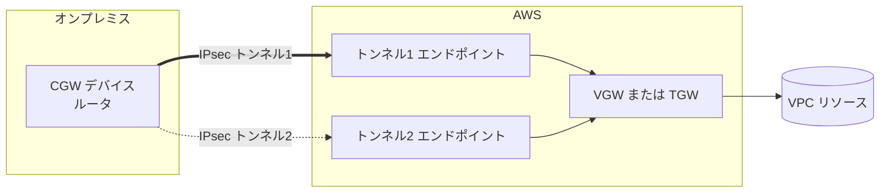
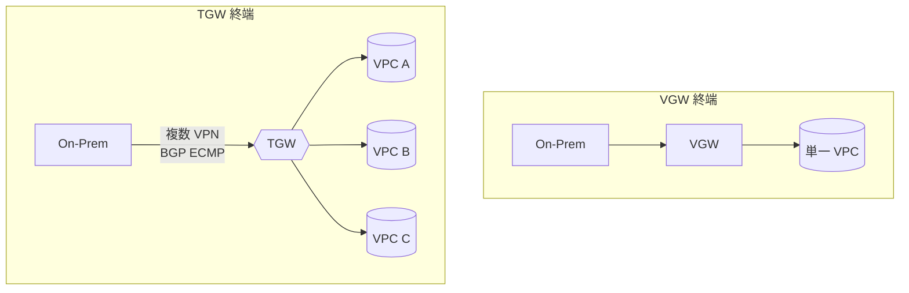
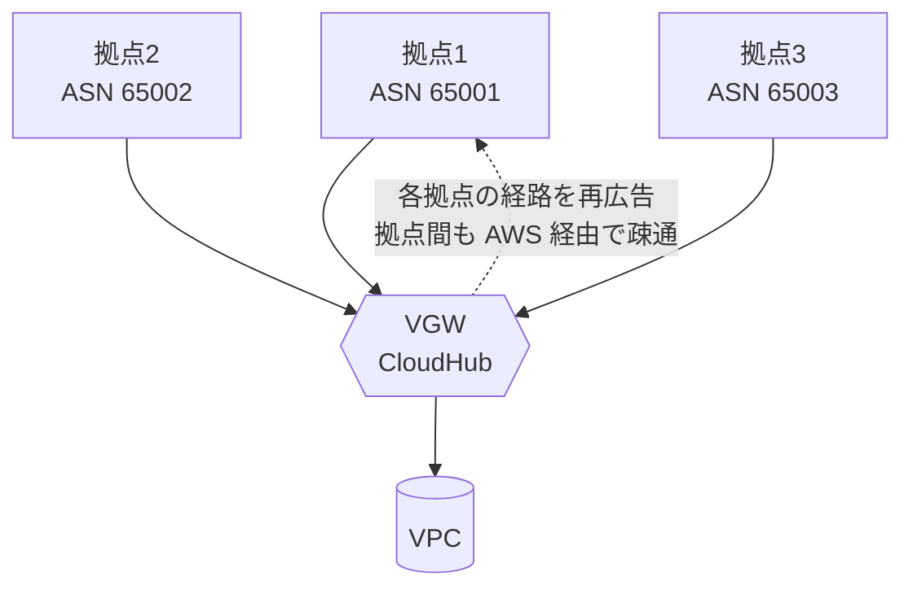
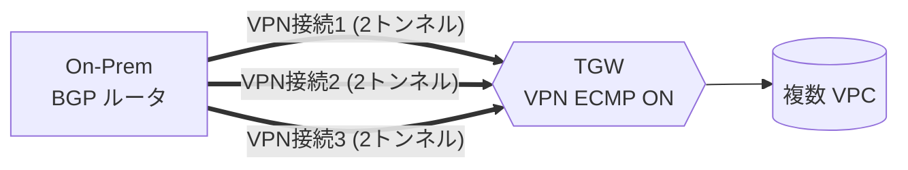
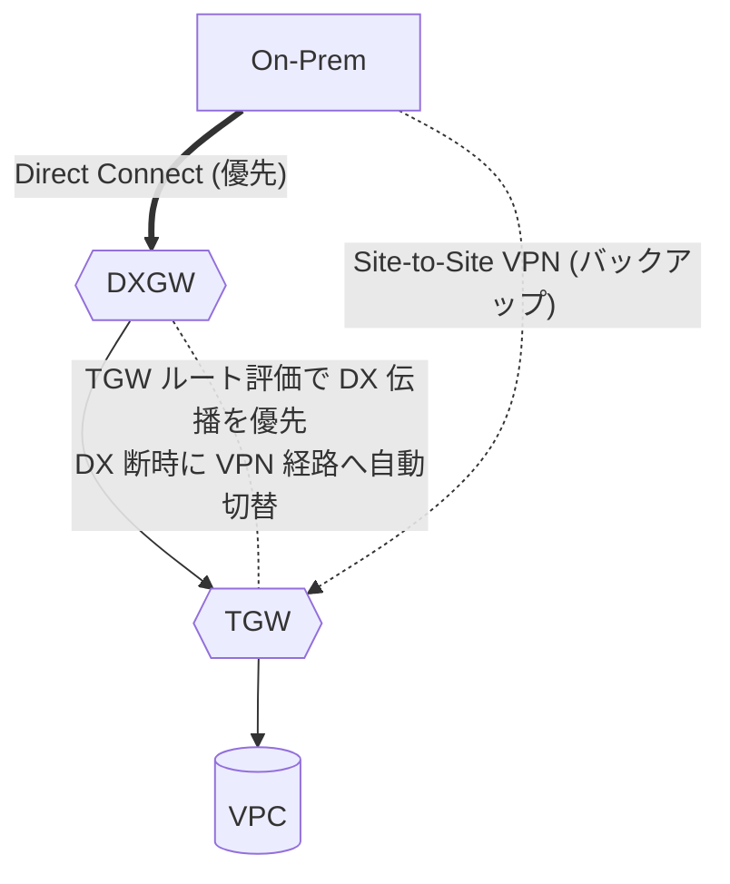

# AWS Site-to-Site VPN（S2S VPN）

> カテゴリ: ネットワークとコンテンツ配信 / 重要度: ◎（最重要）
> ANS-C01 第1分野（ハイブリッド接続）。冗長トンネル・ECMP・Accelerated VPN が頻出。
> 最終更新: 2026-05-24 ／ 出典は本ドキュメント末尾

---

## 1. 概要

AWS Site-to-Site VPN は、オンプレミスネットワークと AWS（VPC）間を**インターネット経由の IPsec 暗号化トンネル**で接続するサービス。1つの VPN 接続には**冗長のため自動的に2本のトンネル**が含まれ、別々の AWS 側エンドポイントに終端する。Direct Connect より低コスト・即時開通だが、インターネット品質に依存する。

### 試験での位置づけ

- 「素早く・安価に」オンプレと暗号化接続する要件の正解。DX のバックアップとしても頻出。
- 最頻出: **2トンネル冗長**、**VGW vs TGW 終端の違い**、**静的 vs 動的(BGP)**、**ECMP による帯域集約（TGW＋BGP）**、**Accelerated VPN（Global Accelerator）**、**VPN CloudHub**、**Private IP VPN over Direct Connect**。

---

## 2. コアコンセプト

| 用語 | 役割 | 試験での要点 |
|---|---|---|
| **VPN 接続** | オンプレと VPC 間の論理接続 | 2トンネルを内包 |
| **VPN トンネル** | IPsec 暗号化リンク | 1接続に**2本**（別エンドポイント＝高可用） |
| **カスタマゲートウェイ（CGW）** | オンプレ側情報を表す AWS リソース | 物理/ソフトの「CGW デバイス」を表現。**2-byte ASN（1〜65535）** |
| **ターゲットゲートウェイ** | AWS 側終端の総称 | VGW または TGW |
| **VGW** | 単一 VPC に付く VPN 終端 | **4-byte ASN（1〜2147483647）** 設定可 |
| **TGW** | マルチ VPC ハブ兼 VPN 終端 | ECMP / Accelerated / Private IP VPN を解放 |

---

## 3. アーキテクチャ（2トンネル冗長）

- **2トンネルは別々の AWS 側エンドポイント**に終端し、同時利用で高可用。片方メンテ/障害でも通信継続。
- IKEv2 / NAT トラバーサル / AES-256・SHA-2・追加 DH グループ対応。

### 静的ルーティング vs 動的（BGP）

| 観点 | 静的ルーティング | 動的ルーティング（BGP） |
|---|---|---|
| 経路学習 | 手動でプレフィックス指定 | CGW と BGP で自動交換 |
| CGW デバイス要件 | BGP 不要 | **BGP 必須** |
| フェイルオーバ | 限定的（経路は固定） | 自動・高速 |
| **ECMP** | **不可** | **可（TGW 終端時）** |
| 推奨 | BGP 非対応機器 | 可能な限りこちら |

---

## 4. VGW 終端 vs TGW 終端（◎最頻出）

| 機能 | VGW 終端 | TGW 終端 |
|---|---|---|
| 接続先 VPC 数 | **1 VPC のみ** | 多数 VPC（ハブ） |
| **ECMP 帯域集約** | 不可 | **可（VPN ECMP 有効＋動的ルーティング）** |
| **Accelerated VPN** | 不可 | **可** |
| **Private IP VPN over DX** | 不可 | **可** |
| Large Bandwidth Tunnel（5 Gbps/トンネル） | 不可 | 可（TGW / Cloud WAN） |
| オンプレ→AWS 動的広告上限 | 100 | **1,000** |
| AWS→オンプレ広告上限 | 1,000 | **5,000** |

> 単一 VPC の手軽な接続 → VGW。スケール・帯域集約・高速化が必要 → **TGW**。

### ECMP（帯域集約）

- 標準トンネルは **最大 1.25 Gbps / 140,000 pps**。これを超えるには**複数 VPN 接続を ECMP で束ねる**。
- 要件: **TGW で「VPN ECMP support」を有効化** ＋ **動的ルーティング（BGP）**。静的では不可。
- 各 VPN は同一プレフィックスを同 BGP 属性で広告すれば負荷分散。N 接続で約 1.25 Gbps × N。
- **Large Bandwidth Tunnel** を使えば 1トンネルで最大 **5 Gbps / 400,000 pps**（TGW / Cloud WAN 終端）。

---

## 5. 試験頻出ポイント

| 論点 | ◎要点 |
|---|---|
| **2トンネル設計** | 別 AWS エンドポイント終端。CGW 側で**両トンネル設定**が高可用の前提 |
| **Accelerated VPN** | **AWS グローバルネットワーク**（Global Accelerator）経由でインターネット混雑を回避。**TGW 終端のみ**。アクセラレータ2基を自動管理（追加課金） |
| **VPN CloudHub** | **単一 VGW に複数 CGW（拠点）を BGP 接続**し、拠点間を AWS 経由でハブ＆スポーク接続（拠点同士の VPN ハブ）。各拠点は**異なる ASN** を使用 |
| **Private IP VPN over DX** | DX の**Transit VIF 上にプライベート IP で IPsec** を張る。インターネット非経由で**暗号化＋プライベート**。TGW 終端 |
| **MTU** | **1446 バイト**（MSS 1406）。**ジャンボフレーム非対応**、**PMTUD 非対応** → MSS クランプ必須 |
| **IPv6** | インナー/アウター IPv6 は **TGW / Cloud WAN のみ**（VGW は IPv6 非対応）。1接続で IPv4 と IPv6 同時不可 |
| **暗号化** | IPsec（IKEv2）。デフォルトで業界標準暗号。トンネルオプションで強度指定可 |

### VPN CloudHub

- 各拠点が**自拠点のプレフィックスを BGP 広告**し、VGW がそれを他拠点へ再広告 → 拠点間メッシュを AWS 上で実現。DX とも併用可。

---

## 6. 他サービスとの連携

- **[VPC](../vpc/README.md)**: VGW を VPC に1つアタッチ。ルート伝播でオンプレ経路を取り込み。
- **[Transit Gateway](../transit-gateway/README.md)**: TGW 終端で ECMP / Accelerated / Private IP VPN / 複数 VPC 集約。
- **[Direct Connect](../direct-connect/README.md)**: DX のバックアップ（DX 優先・VPN フェイルオーバ）。**Private IP VPN over DX** で DX 上を暗号化。
- **AWS Global Accelerator**: Accelerated VPN のバックボーン（自動管理）。
- **[CloudWatch](../../management-governance/cloudwatch/README.md)**: トンネル状態・帯域メトリクスの監視。

---

## 7. 制約・上限・コスト（暗記推奨）

| 項目 | 値 |
|---|---|
| **トンネル / VPN 接続** | **2**（冗長） |
| **帯域 / 標準トンネル** | **最大 1.25 Gbps**、**140,000 pps** |
| 帯域 / Large Bandwidth Tunnel | 最大 **5 Gbps**、400,000 pps（TGW/Cloud WAN） |
| **MTU** | **1446 バイト**（MSS 1406）、ジャンボ非対応、PMTUD 非対応 |
| ECMP | TGW＋動的ルーティング時のみ。複数接続で帯域を線形拡張 |
| 動的広告（オンプレ→AWS） | VGW: **100** ／ TGW: **1,000** |
| 広告（AWS→オンプレ） | VGW: **1,000** ／ TGW: **5,000** |
| CGW ASN | **2-byte（1〜65535）** |
| VGW ASN | 4-byte（1〜2147483647） |
| VPN 接続 / リージョン | 50（引き上げ可） |
| VPN 接続 / VGW | 10 |
| Accelerated VPN / リージョン | 10 |
| CGW / リージョン | 50 ／ VGW / リージョン = 5 |

- **コスト**: ①VPN **接続時間課金**（プロビジョニング中ずっと課金）＋②データ転送（EC2→インターネット）。Accelerated VPN は**アクセラレータ2基の時間＋データ転送**が追加。
- DX より大幅に安価・即時開通だが、帯域は ECMP しても限界がある（高帯域・安定なら DX）。

---

## 8. よくある設計パターン

### TGW＋ECMP による高帯域 VPN

- 各接続を動的ルーティングで同一プレフィックス広告 → ECMP で約 1.25 Gbps × 接続数まで帯域集約。

### DX プライマリ＋VPN バックアップ

- TGW ルート評価で **DX 伝播 > VPN 伝播**（§Transit Gateway §3）。DX 正常時は DX のみ採用、断時に VPN がバックアップとして現れる。

---

## 9. 出典

- [What is AWS Site-to-Site VPN? – AWS Docs](https://docs.aws.amazon.com/vpn/latest/s2svpn/VPC_VPN.html)
- [Site-to-Site VPN quotas（bandwidth/MTU/routes） – AWS Docs](https://docs.aws.amazon.com/vpn/latest/s2svpn/vpn-limits.html)
- [Site-to-Site VPN routing options（static/dynamic BGP） – AWS Docs](https://docs.aws.amazon.com/vpn/latest/s2svpn/VPNRoutingTypes.html)
- [AWS Transit Gateway + Site-to-Site VPN – AWS Whitepaper](https://docs.aws.amazon.com/whitepapers/latest/aws-vpc-connectivity-options/aws-transit-gateway-vpn.html)
- [AWS Accelerated Site-to-Site VPN – AWS Whitepaper](https://docs.aws.amazon.com/whitepapers/latest/hybrid-connectivity/aws-accelerated-site-to-site-vpn-aws-transit-gateway-single-aws-region.html)
- [Scaling VPN throughput using AWS Transit Gateway – AWS Blog](https://aws.amazon.com/blogs/networking-and-content-delivery/scaling-vpn-throughput-using-aws-transit-gateway/)
