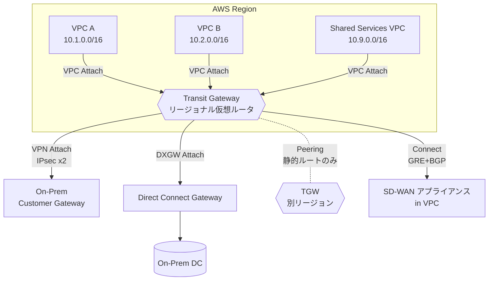
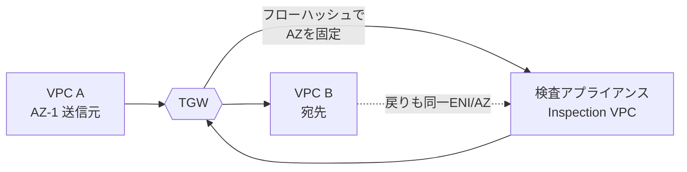
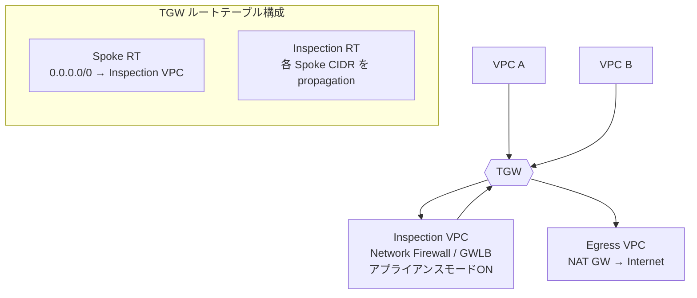
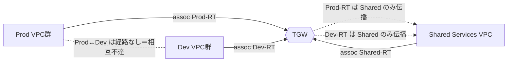

# AWS Transit Gateway（TGW）

> カテゴリ: ネットワークとコンテンツ配信 / 重要度: ◎（最重要）
> ANS-C01 第1分野（ネットワーク設計）の中核。大規模マルチVPC・ハイブリッド接続の標準解。
> 最終更新: 2026-05-24 ／ 出典は本ドキュメント末尾

---

## 1. 概要

AWS Transit Gateway は、複数の VPC・オンプレミスネットワーク（VPN / Direct Connect）を**1つのリージョナルな仮想ルータ**にハブ＆スポーク型で集約するサービス。レイヤ3で動作し、宛先 IP に基づいて次ホップのアタッチメントへパケットを転送する。トラフィック量に応じて**エラスティックに自動スケール**する。

### 試験での位置づけ

- VPC ピアリングのフルメッシュ（N×(N-1)/2 接続）が破綻する規模で必ず登場する「正解」。
- 頻出論点: **association と propagation の違い**、**ルートテーブルによるセグメンテーション**、**アプライアンスモード（対称フロー）**、**TGW Peering（静的ルートのみ・暗号化）**、**TGW Connect（GRE＋BGP・SD-WAN）**、**ルート評価順序**、**ECMP の可否**。
- 「VPC ピアリングか TGW か」「VGW か TGW か」の選択問題が頻出（§5・§9）。

---

## 2. コアコンセプト

| 用語 | 役割 | 試験での要点 |
|---|---|---|
| **アタッチメント** | TGW への接続点（パケットの送受信元） | 種別: VPC / VPN / VPN Concentrator / Direct Connect Gateway / Peering / Connect |
| **TGW ルートテーブル** | アタッチメント単位の転送表 | デフォルト1個。最大20個まで作成しセグメント化 |
| **Association（関連付け）** | アタッチメントが**参照する**ルートテーブル | 1アタッチメント＝**1ルートテーブルのみ** |
| **Propagation（伝播）** | アタッチメントの経路を**注入する**先 | 1アタッチメント→**複数ルートテーブル可**。フィルタ不可 |
| **TGW ASN** | TGW 側の BGP 自律システム番号 | デフォルト 64512。Peerと重複させない推奨 |
| **TGW CIDR** | Connect の GRE/トンネル用 IP プール | Connect peer で使用。最大5ブロック |
| **アプライアンスモード** | VPC アタッチメントの対称フロー保証 | ステートフル検査アプライアンスで必須（§4） |

### Association と Propagation（最頻出）

- **Association** = 「このアタッチメントから出たパケットを**どのルートテーブルで引くか**」（インプット側の入口）。
- **Propagation** = 「このアタッチメントの経路（VPC CIDR / BGP 学習路）を**どのルートテーブルに自動登録するか**」（アウトプット側の出口）。
- 両者を**意図的に分離**することでセグメンテーション（例: 本番系と開発系を相互不達にしつつ共有サービスへは到達可）を実現する。

---

## 3. アーキテクチャ（ハブ＆スポーク）

### ルート評価順序（◎暗記）

1. **最長プレフィックスマッチ**（more specific が最優先）
2. 同一 CIDR・異なるアタッチメント種別の優先順位:
   - 静的ルート（S2S VPN 静的等） > プレフィックスリスト参照 > **VPC 伝播** > **Direct Connect Gateway 伝播** > **TGW Connect 伝播** > **Private IP VPN over DX 伝播** > **S2S VPN 伝播** > VPN Concentrator > Client VPN > TGW Peering 伝播(Cloud WAN)
3. 同一 CIDR・同一種別（BGP）: AS_PATH 短 → MED 低 → eBGP > iBGP
   - MED デフォルト: DX 受信 = **0**、VPN/Connect 受信 = **100**
- **静的ルートは同一宛先の伝播ルートより優先**（静的を消すと伝播ルートが復活）。
- TGW は**プライマリ（採用）経路のみ表示**。バックアップは現用が消えて初めて表示（例: DX とVPN を同経路広告 → DX 優先表示、DX 断時に VPN 表示）。

---

## 4. アプライアンスモード（対称フロー保証）

- ステートフルなファイアウォール/IDS では、**往路と復路が同じアプライアンス（同じ AZ の ENI）を通る必要**がある。
- 通常モードでは TGW は「発信元 AZ を維持」しようとするため、複数 AZ にまたがると**戻りが別 AZ のアプライアンスに着いて破棄**される。
- **アプライアンスモードを Inspection VPC のアタッチメントで有効化**すると、フローハッシュで生存期間中同一 ENI を選択し**対称ルーティング**を保証。
- 注意: フロー固定が保証されるのは**送信元・宛先が同一 TGW アタッチメント経由で Inspection VPC に来る場合のみ**。複数 TGW はフロー状態を共有しない（Inspection VPC には TGW を1つだけ接続）。
- **AWS Network Firewall の TGW ネットワーク機能アタッチメント**は、アプライアンスモードが**自動で有効**になり Inspection VPC の管理が不要（静的ルーティングのみ・サードパーティ FW 非対応）。

---

## 5. 試験頻出ポイント

| 論点 | ◎要点 |
|---|---|
| **VPC ピアリング vs TGW** | ピアリングは**非推移的**（A-B, B-C があっても A-C は不可）。TGW は推移的でハブ集約。**重複 CIDR はどちらも不可** |
| **セグメンテーション** | 複数 TGW ルートテーブル＋association/propagation の組み合わせで実現（分離 / 共有サービス / 集中検査） |
| **ブラックホールルート** | 特定 CIDR をドロップ（VPC 間通信を遮断しつつインターネット出口は共有等） |
| **TGW Peering** | **静的ルートのみ**（動的ルーティング・ECMP 非対応）。同/別アカウント、同/別リージョン可 |
| **暗号化** | リージョン間 Peering は仮想ネットワーク層で **AES-256**、物理リンク（AWS 管理外）でも AES-256 → **二重暗号化** |
| **TGW Connect** | **GRE＋BGP**。SD-WAN 仮想アプライアンス統合。**静的ルート非対応・伝播のみ**。BFD非対応 |
| **Multicast** | TGW でマルチキャストドメイン（IGMPv2 / 静的）。低レイテンシ要件には非推奨 |
| **ECMP** | **VPN（動的のみ）と Connect は対応**。VPC・Peering・VPN Concentrator は非対応。異種アタッチメント間・異 ASN 間（AS-Path Relax 非対応）は不可 |
| **Network Manager / Route Analyzer** | グローバルネットワークの可視化、2点間の経路解析・到達性検証 |

### TGW Connect の詳細（GRE＋BGP / SD-WAN）

- 既存の **VPC または Direct Connect アタッチメントを「トランスポートアタッチメント」**として、その上に GRE トンネル（Connect peer）を張る。
- **Connect peer ごとに BGP セッションを2本**確立（冗長化）。最大4 Connect peer/Connect アタッチメント（合計最大 **20 Gbps**、1 peer 最大 **5 Gbps**）。
- Inside CIDR は `169.254.0.0/16` から **/29**（BGP ピア用）。eBGP は ebgp-multihop TTL=2 が必要。
- IPv6 プレフィックスは MP-BGP（IPv4 ピアリング上）で交換。**IPv6 BGP ピアリング自体は非対応**。
- GRE トンネル MTU は外部 IF MTU から GRE(4)＋外側 IP(20)=24 バイト減（例 1500 → 1476）。

---

## 6. 他サービスとの連携

- **[VPC](../vpc/README.md)**: VPC アタッチメントは AZ ごとにサブネットを指定し ENI を配置。同一 VPC への VPC アタッチは1本のみ。
- **[Direct Connect](../direct-connect/README.md)**: **Transit VIF → Direct Connect Gateway → TGW** でオンプレ集約。1 DXGW に TGW 最大6、TGW に DXGW 最大20。
- **[Site-to-Site VPN](../site-to-site-vpn/README.md)**: TGW を VPN エンドポイントにすると **ECMP で帯域集約**・Accelerated VPN・Private IP VPN が可能（VGW では不可）。
- **[RAM](../../security-identity-compliance/ram/README.md)**: TGW を他アカウント/OU に共有し、マルチアカウントで単一 TGW を利用。
- **[Network Firewall](../../security-identity-compliance/network-firewall/README.md)**: 集中検査（Inspection VPC ＋アプライアンスモード、または TGW ネットワーク機能アタッチメント）。
- **AWS Cloud WAN**: マルチリージョン・グローバル WAN を宣言的に管理（TGW Peering / CNE で接続）。

---

## 7. 制約・上限・コスト（暗記推奨）

| 項目 | デフォルト値 |
|---|---|
| アカウントあたり TGW | 5（引き上げ可） |
| **アタッチメント / TGW** | **5,000**（引き上げ可） |
| TGW ルートテーブル / TGW | 20（引き上げ可） |
| 全ルートテーブル合計の経路数 / TGW | 10,000 |
| Peering アタッチメント / TGW | 50 |
| **帯域: VPC アタッチメント / AZ** | **最大 100 Gbps**（各方向）、最大 750万 pps/AZ |
| 帯域: DXGW / Peering / AZ | 最大 100 Gbps（各方向） |
| 帯域: Connect peer（GRE） | 最大 5 Gbps / 最大 30万 pps |
| Connect peer / Connect アタッチメント | 4 |
| DXGW / TGW | 20 ／ TGW / DXGW = 6 |
| **MTU** | VPC/DX/Connect/Peering 間 **8500**、VPN は **1500**。全パケットで MSS クランプ実施。PMTUD は VPC/Connect 受信のみ対応（VPN/DX/Peering は非対応） |
| Multicast: ドメイン / TGW | 20。スループット 1 Gbps/フロー、20 Gbps/AZ 集約 |

- **コスト**: アタッチメントごとの**時間課金**＋TGW を通過する**データ処理量課金（GB単位）**。リージョン間 Peering はデータ転送料も発生（送信側課金が原則）。
- 同一 VPC 内・同一 AZ で完結すればクロス AZ 課金は発生しないが、アタッチメント不在 AZ 起点のトラフィックは内部で別 AZ にルートされる（追加 TGW 課金なし）。

---

## 8. よくある設計パターン

### 集中検査（Inspection VPC ＋アプライアンスモード）

- Spoke VPC は association を Spoke RT に、default ルートを Inspection VPC へ。Inspection 後に TGW へ戻し宛先へ。East-West と North-South を一元検査。

### 分離（マルチテナント・セグメンテーション）

- 各環境を別ルートテーブルに association、共有サービス VPC だけ両 RT へ propagation することで **Prod/Dev 間は遮断しつつ共有サービスへは双方向到達**。

---

## 9. VPC ピアリング / VGW との使い分け

| 観点 | VPC ピアリング | Transit Gateway | VGW（仮想プライベートゲートウェイ） |
|---|---|---|---|
| 接続トポロジ | 1:1（フルメッシュ必要） | ハブ＆スポーク（推移的） | 単一 VPC に1つ |
| スケール | 小〜中規模 | 大規模（5,000 アタッチメント） | 単一 VPC のオンプレ接続 |
| 推移ルーティング | **不可** | **可** | – |
| 重複 CIDR | 不可 | 不可 | – |
| MTU | 1500（リージョン間） | 8500 | VPN 1500 |
| コスト | データ転送のみ（接続は無料） | アタッチメント＋データ処理 | 無料（VPN/DX 課金は別） |
| ユースケース | 少数 VPC・最低レイテンシ・低コスト | 多数 VPC ／ ハイブリッド集約 | VPN/DX を1 VPC に終端 |

> 数 VPC で重複なし・コスト最優先 → ピアリング。多数 VPC・推移接続・ハイブリッド集約・ECMP/Accelerated VPN → **TGW**。

---

## 10. 出典

- [How AWS Transit Gateway works – AWS Docs](https://docs.aws.amazon.com/vpc/latest/tgw/how-transit-gateways-work.html)
- [Transit gateway quotas – AWS Docs](https://docs.aws.amazon.com/vpc/latest/tgw/transit-gateway-quotas.html)
- [Connect attachments and Connect peers – AWS Docs](https://docs.aws.amazon.com/vpc/latest/tgw/tgw-connect.html)
- [Transit gateway peering attachments – AWS Docs](https://docs.aws.amazon.com/vpc/latest/tgw/tgw-peering.html)
- [Centralized inspection architecture with GWLB and Transit Gateway – AWS Blog](https://aws.amazon.com/blogs/networking-and-content-delivery/centralized-inspection-architecture-with-aws-gateway-load-balancer-and-aws-transit-gateway/)
- [Integrate SD-WAN devices with AWS Transit Gateway and Direct Connect – AWS Blog](https://aws.amazon.com/blogs/networking-and-content-delivery/integrate-sd-wan-devices-with-aws-transit-gateway-and-aws-direct-connect/)
