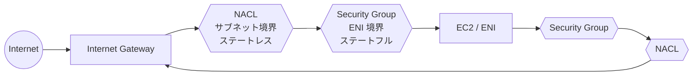
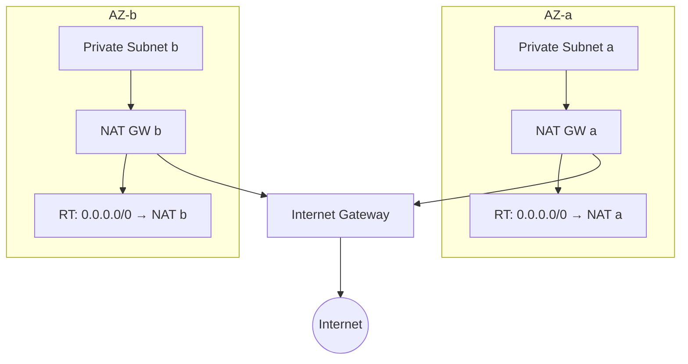
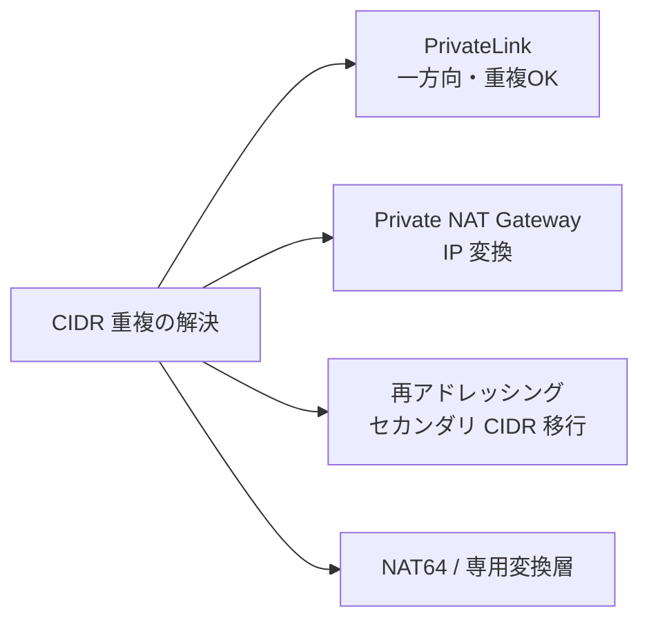
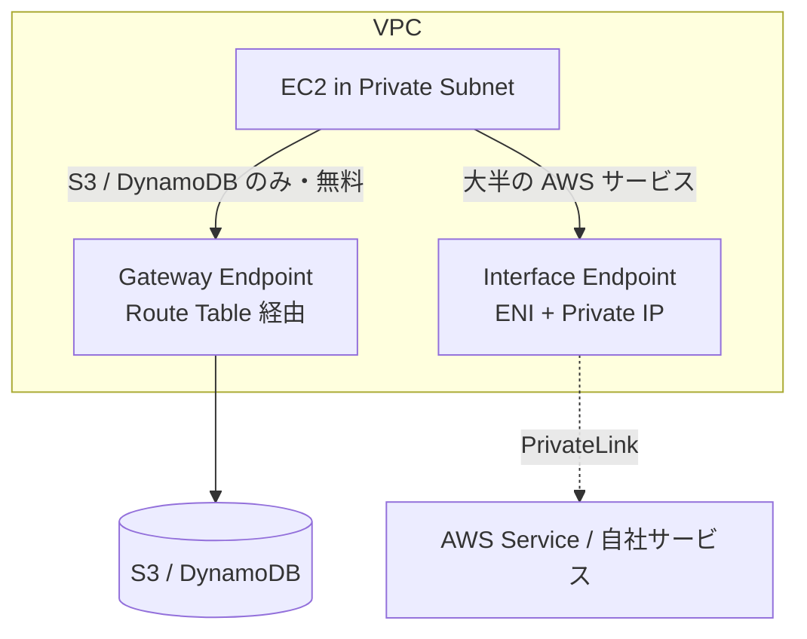
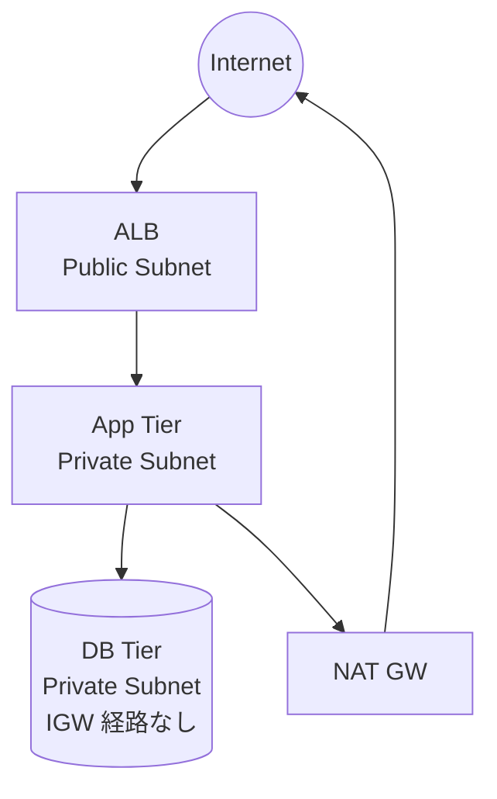

# Amazon VPC（Virtual Private Cloud）

> カテゴリ: ネットワークとコンテンツ配信 / 重要度: ◎（最重要）
> ANS-C01 全分野の基礎。本サービスを理解せずに合格はあり得ない。
> 最終更新: 2026-05-24 ／ 出典は本ドキュメント末尾

---

## 1. 概要

Amazon VPC は AWS 上に論理的に分離された**仮想ネットワーク**を構築するサービス。CIDR ブロックで定義した IP 空間に、サブネット・ルートテーブル・各種ゲートウェイ・セキュリティ制御を配置して、オンプレミスのデータセンターと同等のネットワークをソフトウェア定義で実現する。

### 試験での位置づけ

- 第1分野（設計）〜第4分野（セキュリティ）の**全タスクステートメントの土台**。
- 単独でも問われるが、TGW / Direct Connect / Route 53 / PrivateLink 等の問題の前提知識として常に登場する。
- 特に頻出: **CIDR 設計・IP 枯渇対策**、**SG と NACL の違い**、**フローログ／到達性解析**、**VPC エンドポイント**、**MTU/ジャンボフレーム**。

---

## 2. コアコンポーネント

| コンポーネント | 役割 | 試験での要点 |
|---|---|---|
| **CIDR ブロック** | VPC の IP 範囲（/16〜/28） | プライマリ CIDR は**変更不可**。セカンダリ CIDR で拡張 |
| **サブネット** | AZ 単位の IP 区画 | 先頭4＋末尾1の計5アドレスは AWS 予約。AZ をまたげない |
| **ルートテーブル** | 宛先ごとの転送先 | ロンゲストプレフィックスマッチ。明示関連付けが無ければメイン RT |
| **Internet Gateway (IGW)** | 双方向のインターネット通信 | パブリック IP 必須。水平スケール・冗長は AWS 管理 |
| **NAT Gateway** | プライベートからのアウトバウンド | AZ 単位で配置。詳細は §5 |
| **Egress-Only IGW** | IPv6 アウトバウンド専用 | IPv6 には NAT 概念が無いため専用 GW |
| **ENI / ENA / EFA** | ネットワークインターフェイス | §4 で比較 |
| **セキュリティグループ / NACL** | トラフィック制御 | §3 で比較。最頻出 |
| **VPC エンドポイント** | プライベートな AWS サービス接続 | Gateway型(S3/DDB)とInterface型(PrivateLink) |
| **DHCP オプションセット** | ドメイン名・DNS サーバ配布 | ハイブリッド DNS で使用 |

---

## 3. セキュリティ制御: SG vs NACL（最頻出）

| 観点 | セキュリティグループ (SG) | ネットワーク ACL (NACL) |
|---|---|---|
| 適用単位 | **ENI（インスタンス）** | **サブネット** |
| 状態管理 | **ステートフル**（戻りトラフィックを自動許可） | **ステートレス**（戻りも明示的に許可が必要） |
| ルール | **許可のみ** | **許可＋拒否（Deny）** |
| 評価順 | 全ルールを評価（OR） | **ルール番号の小さい順**、最初にマッチで確定 |
| デフォルト | すべて拒否（インバウンド）/ すべて許可（アウトバウンド） | デフォルト NACL は全許可、カスタムは全拒否 |

### 試験での判断ポイント

- **特定の IP をブロックしたい** → SG は Deny 不可なので **NACL の Deny ルール**を使う。
- ステートレスな NACL では、戻りトラフィック用に**エフェメラルポート（1024–65535）の許可**を忘れると通信不能になる。
- 多層防御: NACL（サブネット粗い制御）＋ SG（インスタンス細かい制御）を併用。

---

## 4. ネットワークインターフェイスの種類

試験では「最大スループット／低レイテンシ要件にどれを選ぶか」が問われる。

| 種類 | 正式名称 | 用途 / 特徴 |
|---|---|---|
| **ENI** | Elastic Network Interface | 標準の仮想 NIC。プライベート/パブリック IP・SG・MAC を保持し、インスタンス間で**付け替え可能** |
| **ENA** | Elastic Network Adapter | 拡張ネットワーキング。最大 100 Gbps 級のスループット。対応インスタンスで自動有効 |
| **EFA** | Elastic Fabric Adapter | HPC・機械学習向け。**OS バイパス**で超低レイテンシ。MPI/NCCL 等の集団通信に最適 |

> 高スループットの一般用途 → ENA、密結合 HPC/分散学習 → EFA、通常 → ENI。

---

## 5. NAT Gateway 詳細（頻出）

- **帯域**: 5 Gbps で開始し**自動で 100 Gbps までスケール**。これ以上はサブネット分割＋NAT複数で対応。
- **パケット処理**: 100万 pps → **自動で1000万 pps** までスケール。超過分はドロップ。
- **同時接続**: 1つの IPv4 アドレスあたり、ユニーク宛先（IP+ポート+プロトコル）ごとに最大 **55,000 同時接続**。最大 8 IPv4（プライマリ1＋セカンダリ7）まで関連付けて拡張可。
- **可用性設計**: NAT GW は**単一 AZ 内で冗長化**されるが AZ をまたがない。**AZ ごとに NAT GW を作り、各 AZ のルートを自 AZ の NAT に向ける**のがベストプラクティス（共有すると NAT の AZ 障害で他 AZ がインターネット断）。
- **対応プロトコル**: TCP / UDP / ICMP。
- **Public NAT GW**: EIP を持ちインターネットへアウトバウンド。**Private NAT GW**: EIP 不要、オンプレや他 VPC へプライベートにアウトバウンド（CIDR 重複の緩和に利用）。
- **NAT64**: IPv6 サブネットから IPv4 リソースへ（Route 53 Resolver の **DNS64** と併用）。
- **SG は付けられない**（インスタンス側 SG／サブネット NACL で制御。NAT は 1024–65535 を使用）。
- **重要な経路制約**:
  - VPC ピアリング越しに NAT GW へ**インバウンドはできない**（`Client→Peering→NAT→Internet` は不可）。逆に `Client→NAT→Peering→Destination` は可（戻りは "Return to Sender" で自動）。
  - **VGW 経由の VPN/Direct Connect から NAT GW へはルーティング不可**。**TGW を使えば可能**。
- **MTU**: NAT GW 自体は 8500 対応だが、**パブリック NAT 経由でインターネット通信する EC2 は MTU 1500 以下にすべき**（パケットロス防止）。PMTUD・MSS クランプをサポート。

---

## 6. IP アドレッシングと CIDR 設計

- **プライマリ CIDR は作成後に変更不可**。/16（65,536）〜/28（16）の範囲。
- **セカンダリ CIDR** を追加して IP 枯渇に対応。RFC1918 範囲は最大4＋プライマリ、計5ブロックがデフォルト（拡張申請可）。
- サブネットの予約: ネットワークアドレス＋VPC ルータ＋AWS DNS（.2）＋将来用＋ブロードキャスト相当の**計5アドレス**は使用不可。
- VPC ローカルの DNS リゾルバは **VPC+2**（例: 10.0.0.0/16 なら 10.0.0.2）。
- **CIDR 重複問題**（マルチアカウント/オンプレ統合で頻発）の解決策:

> ピアリング・TGW は**重複 CIDR を許容しない**。重複したまま単一サービスへ接続するなら **PrivateLink**、双方向通信が必要なら **Private NAT** か再アドレッシング。

---

## 7. 監視・トラブルシュート（第3分野で頻出）

| ツール | 何ができるか | 試験での使いどころ |
|---|---|---|
| **VPC フローログ** | ENI/サブネット/VPC 単位の IP トラフィック**メタデータ**を記録 | SG/NACL の絞りすぎ診断、ACCEPT/REJECT 判定、トラフィック方向の把握 |
| **VPC トラフィックミラーリング** | パケットの**中身（ペイロード）**をアプライアンスへコピー | IDS/IPS、深いパケット解析、パケットシェーピング問題の特定 |
| **Reachability Analyzer** | 2点間の到達可否を**静的に**解析（実トラフィック不要） | 構成ミス起因の不通の特定、接続意図の検証自動化 |
| **Network Access Analyzer** | 意図しないアクセス経路を検出 | コンプライアンス検証、セキュリティ姿勢の改善 |

### VPC フローログの要点

- 送信先: **CloudWatch Logs / Amazon S3 / Amazon Data Firehose**（この配信設定を「サブスクリプション」と呼ぶ）。
- **デフォルトフィールド**: version, account-id, interface-id, srcaddr, dstaddr, srcport, dstport, protocol, packets, bytes, start, end, action(ACCEPT/REJECT), log-status。
- **カスタム/拡張フィールド**: `pkt-srcaddr` / `pkt-dstaddr`（NAT 前後の本来の IP）, `tcp-flags`, `flow-direction`, `traffic-path`, `region`, `az-id` など。
  - 例: セカンダリ IP 宛のトラフィックは `dstaddr` にプライマリ IP が出るため、**実宛先は `pkt-dstaddr`** で取得する。
- **集約間隔**: デフォルト10分、最短**1分**（Athena/Insights 解析の粒度に影響）。
- **記録されない**: Amazon DNS サーバ宛、DHCP、169.254.169.254（メタデータ）、Windows ライセンス認証、**ミラーリング対象トラフィック**等。トラフィックの**中身は記録しない**（中身は要トラフィックミラーリング）。
- リソースあたり最大 250 サブスクリプション。

---

## 8. VPC エンドポイント

| 種類 | 対象 | 仕組み | 課金 |
|---|---|---|---|
| **Gateway エンドポイント** | **S3 / DynamoDB のみ** | ルートテーブルにエントリ追加。リージョン内のみ | 無料 |
| **Interface エンドポイント** | 大半のサービス（PrivateLink） | ENI＋プライベート IP、プライベート DNS で透過 | 時間＋データ課金 |

- **エンドポイントポリシー**で経由アクセスを IAM 条件で制限（最小権限）。
- 詳細は [PrivateLink](../privatelink/README.md) を参照。

---

## 9. MTU / ジャンボフレーム

- VPC 内・同一リージョンの一部経路は **MTU 9001（ジャンボフレーム）** に対応。
- **1500 に制限される経路**: IGW 経由のインターネット、Site-to-Site VPN、（設定外の）一部 Direct Connect、VPC ピアリングのリージョン間など。
- 経路上の**最小 MTU に合わせる**こと。PMTUD（ICMP Type3 Code4 / "Fragmentation Needed"）を遮断するとブラックホール化して通信が止まる → **ICMP を通す**。

---

## 10. 他サービスとの連携

- **Transit Gateway / VPC ピアリング**: VPC 間接続（[TGW](../transit-gateway/README.md) / 重複 CIDR 不可）。
- **Direct Connect / Site-to-Site VPN**: オンプレ接続（VGW または TGW 経由）。
- **Route 53 Resolver**: VPC+2 リゾルバ、ハイブリッド DNS のインバウンド/アウトバウンドエンドポイント。
- **RAM**: **VPC 共有**（サブネットを他アカウントに共有し、1 VPC にマルチアカウントのリソースを集約 → IP 効率化・管理集中）。
- **Network Firewall / GWLB**: VPC 内のトラフィック検査。
- **PrivateLink**: プライベートなサービス公開・接続。

---

## 11. 制約・上限・コスト（暗記推奨）

| 項目 | デフォルト値 |
|---|---|
| リージョンあたり VPC | 5（引き上げ可） |
| VPC あたり CIDR ブロック | 5（最大50まで拡張可） |
| VPC あたりサブネット | 200 |
| VPC あたりルートテーブル | 200 / RT あたりルート 50（伝播は別枠） |
| SG / ENI | 5（最大16）、SG あたりルール インバウンド60・アウトバウンド60 |
| NAT GW / AZ | 5 |
| フローログ サブスクリプション / リソース | 250 |

- **コスト発生源**: NAT Gateway（時間＋データ処理）、Interface エンドポイント、トラフィックミラーリング、Reachability/Network Access Analyzer、IPAM。**Gateway エンドポイント・SG・NACL・IGW は無料**。
- コスト最適化: NAT GW のデータ処理料が高い → S3/DynamoDB は **Gateway エンドポイント**で NAT を経由させない。

---

## 12. よくある設計パターン

### 3 層アーキテクチャ（境界 VPC）

- **Public**: ALB / NAT GW。**Private(App)**: アプリ。**Private(DB)**: DB（インターネット経路なし）。
- アウトバウンドのみ必要なアプリ層は NAT GW 経由、DB 層は外部経路を持たせない。

### 集中型インスペクション（セキュリティ）

- 検査用 VPC（インスペクション VPC）＋ TGW で全 VPC トラフィックを集約し、Network Firewall / GWLB で East-West・North-South を検査。詳細は [Network Firewall](../../security-identity-compliance/network-firewall/README.md)。

---

## 13. 出典

- [What is Amazon VPC? – AWS Docs](https://docs.aws.amazon.com/vpc/latest/userguide/what-is-amazon-vpc.html)
- [NAT gateway basics – AWS Docs](https://docs.aws.amazon.com/vpc/latest/userguide/nat-gateway-basics.html)
- [Logging IP traffic using VPC Flow Logs – AWS Docs](https://docs.aws.amazon.com/vpc/latest/userguide/flow-logs.html)
- [Flow log records (fields) – AWS Docs](https://docs.aws.amazon.com/vpc/latest/userguide/flow-log-records.html)
- [How Reachability Analyzer works – AWS Docs](https://docs.aws.amazon.com/vpc/latest/reachability/how-reachability-analyzer-works.html)
- [What is Traffic Mirroring? – AWS Docs](https://docs.aws.amazon.com/vpc/latest/mirroring/what-is-traffic-mirroring.html)
- [Network MTU for your EC2 instance – AWS Docs](https://docs.aws.amazon.com/AWSEC2/latest/UserGuide/network_mtu.html)
- [Amazon VPC quotas – AWS Docs](https://docs.aws.amazon.com/vpc/latest/userguide/amazon-vpc-limits.html)
