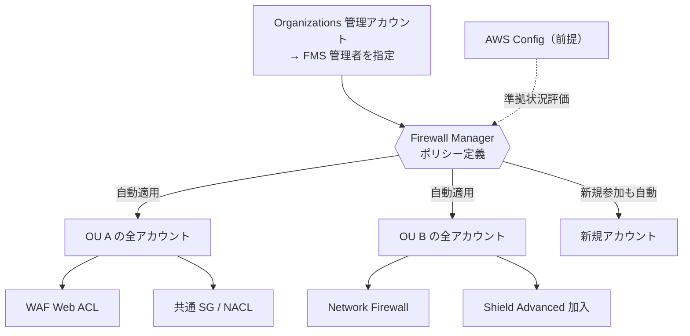
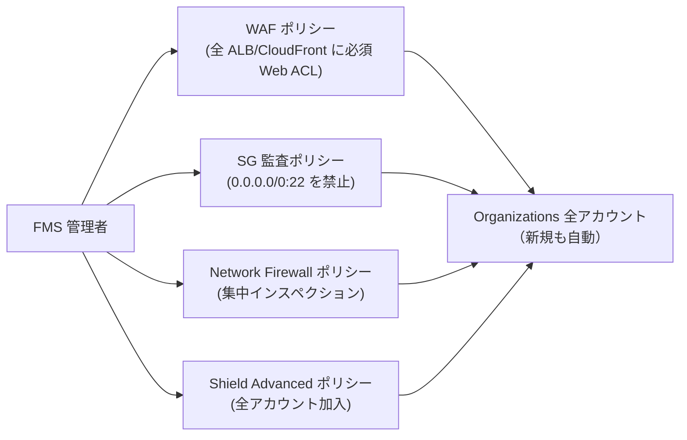

# AWS Firewall Manager

> カテゴリ: セキュリティ・アイデンティティ・コンプライアンス / 重要度: ○
> ANS-C01 第4分野。Organizations 横断のセキュリティポリシー一元管理が頻出。
> 最終更新: 2026-05-24 ／ 出典は本ドキュメント末尾

---

## 1. 概要

AWS Firewall Manager（FMS）は **AWS Organizations 全体で各種ファイアウォール/保護を一元的に設定・維持**するサービス。一度ポリシーを定義すれば、**新規アカウントや新規リソースにも自動適用**される。管理対象は WAF・Shield Advanced・VPC セキュリティグループ/NACL・Network Firewall・Route 53 Resolver DNS Firewall など。

### 試験での位置づけ

- 「**複数アカウントに同一の WAF/SG/Network Firewall を強制し、新規アカウントにも自動適用したい**」→ Firewall Manager が定番解。
- **前提条件**（Organizations 有効・**管理者アカウント指定**・**AWS Config 有効**）が問われる。
- 管理できるポリシータイプの暗記が重要。

---

## 2. コアコンセプト

| 概念 | 説明 | 試験での要点 |
|---|---|---|
| **FMS 管理者アカウント** | 組織内で FMS を運用する指定アカウント | Organizations 管理アカウントが指定（委任管理者も可） |
| **ポリシー** | 適用する保護の定義（タイプ＋スコープ＋アクション） | リージョン単位（一部グローバル） |
| **スコープ** | 適用範囲（全アカウント/特定 OU/タグ） | タグやアカウント ID、OU で絞る |
| **自動修復（remediation）** | 非準拠リソースへの自動適用 | 新規リソース・新規アカウントへ自動展開 |
| **リソースセット** | 保護対象リソースのグルーピング | Network Firewall 等で利用 |

### 管理できるポリシータイプ

| ポリシー | 内容 |
|---|---|
| **AWS WAF / WAF Classic** | Web ACL を組織横断で適用 |
| **Shield Advanced** | 全メンバーアカウントを一括サブスク・保護有効化 |
| **VPC セキュリティグループ** | 共通 SG・コンテンツ監査・未使用/冗長 SG 監査 |
| **VPC NACL** | ネットワーク ACL の一元管理 |
| **AWS Network Firewall** | 集中/分散の Network Firewall を組織展開 |
| **Route 53 Resolver DNS Firewall** | DNS ドメインブロックルールを組織展開 |
| **サードパーティ（Palo Alto 等）** | パートナー製ファイアウォール |

---

## 3. アーキテクチャ / 仕組み

- 管理者アカウントでポリシーを一度定義 → スコープ内の既存・新規リソースに自動展開。
- **AWS Config** が準拠状態の評価基盤として必須。

---

## 4. 試験頻出ポイント

- **前提条件**: ①AWS Organizations を**全機能（all features）**で有効化、②FMS 管理者アカウントを指定、③**AWS Config を各アカウント/リージョンで有効化**。
- **新規アカウント・新規リソースに自動適用**できる点が最大の差別化。手動で各アカウントに設定する運用を不要にする。
- **SG ポリシーの3種**: 共通ポリシー（共通 SG を配布）、コンテンツ監査（許可/拒否される SG ルールを監査）、使用状況監査（未使用・冗長 SG を検出）。
- **Shield Advanced ポリシー**で組織全アカウントを一括サブスク、新規アカウントも自動加入。
- FMS 自体の料金は**ポリシーあたり**＋背後のサービス（WAF/Config 等）の通常料金。
- リージョナルサービスはリージョンごとにポリシーが必要（CloudFront 系はグローバル）。

---

## 5. 他サービスとの連携

- **[WAF](../waf/README.md)**: Web ACL を組織横断で一元適用。
- **[Shield](../shield/README.md)**: 全アカウントを Shield Advanced に一括サブスク。
- **[Network Firewall](../network-firewall/README.md)**: 集中/分散ファイアウォールを組織展開。
- **[VPC](../../networking-content-delivery/vpc/README.md)**: SG/NACL を共通ポリシーで配布・監査。
- **Route 53 Resolver DNS Firewall**: DNS ブロックルールを組織展開。
- **AWS Organizations / AWS Config**: 前提基盤（スコープ管理・準拠評価）。

---

## 6. 制約・上限・コスト

| 項目 | 値 |
|---|---|
| 前提 | Organizations（all features）／管理者アカウント指定／AWS Config 有効 |
| 課金要素 | アクティブなポリシーあたりの月額 ＋ 背後サービス（WAF/Shield/Config 等）の通常料金 |
| 適用範囲 | 全アカウント / 特定 OU / タグベース |
| リージョン | リージョナルポリシーはリージョンごとに作成 |

- **コスト**: FMS の課金はポリシー単位。実際のコストの大半は WAF/Shield Advanced/Config など下層サービス。

---

## 7. よくある設計パターン

### 組織全体のガードレール強制

- セキュリティ標準（必須 WAF、危険な SG ルール禁止、集中検査、DDoS 保護）を**ポリシーとして強制**し、ドリフトを自動修復。

---

## 8. 出典

- [AWS Firewall Manager – AWS Docs](https://docs.aws.amazon.com/waf/latest/developerguide/fms-chapter.html)
- [AWS Firewall Manager prerequisites – AWS Docs](https://docs.aws.amazon.com/waf/latest/developerguide/fms-prereq.html)
- [Using AWS Firewall Manager policies – AWS Docs](https://docs.aws.amazon.com/waf/latest/developerguide/working-with-policies.html)
- [AWS Firewall Manager quotas – AWS Docs](https://docs.aws.amazon.com/waf/latest/developerguide/fms-limits.html)
- [AWS Firewall Manager pricing](https://aws.amazon.com/firewall-manager/pricing/)
