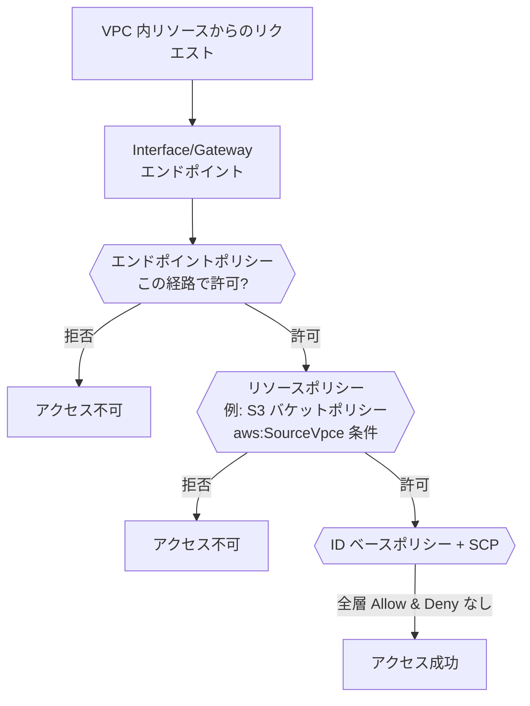
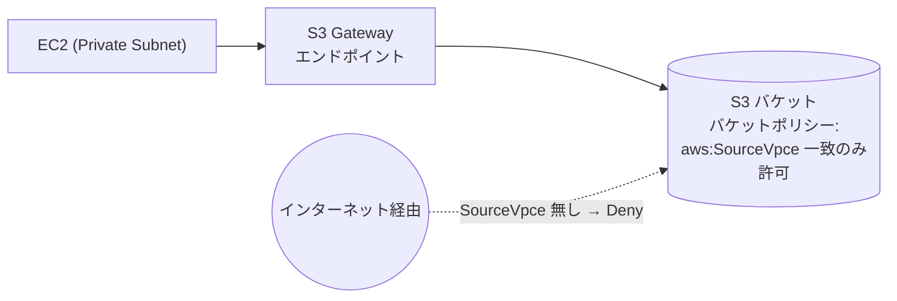

# AWS IAM（ネットワーク観点）

> カテゴリ: セキュリティ・アイデンティティ・コンプライアンス / 重要度: △
> ANS-C01 では IAM 全般ではなく、**VPC エンドポイントポリシー・リソースベースポリシー・SCP・ネットワーク条件キー**に絞って押さえる。
> 最終更新: 2026-05-24 ／ 出典は本ドキュメント末尾

---

## 1. 概要

IAM は AWS のアクセス制御の中核だが、ANS-C01 では**ネットワーク経路をベースにアクセスを制限する**用途が問われる。具体的には、VPC エンドポイント経由のアクセスを許可/制限する**エンドポイントポリシー**、S3 バケットポリシー等の**リソースベースポリシー**、そして `aws:SourceVpc` / `aws:SourceVpce` / `aws:VpcSourceIp` といった**ネットワーク系条件キー**である。

### 試験での位置づけ（ネットワーク限定）

- 「**特定の VPC エンドポイント経由でのみ S3 にアクセスさせたい**」→ バケットポリシーで `aws:SourceVpce` 条件。
- **エンドポイントポリシー**で、その VPC エンドポイントを通せるアクション/リソース/プリンシパルを絞る。
- **SCP** で組織全体のガードレール（例: 特定リージョン外への通信禁止）。

---

## 2. コアコンセプト（ネットワーク関連）

| 概念 | 役割 | 試験での要点 |
|---|---|---|
| **エンドポイントポリシー** | VPC エンドポイントに付けるリソースベースポリシー | その**エンドポイント経由のアクセス範囲**を制限。ID/リソースポリシーを上書きしない |
| **リソースベースポリシー** | S3 バケット等のリソース側ポリシー | `aws:SourceVpc/SourceVpce` で経路を限定可能 |
| **SCP（Service Control Policy）** | Organizations のアクセス上限 | 個々の許可を超える上限を設定（許可は付与しない） |
| **`aws:SourceVpc`** | リクエスト元の VPC ID | どの VPC からのアクセスか |
| **`aws:SourceVpce`** | リクエスト元の VPC エンドポイント ID | **どのエンドポイント経由か**（最頻出） |
| **`aws:VpcSourceIp`** | エンドポイント経由リクエストの送信元 IP | VPC 内の送信元 IP で制限 |

> 重要: これらの条件キーは**VPC エンドポイント経由のリクエストにのみ存在**する。インターネット経由のリクエストには付かないため、暗黙にエンドポイント強制にもなる。

---

## 3. 仕組み / 評価フロー

- アクセスは**全レイヤーの評価の AND**。エンドポイントポリシー・リソースポリシー・ID ポリシー・SCP のどれかで明示 Deny / 許可不足があれば不可。
- **エンドポイントポリシーはデフォルトで全許可**（Principal `*`, Action `*`, Resource `*`）。絞る場合のみカスタムを付与。

---

## 4. 試験頻出ポイント

- **「S3 アクセスを特定 VPC エンドポイント経由のみに限定」** → S3 **バケットポリシー**で `Deny` ＋ `StringNotEquals: aws:SourceVpce = vpce-xxxx`（または `aws:SourceVpc`）。これによりインターネット経由・他経路を遮断。
- **エンドポイントポリシー vs バケットポリシー**: エンドポイントポリシーは「この**エンドポイントを通せる範囲**」、バケットポリシーは「このバケットへ**どの経路を許すか**」。両方を組み合わせて最小権限。
- **Gateway エンドポイント（S3/DynamoDB）のエンドポイントポリシー**では `Principal` は `*` 固定。プリンシパル限定は `aws:PrincipalArn` 条件で行う。
- **条件キーはワイルドカード/数値演算子と併用不可**（システム生成 ID のため）。`aws:SourceVpc` 等は完全一致で指定。
- **SCP** は許可を付与しない（上限のみ）。例: 「特定リージョン以外の API 呼び出しを Deny」「VPC エンドポイント削除を禁止」などのガードレール。
- エンドポイントポリシーは**ID/リソースポリシーを上書きしない**（追加の絞り込み層）。

---

## 5. 他サービスとの連携

- **[VPC](../../networking-content-delivery/vpc/README.md)**: エンドポイントポリシーは Gateway/Interface エンドポイントに付与。PrivateLink 経由アクセスの最小権限化。
- **[RAM](../ram/README.md)**: 共有リソースでも、コンシューマー側の IAM ポリシー・SCP は引き続き適用される。
- **[Firewall Manager](../firewall-manager/README.md)**: 組織のガードレールは SCP（IAM 上限）と FMS（保護リソース）で役割分担。
- **AWS Organizations**: SCP の適用単位。

---

## 6. 制約・上限・コスト

| 項目 | 値 |
|---|---|
| エンドポイントポリシーサイズ | 最大 20,480 文字（空白含む） |
| 課金 | IAM・ポリシー・条件キーの利用は**無料** |
| 条件キー制約 | `aws:SourceVpc` 等にワイルドカード/数値演算子は不可 |
| エンドポイントポリシー対応 | サービスにより対応有無あり（非対応なら全許可扱い） |

---

## 7. よくある設計パターン

### エンドポイント経由限定の S3 アクセス（データ漏洩防止）

- バケットポリシーで `aws:SourceVpce`（または `aws:SourceVpc`）一致以外を Deny → **指定エンドポイント経由のみ**許可。
- エンドポイントポリシーで対象バケット/アクションをさらに最小化。
- SCP で組織全体に「VPC エンドポイント経由でないと特定操作を許さない」ガードレールを重ねる。

---

## 8. 出典

- [Control access to VPC endpoints using endpoint policies – AWS Docs](https://docs.aws.amazon.com/vpc/latest/privatelink/vpc-endpoints-access.html)
- [AWS global condition context keys (aws:SourceVpc, aws:SourceVpce, aws:VpcSourceIp) – AWS Docs](https://docs.aws.amazon.com/IAM/latest/UserGuide/reference_policies_condition-keys.html)
- [Restricting access to a specific VPC / VPC endpoint (S3) – AWS Docs](https://docs.aws.amazon.com/AmazonS3/latest/userguide/example-bucket-policies-vpc-endpoint.html)
- [Service control policies (SCPs) – AWS Organizations Docs](https://docs.aws.amazon.com/organizations/latest/userguide/orgs_manage_policies_scps.html)
