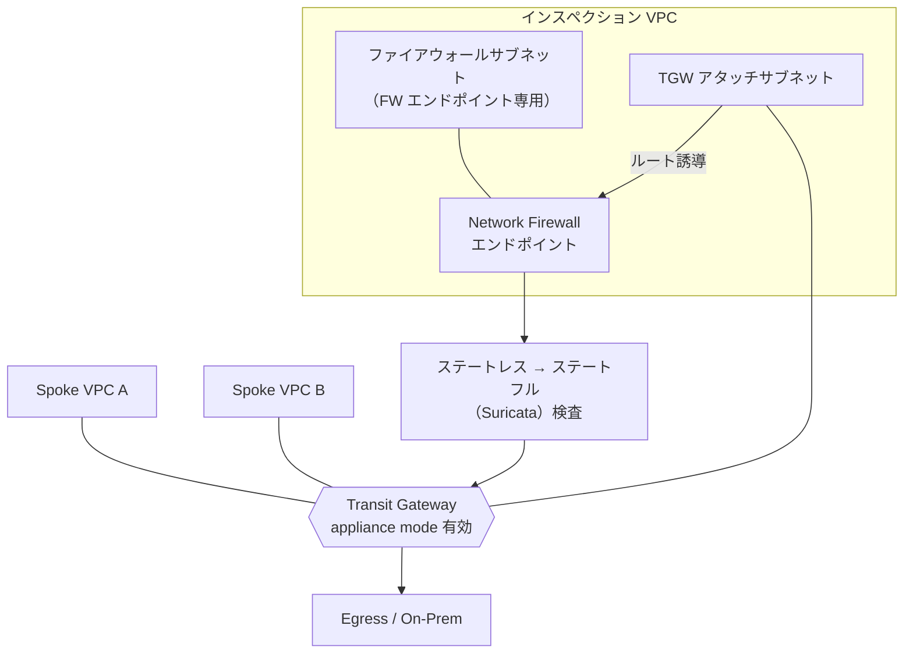
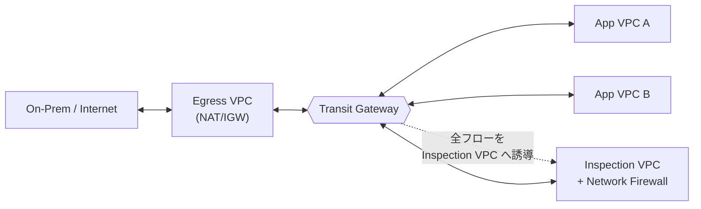

# AWS Network Firewall

> カテゴリ: セキュリティ・アイデンティティ・コンプライアンス / 重要度: ○
> ANS-C01 第4分野（ネットワークセキュリティ）の主役。集中インスペクション設計で頻出。
> 最終更新: 2026-05-24 ／ 出典は本ドキュメント末尾

---

## 1. 概要

AWS Network Firewall は VPC のために提供される**マネージドのステートフル・ファイアウォール兼 IDS/IPS** サービス。VPC の境界（IGW・NAT GW・VPN・Direct Connect の手前）でトラフィックをフィルタリングし、L3/L4 のステートレス検査と、オープンソースの **Suricata** 互換ルールによる L7 ステートフル検査の両方を行う。

### 試験での位置づけ

- **集中型インスペクション VPC ＋ Transit Gateway** の構成が最頻出（East-West / North-South 検査）。
- **GWLB（Gateway Load Balancer）との使い分け**（自前/サードパーティアプライアンス vs マネージド）が問われる。
- **アウトバウンドのドメインフィルタリング**（許可ドメインのみ通す）、SNI/HTTP Host ベースのフィルタが頻出。
- **ファイアウォールサブネットの専用化**・ルートテーブル書き換えによるトラフィック誘導の理解が必須。

---

## 2. コアコンセプト

| 概念 | 役割 | 試験での要点 |
|---|---|---|
| **Firewall** | 保護対象 VPC と AZ ごとのファイアウォールサブネットを定義 | AZ 単位で**ファイアウォールエンドポイント**（VPC エンドポイント）を生成 |
| **Firewall Policy** | ルールグループと既定アクションを束ねる設定 | 複数ファイアウォールで再利用可能 |
| **Rule Group（ステートレス）** | 5タプルで単一パケットを評価 | フロー文脈なし。高速。Pass/Drop/Forward to stateful |
| **Rule Group（ステートフル）** | フロー文脈を持つ検査。**Suricata 互換** | DPI、プロトコル検出（ポート非依存）、ドメインフィルタ |
| **ファイアウォールエンドポイント** | サブネット内に作られる検査ポイント | **自サブネットのトラフィックは検査不可**（専用サブネットにする） |
| **VPC エンドポイント関連付け** | プライマリ以外の追加エンドポイント | 同一/別 VPC に検査ポイントを拡張 |
| **ファイアウォール状態テーブル** | ステートフルフローを追跡 | フローログに反映。フラッシュ操作で管理 |

### ステートレス vs ステートフル

| 観点 | ステートレスエンジン | ステートフルエンジン |
|---|---|---|
| 評価単位 | 単一パケット（5タプル） | フロー全体（双方向の文脈） |
| ルール形式 | AWS 独自 | **Suricata 互換ルール** |
| アクション | Pass / Drop / Forward to stateful | Pass / Drop / Alert / Reject |
| ログ | 不可（メトリクスのみ） | **フロー/アラート/TLS ログ可** |
| 用途 | 粗いふるい分け・高速処理 | DPI・ドメインフィルタ・IDS/IPS |

> ステートレスで `Forward to stateful` したトラフィックだけがステートフルエンジンで検査・ログ記録される。

---

## 3. アーキテクチャ / 仕組み

- **ファイアウォールエンドポイント**は AZ ごとに専用サブネットへ配置。VPC のルートテーブルを書き換えて、対象トラフィックをエンドポイント経由に誘導する。
- 集中構成では **Transit Gateway を appliance mode** にして、フローを同一 AZ の同一エンドポイントへ対称ルーティングし、ステートフル検査の戻りパケット非対称を防ぐ。

---

## 4. 試験頻出ポイント

- **ファイアウォールエンドポイントは自分のいるサブネットのトラフィックを検査できない** → 専用サブネットを用意し、保護対象は別サブネットへ。
- **appliance mode 必須**: TGW 経由のステートフル検査で AZ をまたぐと戻りが別 AZ に行き検査が壊れる。appliance mode で対称化。
- **アウトバウンドドメインフィルタ**: ステートフルルールで `tls.sni` / `http.host` を使い、許可ドメインのみ Pass、それ以外 Drop。S3 など既知ドメインのみ許可する egress 制御に使う。
- **GWLB との違い**: Network Firewall は**マネージドな AWS 製エンジン**。GWLB は**自前/サードパーティの仮想アプライアンス**（Palo Alto 等）を GENEVE で透過挿入する仕組み。両者は排他ではなく、要件（マネージド希望か特定ベンダ製品か）で選ぶ。
- **ログ**: ステートフルエンジンのみログ可（フロー/アラート/TLS）。ステートレスはメトリクスのみ。
- **デフォルトアクションの方向**: ポリシーの既定アクションはフラグメント/通常で個別設定可能。

---

## 5. 他サービスとの連携

- **[VPC](../../networking-content-delivery/vpc/README.md)**: 専用ファイアウォールサブネットとルートテーブル書き換えで誘導。
- **Transit Gateway**: 集中インスペクション VPC のハブ。appliance mode で対称ルーティング。
- **NAT Gateway**: 集中 egress では FW → NAT GW → IGW の順で配置（インスペクション後に変換）。
- **[Firewall Manager](../firewall-manager/README.md)**: Organizations 横断で Network Firewall ポリシーを一元適用。
- **[Route 53 Resolver DNS Firewall](../../networking-content-delivery/vpc/README.md)**: DNS レイヤーのドメインブロックを補完（Network Firewall は IP/TLS/HTTP レイヤー）。
- **[GWLB](../../networking-content-delivery/vpc/README.md)**: サードパーティ製アプライアンスでの検査が必要な場合の代替。

---

## 6. 制約・上限・コスト

| 項目 | 値 |
|---|---|
| 課金要素 | エンドポイント時間課金（エンドポイント数 × 時間）＋ 処理データ量（GB） |
| 追加コスト | クロス AZ 通信料、ログ配信先（CloudWatch/S3/Firehose）の料金 |
| ルールキャパシティ | ルールグループにはキャパシティ上限がある（ステートレス/ステートフルで別管理） |
| エンジン | ステートフルは Suricata 7.x 系互換 |

- **コスト最適化**: エンドポイントは AZ ごとに課金されるため、必要 AZ 数を見極める。クロス AZ 検査はデータ転送料が増える。
- ログ量が多いと配信先コストが増大 → アラートログのみに絞る選択肢。

---

## 7. よくある設計パターン

### 集中インスペクション（East-West ＋ North-South）

- TGW のルートテーブルで全トラフィックを Inspection VPC に向け、検査後に宛先へ。
- East-West（VPC 間）も North-South（egress/オンプレ）も一箇所で検査。

### 分散インスペクション（VPC ごと）

- 各 VPC に Network Firewall を配置。小規模・VPC 数が少ない場合に単純。TGW 不要だが管理点が増える。

---

## 8. 出典

- [What is AWS Network Firewall? – AWS Docs](https://docs.aws.amazon.com/network-firewall/latest/developerguide/what-is-aws-network-firewall.html)
- [How AWS Network Firewall works – AWS Docs](https://docs.aws.amazon.com/network-firewall/latest/developerguide/how-it-works.html)
- [Logging network traffic from AWS Network Firewall – AWS Docs](https://docs.aws.amazon.com/network-firewall/latest/developerguide/firewall-logging.html)
- [Working with stateful rule groups (Suricata) – AWS Docs](https://docs.aws.amazon.com/network-firewall/latest/developerguide/stateful-rule-groups-ips.html)
- [Deployment models for AWS Network Firewall – AWS Blog](https://aws.amazon.com/blogs/networking-and-content-delivery/deployment-models-for-aws-network-firewall/)
- [Centralized network security for VPC-to-VPC and on-premises – AWS Whitepaper](https://docs.aws.amazon.com/whitepapers/latest/building-scalable-secure-multi-vpc-network-infrastructure/centralized-network-security-for-vpc-to-vpc-and-on-premises-to-vpc-traffic.html)
- [AWS Network Firewall pricing](https://aws.amazon.com/network-firewall/pricing/)
