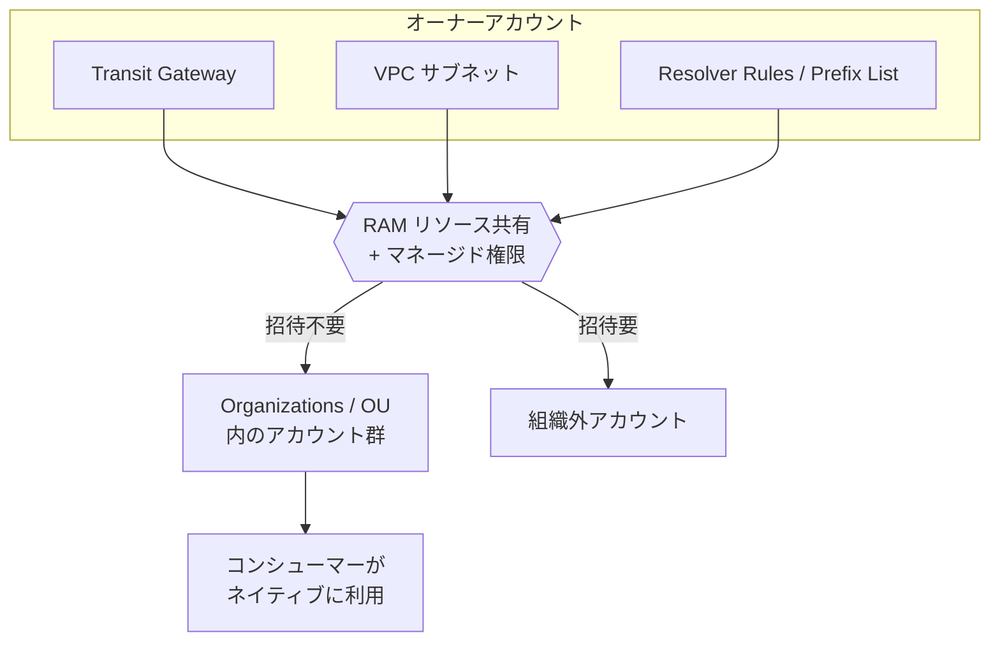
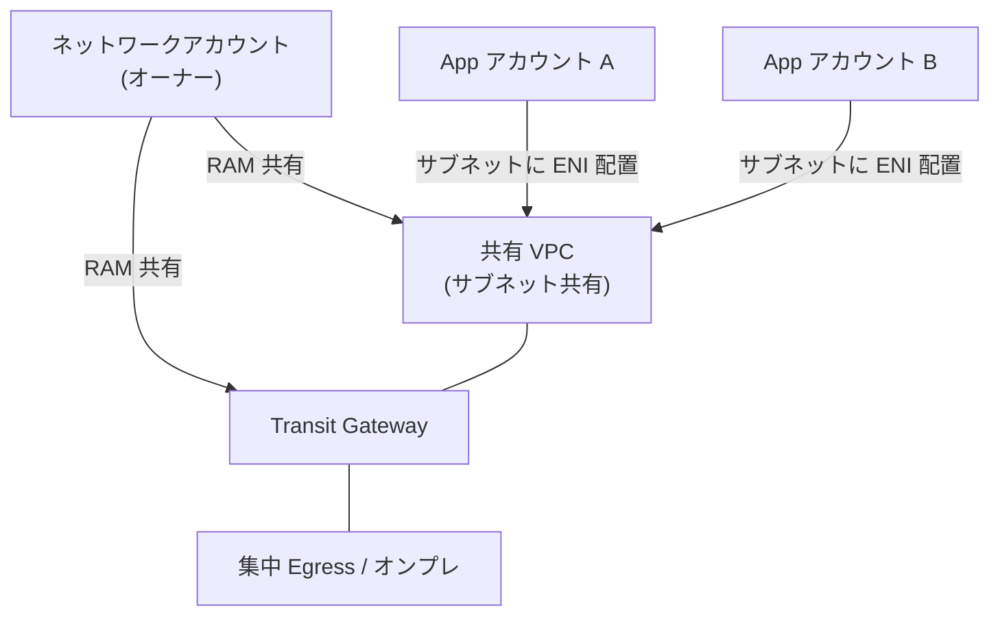

# AWS RAM（Resource Access Manager）

> カテゴリ: セキュリティ・アイデンティティ・コンプライアンス / 重要度: ○
> ANS-C01 第1分野（マルチアカウント設計）。TGW/サブネット共有/Resolver ルール/Prefix List の共有が頻出。
> 最終更新: 2026-05-24 ／ 出典は本ドキュメント末尾

---

## 1. 概要

AWS RAM は **AWS アカウント間・Organizations/OU 間・IAM ロール/ユーザー間でリソースを安全に共有**するサービス。リソースを一度作成して RAM で共有すれば、他アカウントから**ネイティブに存在するかのように**利用できる。ネットワークでは Transit Gateway・VPC サブネット（VPC 共有）・Route 53 Resolver ルール・Prefix List・IPAM プールの共有が重要。

### 試験での位置づけ

- **マルチアカウントネットワーク設計の中核**。「複数アカウントで TGW やサブネットを共有したい」→ RAM。
- **VPC 共有（サブネット共有）**: 1 VPC のサブネットを他アカウントに共有し、複数アカウントのリソースを集約 → IP 効率化・ネットワーク管理集中。
- **Organizations 連携で招待不要**になる点が頻出。

---

## 2. コアコンセプト

| 概念 | 説明 | 試験での要点 |
|---|---|---|
| **リソース共有（Resource Share）** | 共有するリソース＋プリンシパル＋マネージド権限の束 | リージョン単位（グローバルリソースは us-east-1） |
| **オーナーアカウント** | リソースを所有・共有する側 | **所有権は保持**したまま使用権だけ付与 |
| **コンシューマーアカウント** | 共有を受けて利用する側 | 自分のリソースのように操作可（権限範囲内） |
| **プリンシパル** | 共有先（アカウント / OU / 組織 / IAM ロール・ユーザー） | リソースタイプにより IAM プリンシパル共有可否が異なる |
| **マネージド権限** | 共有時に付与される操作範囲 | AWS マネージド or カスタマーマネージド権限 |
| **招待（invitation）** | 組織外アカウントへの共有時に必要 | **組織内共有を有効化すると招待不要** |

### 主な共有可能ネットワークリソース

| リソース | 共有のメリット |
|---|---|
| **Transit Gateway** | 複数アカウントから同一 TGW にアタッチ（ハブ集中） |
| **VPC サブネット（VPC 共有）** | 1 VPC を複数アカウントで共用、IP 効率化・管理集中 |
| **Route 53 Resolver Rules** | ハイブリッド DNS の転送ルールを組織で共有 |
| **Prefix List（マネージド）** | SG/RT で参照する CIDR リストを一元配布 |
| **IPAM プール** | IP アドレス管理を組織横断で共有 |
| **Route 53 Resolver DNS Firewall ルールグループ** | DNS ブロックルールの共有 |

---

## 3. アーキテクチャ / 仕組み

- 組織内共有を有効化すると、OU/組織への共有は**招待プロセス不要**で即時利用可能。
- 共有後もコンシューマー側の **IAM ポリシー・SCP は引き続き適用**される。

---

## 4. 試験頻出ポイント

- **VPC 共有（サブネット共有）**: オーナーが VPC/サブネットを所有し管理、参加アカウントはサブネットに ENI/リソースを配置。**CIDR を分散させず IP を集約**でき、ピアリング不要で同一 VPC 内通信。
- **TGW 共有**: 複数アカウントの VPC を同一 TGW にアタッチする標準手段。アタッチメント自体は各アカウント所有。
- **Organizations 連携で招待不要**: 組織外は招待＋承諾が必要、組織内は有効化すれば自動。
- **Prefix List 共有**で SG/ルートテーブルが参照する CIDR を一元更新（DRY）。
- **Resolver Rules 共有**でハイブリッド DNS の転送設定を組織で再利用。
- RAM 自体は**無料**。共有したリソースの利用料は通常どおり発生。
- グローバルリソースの共有は **us-east-1（バージニア北部）** がホームリージョン。

---

## 5. 他サービスとの連携

- **[VPC](../../networking-content-delivery/vpc/README.md)**: サブネット共有（VPC 共有）で IP 効率化・管理集中。
- **Transit Gateway**: 複数アカウントの VPC を同一ハブにアタッチ。
- **Route 53 Resolver**: 転送ルールを組織共有しハイブリッド DNS を統一。
- **[Network Firewall](../network-firewall/README.md) / [Firewall Manager](../firewall-manager/README.md)**: ルールグループや DNS Firewall ルールの共有・組織展開。
- **AWS Organizations**: 組織/OU 単位での共有・招待不要化の前提。

---

## 6. 制約・上限・コスト

| 項目 | 値 |
|---|---|
| RAM 利用料 | **無料**（共有自体に課金なし。リソース利用料は通常どおり） |
| 共有範囲 | アカウント ID / OU / 組織全体 / 一部は IAM ロール・ユーザー |
| リージョン | リージョナルリソースは同一リージョンの共有のみ。グローバルは us-east-1 |
| IAM プリンシパル共有 | リソースタイプにより可否が異なる |

- **コスト最適化**: VPC 共有でアカウントごとの NAT GW/エンドポイント重複を削減（共有 VPC に集約）。

---

## 7. よくある設計パターン

### VPC 共有 + TGW のマルチアカウントネットワーク

- ネットワーク専用アカウントが VPC・TGW・Resolver ルールを集中所有し RAM で共有。
- アプリアカウントはサブネットを借りてリソースを配置 → IP 集約・ガバナンス集中・重複排除。

---

## 8. 出典

- [What is AWS RAM? – AWS Docs](https://docs.aws.amazon.com/ram/latest/userguide/what-is.html)
- [Shareable AWS resources – AWS Docs](https://docs.aws.amazon.com/ram/latest/userguide/shareable.html)
- [Sharing within your organization – AWS Docs](https://docs.aws.amazon.com/ram/latest/userguide/getting-started-sharing.html)
- [VPC sharing – AWS VPC Docs](https://docs.aws.amazon.com/vpc/latest/userguide/vpc-sharing.html)
- [Managing permissions in AWS RAM – AWS Docs](https://docs.aws.amazon.com/ram/latest/userguide/security-ram-permissions.html)
