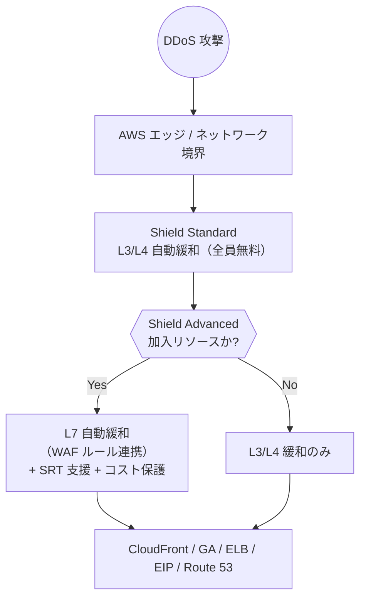
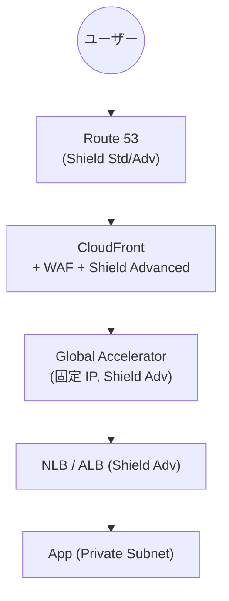

# AWS Shield

> カテゴリ: セキュリティ・アイデンティティ・コンプライアンス / 重要度: ○
> ANS-C01 第4分野。DDoS 保護（L3/L4/L7）の Standard と Advanced の違い、保護対象が頻出。
> 最終更新: 2026-05-24 ／ 出典は本ドキュメント末尾

---

## 1. 概要

AWS Shield は **DDoS（分散型サービス拒否）攻撃から AWS リソースを保護**するサービス。ネットワーク/トランスポート層（L3/L4）とアプリケーション層（L7）の攻撃に対応する。**Standard**（全ユーザーに無料で自動適用）と、**Advanced**（有料・高度な保護と DRT/SRT 支援、コスト保護）の2階層。

### 試験での位置づけ

- **Standard（無料・L3/L4 自動）vs Advanced（有料・L3/L4/L7・SRT・コスト保護）**の差分が最頻出。
- **Advanced の保護対象リソースの暗記**: CloudFront / Route 53 / Global Accelerator（standard accelerator）/ ELB（ALB/NLB/CLB）/ EC2 の Elastic IP。
- **WAF と Advanced の統合**（L7 緩和は WAF が前提）、**Firewall Manager で組織横断適用**。

---

## 2. コアコンセプト

| 階層 | 対象レイヤー | 主な機能 | コスト |
|---|---|---|---|
| **Shield Standard** | L3 / L4 | 一般的なネットワーク/トランスポート層 DDoS の自動緩和。常時オン | **無料**（AWS 利用に自動付帯） |
| **Shield Advanced** | L3 / L4 / **L7** | 自動 L7 緩和、詳細な可視化、**SRT 支援**、**DDoS コスト保護**、Firewall Manager 連携 | 有料（月額サブスク＋データ） |

| 概念 | 説明 |
|---|---|
| **SRT（Shield Response Team）** | Advanced 加入者が攻撃時に支援を受けられる専門チーム（旧称 DRT） |
| **DDoS コスト保護** | 攻撃に起因するスケール（ELB/CloudFront/Route 53 等）の課金急増分をクレジットで補償 |
| **ヘルスベース検出** | Route 53 ヘルスチェックと連携し検出精度を向上 |
| **保護対象（protection）** | Advanced で個別リソースに保護を有効化、または FMS で一括 |

---

## 3. アーキテクチャ / 仕組み

- **Standard** はすべての AWS 顧客に常時適用され、一般的な L3/L4 攻撃を自動緩和。
- **Advanced** は保護を有効化したリソースに対し、L7 まで含む高度な検出・自動緩和（WAF と統合）を提供。

---

## 4. 試験頻出ポイント

- **L7（アプリ層）緩和は Advanced ＋ WAF が前提**。WAF の自動緩和ルールを Advanced が生成。
- **保護対象（Advanced）**: CloudFront / Route 53 ホストゾーン / Global Accelerator（standard）/ ELB（ALB・NLB・CLB）/ EC2 の **Elastic IP**。
- **DDoS コスト保護**: 攻撃による Auto Scaling / データ転送の課金急増をクレジット補償（Advanced 限定）。試験で「攻撃時の予期せぬ課金を防ぐ」→ Shield Advanced。
- **SRT（Shield Response Team）**: Advanced 加入で攻撃時のプロアクティブ対応を依頼可能。
- **Global Accelerator を前段に置く**と固定エニーキャスト IP ＋ Shield で大規模 L3/L4 攻撃を吸収しやすい。
- Standard は申し込み不要・無料。Advanced は明示的なサブスクリプションが必要。

---

## 5. 他サービスとの連携

- **[WAF](../waf/README.md)**: L7 DDoS 緩和の実行主体。Advanced が WAF と統合して自動ルールを適用。
- **[Firewall Manager](../firewall-manager/README.md)**: Organizations 全メンバーアカウントを Shield Advanced に一括サブスクライブ、新規アカウントも自動。
- **CloudFront / Global Accelerator**: エッジ/エニーキャストで攻撃を分散吸収。Advanced の主要保護対象。
- **Route 53**: ヘルスベース検出と保護対象（ホストゾーン）。
- **[VPC](../../networking-content-delivery/vpc/README.md) 内 ELB / Elastic IP**: Advanced で保護。

---

## 6. 制約・上限・コスト

| 項目 | 値 |
|---|---|
| Shield Standard | 無料・自動・全リソース |
| Shield Advanced 月額 | 固定サブスクリプション料（組織単位、1年コミット）＋ データ転送従量 |
| 保護対象タイプ | CloudFront / Route 53 / Global Accelerator(standard) / ELB / EC2 EIP |
| コスト保護 | 対象リソースの攻撃起因スケール分をクレジット補償 |

- **コスト最適化**: Advanced は組織でサブスクすると複数アカウントをまとめて保護でき、FMS で新規アカウント自動加入。

---

## 7. よくある設計パターン

### グローバル多層 DDoS 防御

- エッジ（CloudFront/Route 53）＋エニーキャスト（GA）で L3/L4 を吸収、WAF＋Shield Advanced で L7 を緩和。
- FMS で組織全リソースに Shield Advanced 保護を強制適用。

---

## 8. 出典

- [How AWS Shield and Shield Advanced work – AWS Docs](https://docs.aws.amazon.com/waf/latest/developerguide/ddos-overview.html)
- [AWS Shield Advanced overview – AWS Docs](https://docs.aws.amazon.com/waf/latest/developerguide/ddos-advanced-summary.html)
- [List of resources that Shield Advanced protects – AWS Docs](https://docs.aws.amazon.com/waf/latest/developerguide/ddos-advanced-summary-protected-resources.html)
- [Shield Advanced capabilities and options – AWS Docs](https://docs.aws.amazon.com/waf/latest/developerguide/ddos-advanced-summary-capabilities.html)
- [AWS Shield pricing](https://aws.amazon.com/shield/pricing/)
