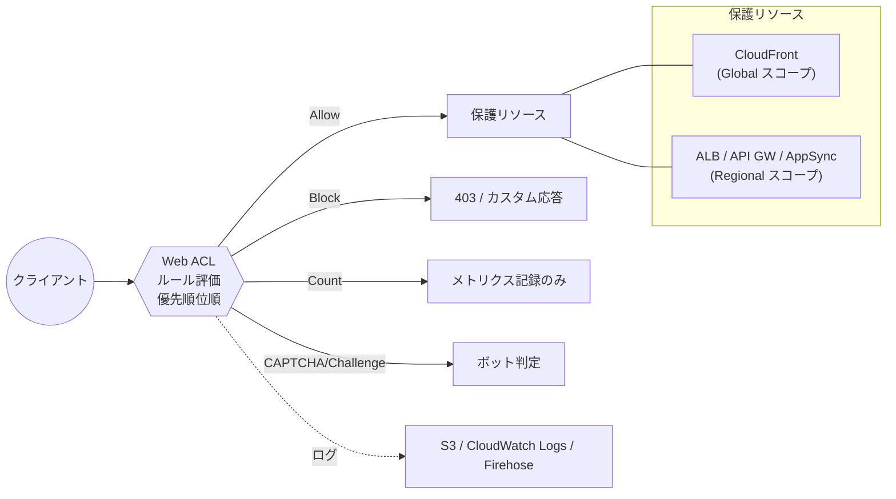
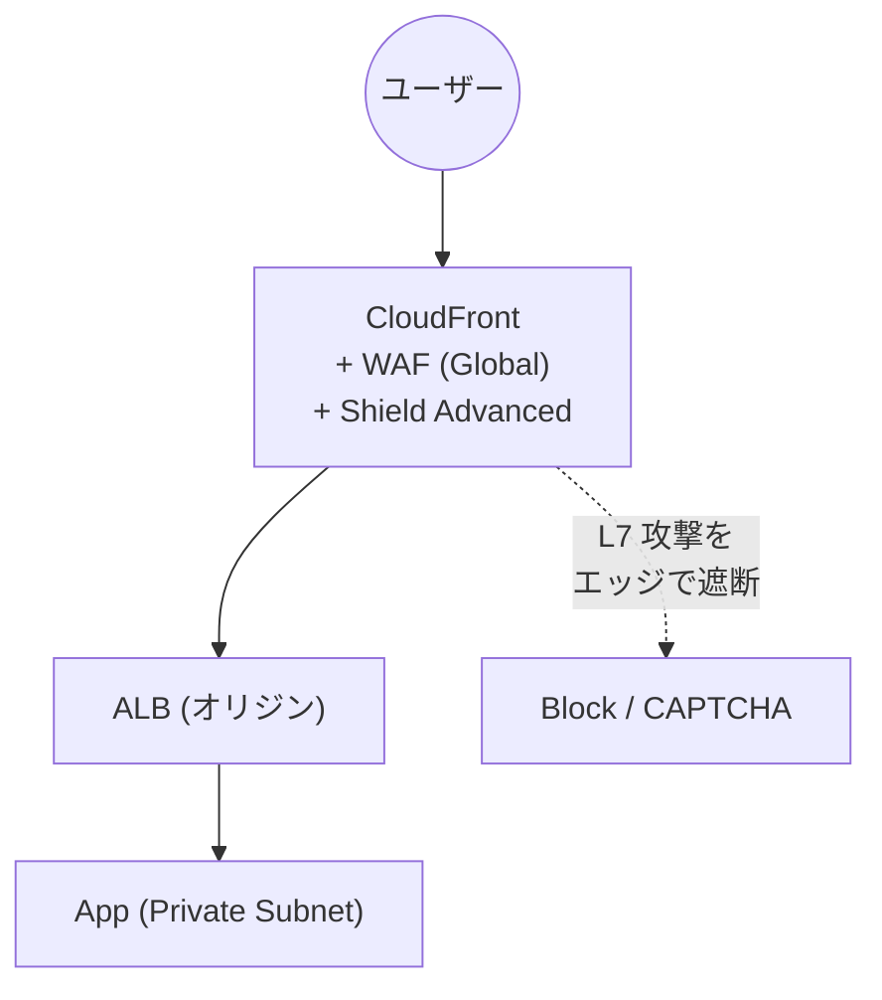

# AWS WAF（Web Application Firewall）

> カテゴリ: セキュリティ・アイデンティティ・コンプライアンス / 重要度: ○
> ANS-C01 第4分野。L7（アプリ層）保護と適用先（CloudFront/ALB/API GW/AppSync）の理解が必須。
> 最終更新: 2026-05-24 ／ 出典は本ドキュメント末尾

---

## 1. 概要

AWS WAF は HTTP/HTTPS リクエストを監視・制御する**Web アプリケーションファイアウォール（L7）**。`Web ACL`（Web Access Control List）に複数のルールを定義し、リクエストを **Allow / Block / Count / CAPTCHA / Challenge** で処理する。SQLi・XSS・レート制限・地理ブロック・マネージドルール・Bot Control をサポート。

### 試験での位置づけ

- **適用先（保護対象）の暗記**が頻出: CloudFront / ALB / API Gateway(REST) / AppSync / Cognito / App Runner / Verified Access / Amplify。
- **CloudFront に付ける WAF は Global（CLOUDFRONT スコープ、us-east-1 で作成）**、それ以外は **Regional スコープ**という区別が問われる。
- **Shield Advanced と連携**した L7 DDoS 緩和、**レートベースルール**による flood 対策。

---

## 2. コアコンセプト

| 概念 | 役割 | 試験での要点 |
|---|---|---|
| **Web ACL** | ルールの集合と既定アクションを束ねる | 1つのリソースに関連付けて保護 |
| **Rule / Rule Group** | マッチ条件＋アクション | 再利用可能。マネージド or 自作 |
| **Statement** | マッチ条件（IP/地理/文字列/SQLi/XSS/サイズ/レート） | AND/OR/NOT で組み合わせ可 |
| **WCU（Web ACL Capacity Unit）** | ルールの計算コスト指標 | Web ACL あたり既定上限あり（拡張可） |
| **Action** | Allow / Block / Count / CAPTCHA / Challenge | Count はテスト・監視に有用 |
| **マネージドルールグループ** | AWS/Marketplace 提供の既製ルール | 共通脆弱性・Bot Control・IP 評価リスト |

### 主なルールタイプ

| ルール | 用途 |
|---|---|
| **SQL injection（SQLi）** | リクエスト内の悪意ある SQL を検出 |
| **Cross-site scripting（XSS）** | 悪意あるスクリプト混入を検出 |
| **レートベース** | 5分間（または1分）の閾値超過 IP をブロック（flood/DDoS L7） |
| **地理マッチ（Geo）** | 送信元国で許可/ブロック |
| **IP セット / 正規表現パターンセット** | 既知の良/悪 IP、URL パターン |
| **マネージドルール** | OWASP 系共通脆弱性、既知 Bad Inputs |
| **Bot Control** | 既知/未知ボットの分類・制御 |

---

## 3. アーキテクチャ / 仕組み

- Web ACL 内のルールは**優先順位の昇順**で評価され、終端アクション（Allow/Block）で確定。
- **スコープ**: CloudFront 用は `CLOUDFRONT`（グローバル、us-east-1）。それ以外は `REGIONAL`（リソースと同一リージョン）。

---

## 4. 試験頻出ポイント

- **CloudFront ＝ Global（us-east-1）、ALB/API GW/AppSync ＝ Regional**。エッジで弾きたいなら CloudFront に WAF。
- **API Gateway は REST API に適用可**（HTTP API は直接非対応 → CloudFront 経由などで対応）。
- **レートベースルール**は L7 flood の主要対策。`Count` で挙動を検証してから `Block` に切り替えるのがベストプラクティス。
- **マネージドルール**で既知脆弱性を即時カバー、誤検知は除外ルールで調整。
- **WAF ログ**は CloudWatch Logs / S3 / Kinesis Data Firehose に配信可（フィールドの編集/フィルタ可能）。
- WAF は**リクエストの内容（L7）**を見る。L3/L4 のボリューム攻撃は **Shield**、ネットワーク境界は **Network Firewall** の領域。

---

## 5. 他サービスとの連携

- **[Shield](../shield/README.md)**: Shield Advanced は WAF と統合し、自動 L7 DDoS 緩和ルールを生成。SRT が WAF ルールを支援。
- **[Firewall Manager](../firewall-manager/README.md)**: Organizations 横断で Web ACL を一元適用・新規リソースへ自動付与。
- **CloudFront / [VPC](../../networking-content-delivery/vpc/README.md) 内 ALB**: 適用先。エッジ保護は CloudFront＋WAF。
- **API Gateway / AppSync**: API レイヤーの保護。

---

## 6. 制約・上限・コスト

| 項目 | 値 |
|---|---|
| 課金要素 | Web ACL 月額 ＋ ルール数 ＋ 処理リクエスト数（100万リクエスト単位） |
| Bot Control / Fraud Control | 追加料金（マネージドルールの一部は従量） |
| WCU | Web ACL あたり既定上限（既定 1,500、引き上げ可） |
| ルール数 | Web ACL あたりの上限あり |
| スコープ | CLOUDFRONT（グローバル）/ REGIONAL（リージョン別） |

- **コスト最適化**: 高 WCU のマネージドルールを盛りすぎない。Count モードで不要ルールを精査。

---

## 7. よくある設計パターン

### エッジ集中保護（CloudFront + WAF + Shield Adv）

- エッジ（CloudFront）で WAF と Shield Advanced を効かせ、オリジン（ALB）に到達する前に L7 攻撃を遮断。
- レートベース＋マネージドルール＋Bot Control を組み合わせて多層化。

---

## 8. 出典

- [What is AWS WAF? – AWS Docs](https://docs.aws.amazon.com/waf/latest/developerguide/what-is-aws-waf.html)
- [How AWS WAF works / Web ACLs – AWS Docs](https://docs.aws.amazon.com/waf/latest/developerguide/how-aws-waf-works.html)
- [Rate-based rule statement – AWS Docs](https://docs.aws.amazon.com/waf/latest/developerguide/waf-rule-statement-type-rate-based.html)
- [AWS Managed Rules / Bot Control – AWS Docs](https://docs.aws.amazon.com/waf/latest/developerguide/aws-managed-rule-groups.html)
- [Logging web ACL traffic – AWS Docs](https://docs.aws.amazon.com/waf/latest/developerguide/logging.html)
- [AWS WAF pricing](https://aws.amazon.com/waf/pricing/)
