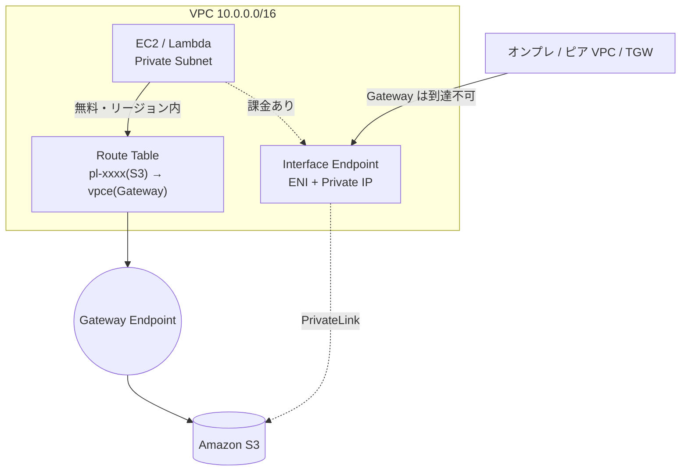

# Amazon S3（Simple Storage Service）

> カテゴリ: ストレージ / 重要度: △（周辺）
> 最終更新: 2026-05-24 ／ 出典は本ドキュメント末尾

---

## 1. 概要

Amazon S3 はリージョン単位のオブジェクトストレージ。ANS-C01 では「VPC からインターネットを経由せず S3 へプライベートアクセスする方法」と「VPC エンドポイント経由のアクセス制御」「各種ネットワークログの保存先」という観点で重点的に問われる。本ドキュメントはネットワーク観点に絞る。

### 試験での位置づけ

- **VPC エンドポイント（Gateway / Interface）** の代表的な接続先であり、両者の使い分けが頻出。
- フローログ・ELB アクセスログ・CloudTrail・Network Firewall ログなど**ネットワーク監視データの保存先**。
- `aws:SourceVpc` / `aws:SourceVpce` によるバケットポリシー制限が出題される。

---

## 2. コアコンセプト

| 要素 | 役割 | ネットワーク観点の要点 |
|---|---|---|
| **Gateway エンドポイント** | S3/DynamoDB 専用のプライベート経路 | **無料**・ルートテーブルにルート追加・**リージョン内のみ** |
| **Interface エンドポイント** | PrivateLink による ENI 経由接続 | 課金あり・**オンプレ/ピア/TGW から到達可** |
| **バケットポリシー** | リソースベースのアクセス制御 | `aws:SourceVpc` / `aws:SourceVpce` で経路を限定 |
| **マネージドプレフィックスリスト** | S3 の IP レンジ | SG/NACL のルールで参照（NACL は IP 直書き） |
| **転送中暗号化** | HTTPS / TLS | `aws:SecureTransport` で TLS 強制 |

---

## 3. VPC エンドポイントによるプライベートアクセス（最重要）



| 種類 | 接続元 | 仕組み | 課金 |
|---|---|---|---|
| **Gateway エンドポイント** | **同一 VPC 内のみ** | ルートテーブルに S3 プレフィックスリスト宛のルートを追加 | **無料** |
| **Interface エンドポイント** | VPC＋**オンプレ/ピア VPC/TGW/VPN/DX** | サブネットに ENI＋プライベート IP、プライベート DNS で透過 | 時間＋データ課金 |

- **使い分け**: VPC 内からのアクセスだけなら **Gateway（無料・NAT 不要）** が第一選択。**オンプレや他リージョン・TGW 越し**から S3 へプライベートアクセスが必要なら **Interface** が必須（Gateway はこれらから到達不可）。
- **コスト最適化（頻出）**: Gateway + Interface を併用しつつ「**プライベート DNS をインバウンド Resolver エンドポイント専用にする**」と、VPC 内からは無料の Gateway、オンプレからは Interface、と振り分けられデータ処理料を最小化できる。
- **重要な経路制約**: Gateway エンドポイントの接続は VPC 外へ拡張できない。**VPN/ピアリング/TGW/Direct Connect の先のリソースは Gateway を使えない**（→ Interface を使う）。
- SG/NACL: Gateway 経由の S3 アクセスを許可するには、SG で **S3 マネージドプレフィックスリスト**を参照して許可（NACL はプレフィックスリスト不可なので IP レンジを記述）。

---

## 4. バケットポリシーによる経路制限

```json
{
  "Effect": "Deny",
  "Principal": "*",
  "Action": "s3:*",
  "Resource": ["arn:aws:s3:::example", "arn:aws:s3:::example/*"],
  "Condition": { "StringNotEquals": { "aws:SourceVpce": "vpce-1a2b3c4d" } }
}
```

- **`aws:SourceVpce`**: 指定 VPC エンドポイント経由**以外**を拒否（特定経路のみ許可）。
- **`aws:SourceVpc`**: 指定 VPC からのリクエスト**以外**を拒否（同一 VPC に複数エンドポイントがある場合に便利）。
- **`aws:SourceIp` は VPC エンドポイント経由のリクエストには使えない** → 代わりに **`aws:VpcSourceIp`** を使う（重要な引っかけ）。
- 上記はマネジメントコンソール経由のアクセスもブロックする点に注意。

---

## 5. ネットワークログの保存先 / 転送中暗号化

- S3 は以下の**ネットワーク監視データの主要な保存先**:
  - **VPC フローログ**（CloudWatch Logs / S3 / Data Firehose のいずれか）
  - **ELB（ALB/NLB）アクセスログ**、**CloudFront アクセスログ**
  - **AWS CloudTrail**（VPC/TGW/SG 等の API 操作監査）
  - **Network Firewall ログ**、**Route 53 Resolver クエリログ**
- **転送中暗号化**: S3 への通信は HTTPS（TLS）。バケットポリシーで `aws:SecureTransport == false` を Deny して **TLS を強制**するのが定石。

---

## 6. 他サービスとの連携

- [VPC](../../networking-content-delivery/vpc/README.md): Gateway/Interface エンドポイント、フローログ保存先。
- [SNS](../../app-integration/sns/README.md) / [SQS](../../app-integration/sqs/README.md): S3 イベント通知の配信先。
- CloudTrail / Network Firewall / Route 53 Resolver: ログの保存先として S3 を利用。

---

## 7. 制約・上限・コスト

| 項目 | 値 |
|---|---|
| Gateway エンドポイント / リージョン | 20（引き上げ可）、VPC あたり最大 255 |
| Gateway エンドポイント料金 | **無料**（データ処理・時間課金なし） |
| Interface エンドポイント料金 | 時間課金＋データ処理課金 |

- **コスト最適化**: VPC 内アプリの S3 アクセスは Gateway を使い **NAT Gateway のデータ処理料を回避**（最頻出の最適化パターン）。

---

## 8. 出典

- [Gateway endpoints for Amazon S3 – AWS Docs](https://docs.aws.amazon.com/vpc/latest/privatelink/vpc-endpoints-s3.html)
- [Types of VPC endpoints for Amazon S3 – AWS Docs](https://docs.aws.amazon.com/AmazonS3/latest/userguide/privatelink-interface-endpoints.html)
- [Controlling access from VPC endpoints with bucket policies – AWS Docs](https://docs.aws.amazon.com/AmazonS3/latest/userguide/example-bucket-policies-vpc-endpoint.html)
- [Gateway endpoints – AWS PrivateLink – AWS Docs](https://docs.aws.amazon.com/vpc/latest/privatelink/gateway-endpoints.html)
